# ECM-L Architecture Documentation
Extracted from: Enterprise Correspondence Manage_a625210899d84ccbb5ad17e999a126b3-040226-1933-2402.pdf
Total Pages: 76
---

## Document Metadata

- **format**: PDF 1.5

---

## Page 1

Enterprise Correspondence Management - Letters
1 Introduction
1.1 What Problem Needs to be Solved?
1.2 Business Needs
1.2.1 Costing Considerations
1.2.2 Chargeback Considerations
1.3 Technical Needs
2 Key Concepts and Summary
2.1 Mission Statement
2.2 Goals of the ECM-L Ecosystem
2.3 The Building Blocks of Correspondence
2.3.1 The Basics of Correspondence
2.3.2 Gathering the Ingredients
2.3.2.1 Input-Driven Information (Provided by Users)
2.3.2.2 Resource-Driven Information (Collected from External Services)
2.3.2.3 Combining the Ingredients into Correspondence
2.3.3 Reusable Content
2.4 The Four Major ECM-L Components
2.5 Glossary of Terminology
2.6 Other Important Concepts
2.6.1 Letter Instance Archival
2.6.1.1 Why do we need Letter Instance archival?
2.6.1.2 How long before a Letter Instance is archived?
2.6.1.3 How do we handle Letter Instance archival?
2.6.2 Retirement
2.6.2.1 Why do we need the concept of Retirement in the ECM-L?
2.6.2.2 What happens when something gets Retired?
2.6.2.3 How does ECM-L handle Template Versions with Retired components / dependencies within a Changeset?
2.6.3 Versioning
2.6.3.1 Versioning of Material
2.6.3.2 Major and Minor Template Versions
2.6.3.3 Template Version Duplication and "Restoring" Retired or cancelled Template Versions
2.6.3.3.1 New Template Versions
2.6.3.3.2 Completely New Templates
2.6.4 Changeset Locking
2.6.5 Workflows
2.6.5.1 What is a Workflow?
2.6.5.2 Example
2.6.6 System Actors and Automated Activities
2.6.6.1 Automatic Letter Generation
2.6.6.1.1 Auto-Finalize / Fast-Tracking
2.6.6.1.2 Other System Actor Activities
2.6.6.2 Eventing
2.6.6.2.1 Eventing Use Case Example
2.6.6.2.2 Examples of Events
2.6.7 Style Guide and Special Characters
2.6.7.1 Style Guide
2.6.7.2 Special Characters
2.6.8 JSON Path Expression Examples
2.6.9 Date Formatting
2.6.10 History and Audit Trail Tracking
2.6.11 System Level Key Parameter Types
2.6.12 New Name Uniqueness
3 Solution Space and Discussion
3.1 Use Case View
3.1.1 Capability Viewpoint Vision (CV-1) (VASI Description)
3.1.2 Capability Viewpoint Taxonomy (CV-2)
3.1.3 Use Case
3.1.3.1 Main Actors
3.1.3.2 System/Tenant/Application Description
3.1.3.3 Main User Functions (Use Cases)
3.1.4 Primary Systems High Level Operational Viewpoint (OV-1)
3.2 Logical View
3.2.1 Systems Interface Description (SV-1)
3.2.2 FTI Environment Example SV-1
3.2.3 Services Context (SvcV-1) (VASI APIs)
3.2.4 Services Resource Flow (SvcV-2)
3.2.5 API Operations Lists
3.2.5.1 Operational Diagrams
3.2.5.2 Resource Manager API Operations
3.2.5.3 Template Manager API Operations
3.2.5.4 Letter Manager API Operations
3.2.5.5 ECM-L API Operations
3.2.6 State Transitions (OV-6b)
3.2.6.1 Lifecycle Interactions and Availability
3.2.6.2 Resource Manager Elements

### Images on Page 1

*Image 1: Extracted from page 1*

*Image 2: Extracted from page 1*

*Image 3: Extracted from page 1*

*Image 4: Extracted from page 1*

*Image 5: Extracted from page 1*

*Image 6: Extracted from page 1*

*Image 7: Extracted from page 1*

*Image 8: Extracted from page 1*

*Image 9: Extracted from page 1*

*Image 10: Extracted from page 1*

*Image 11: Extracted from page 1*

*Image 12: Extracted from page 1*

*Image 13: Extracted from page 1*

*Image 14: Extracted from page 1*

*Image 15: Extracted from page 1*

*Image 16: Extracted from page 1*

*Image 17: Extracted from page 1*

*Image 18: Extracted from page 1*

*Image 19: Extracted from page 1*

*Image 20: Extracted from page 1*

*Image 21: Extracted from page 1*

*Image 22: Extracted from page 1*

*Image 23: Extracted from page 1*

*Image 24: Extracted from page 1*

*Image 25: Extracted from page 1*

*Image 26: Extracted from page 1*

*Image 27: Extracted from page 1*

*Image 28: Extracted from page 1*

*Image 29: Extracted from page 1*

*Image 30: Extracted from page 1*

*Image 31: Extracted from page 1*

*Image 32: Extracted from page 1*

### Vector Graphics on Page 1

*This page contains 140 vector graphic elements (diagrams, shapes, lines)*

---

## Page 2

3.2.6.2.1 Connection Configuration Lifecycle
3.2.6.2.1.1 Jira Realm
3.2.6.2.1.2 ECM-L Realm
3.2.6.2.2 Key Parameter Type Lifecycle
3.2.6.2.3 Resource Version Lifecycle
3.2.6.3 Template Manager Elements
3.2.6.3.1 Changeset Lifecycle
3.2.6.3.2 Label Lifecycle
3.2.6.3.3 Template Version Lifecycle
3.2.6.3.4 File Version Lifecycle
3.2.6.3.5 Retirement Action Lifecycle
3.2.6.3.6 Test Scenario Lifecycle
3.2.6.3.7 Workflow Lifecycle
3.2.6.4 Letter Manager Elements
3.2.6.4.1 Letter Instance Lifecycle
3.2.7 Data Models
3.2.7.1 Conceptual Data Models (DIV-1)
3.2.7.1.1 Key Concepts
3.2.7.1.2 Entity Relationship Diagram
3.2.7.1.2.1 Resource Manager
3.2.7.1.2.2 Template Manager
3.2.7.1.2.3 Letter Manager
3.2.7.2 Logical Data Viewpoint Model (DIV-2)
3.2.7.3 Physical Data Viewpoint Model (DIV-3)
3.2.8 Transitioning Concepts From Legacy Correspondence Management
3.2.8.1 High Level Concept Changes
3.2.8.2 Low Level Concept Changes
3.3 Claim Evidence and Package Manager Integration
3.3.1 What Are Claim Evidence and Package Manager?
3.3.2 Workflow Configuration
3.3.2.1 Key Parameter Types
3.3.2.2 Storage and Distribution
3.3.2.3 Template Association
3.3.2.3.1 Document Type
3.3.2.3.2 Claim Evidence Exempt
3.3.2.3.3 Package Manager Exempt
3.4 Intake
3.4.1 Initial Evaluation
3.4.2 Line of Business Intake
3.4.2.1 Line of Business Intake Form
3.4.2.2 Intake Processing
3.4.2.3 System Registry
3.4.3 Connection Configuration Intake
3.4.3.1 Connection Configuration Intake Form
3.4.4 User Roles and Permissions / Intake
3.5 Process View (Business Process Model)
3.5.1 Main Business Process Model (OV-6d)
3.5.2 Intake Processes
3.5.2.1 Connection Configuration Process Workflows
3.5.2.1.1 Process Workflow for Connection Configuration Intake
3.5.2.2 Make Connection Available
3.5.2.3 Connection Configuration Decommissioning Process
3.5.2.4 Connection Configuration Replacement Process
3.5.2.5 Overall Resource Version Process
3.5.2.6 Resource Version Retirement Subprocess
3.5.2.7 Create / Update / Retire Workflow
3.5.2.8 Overall Changeset Process
3.5.2.9 Create Template Version for Changeset Subprocess
3.5.2.10 Template Version and File Version Retirement Subprocess
3.5.2.11 Template Version Testing Subprocess
3.5.2.12 Create File Version Subprocess
3.5.2.13 Changeset Approval Subprocess
3.5.2.14 Changeset Scheduling Subprocess
3.5.2.15 Letter Finalization Process
3.5.3 Process Sequence - Systems Event-Trace Description (SV-10c)
3.6 Implementation View
3.7 Deployment View
3.7.1 Environment Mapping
3.7.2 System Configuration
3.7.3 System Monitoring and Metrics
3.7.4 System Logging and Auditing
3.7.4.1 Long-Term Provenance
3.7.5 Security Strategy
3.8 Analysis of Alternatives
3.9 Recommendation
3.10 Phases and Roadmap
3.10.1 Summary of Phases
3.10.2 Functionality Breakdown
3.10.3 Phase Map

### Images on Page 2

*Image 33: Extracted from page 2*

*Image 34: Extracted from page 2*

*Image 35: Extracted from page 2*

*Image 36: Extracted from page 2*

*Image 37: Extracted from page 2*

*Image 38: Extracted from page 2*

*Image 39: Extracted from page 2*

*Image 40: Extracted from page 2*

*Image 41: Extracted from page 2*

*Image 42: Extracted from page 2*

*Image 43: Extracted from page 2*

*Image 44: Extracted from page 2*

*Image 45: Extracted from page 2*

*Image 46: Extracted from page 2*

*Image 47: Extracted from page 2*

*Image 48: Extracted from page 2*

*Image 49: Extracted from page 2*

*Image 50: Extracted from page 2*

*Image 51: Extracted from page 2*

*Image 52: Extracted from page 2*

*Image 53: Extracted from page 2*

*Image 54: Extracted from page 2*

*Image 55: Extracted from page 2*

*Image 56: Extracted from page 2*

*Image 57: Extracted from page 2*

*Image 58: Extracted from page 2*

*Image 59: Extracted from page 2*

*Image 60: Extracted from page 2*

*Image 61: Extracted from page 2*

*Image 62: Extracted from page 2*

*Image 63: Extracted from page 2*

*Image 64: Extracted from page 2*

### Vector Graphics on Page 2

*This page contains 147 vector graphic elements (diagrams, shapes, lines)*

---

## Page 3

For development specific information, view 
.
ECM-L Developer View
For UI/UX design specific information, view 
.
ECM-L UI/UX Design View
For General Audience specific information, view ECM-L General Audience View.
Solution Metadata
Name
Value
Solution Status 
DRAFT
Solution Type
NEW TENANT
Tenant
TBD ECM-L
Recommended Namespace
ecml
Recommended BIP Tenant App(s)
bip-ecml-resource-manager
bip-ecml-resource-manager-mfe-ui
bip-ecml-letter-manager
bip-ecml-letter-manager-mfe-ui
bip-ecml-template-manager
bip-ecml-template-manager-mfe-ui
bip-ecml-svc
bip-ecml-mfe-root-ui
Sponsoring organization
OIT
Number of users
TBD
Estimated Monthly Cost
TBD
Privacy
Differs from system to system.
Resource Manager - None.
Template Manager - None.
Letter Manager - Both possible.
ECM-L-API - Both possible.
 
Will need 508 Compliance 
Yes, all of the MFE UI's will require 508 compliance.
Deployment date
TBD
221
Introduction
This document outlines the design for Enterprise Correspondence Management-Letters (ECM-L), a centralized platform that empowers business users to 
efficiently manage letter content and generation. Currently, multiple Lines of Business (LoBs) within the Veterans Affairs infrastructure use disparate 
methods and applications to create correspondence, resulting in operational inefficiencies and a heavy dependence on IT support.
ECM-L addresses these challenges by providing a unified solution that enables LoBs to self-manage their correspondence needs within a standardized 
environment. Once onboarded, LoBs can independently make changes—such as updating Letter Templates and Resources—without requiring IT 
intervention. This centralized approach provides a controlled, reliable environment for producing, testing, releasing, and storing correspondence while 
streamlining operations and enhancing consistency across all LoBs.

### Images on Page 3

*Image 65: Extracted from page 3*

*Image 66: Extracted from page 3*

*Image 67: Extracted from page 3*

*Image 68: Extracted from page 3*

*Image 69: Extracted from page 3*

*Image 70: Extracted from page 3*

*Image 71: Extracted from page 3*

*Image 72: Extracted from page 3*

*Image 73: Extracted from page 3*

*Image 74: Extracted from page 3*

*Image 75: Extracted from page 3*

*Image 76: Extracted from page 3*

*Image 77: Extracted from page 3*

*Image 78: Extracted from page 3*

*Image 79: Extracted from page 3*

*Image 80: Extracted from page 3*

*Image 81: Extracted from page 3*

*Image 82: Extracted from page 3*

*Image 83: Extracted from page 3*

*Image 84: Extracted from page 3*

*Image 85: Extracted from page 3*

*Image 86: Extracted from page 3*

*Image 87: Extracted from page 3*

*Image 88: Extracted from page 3*

*Image 89: Extracted from page 3*

*Image 90: Extracted from page 3*

*Image 91: Extracted from page 3*

*Image 92: Extracted from page 3*

*Image 93: Extracted from page 3*

*Image 94: Extracted from page 3*

*Image 95: Extracted from page 3*

*Image 96: Extracted from page 3*

### Vector Graphics on Page 3

*This page contains 186 vector graphic elements (diagrams, shapes, lines)*

---

## Page 4

What Problem Needs to be Solved?
Individual Lines of Business (LoBs) within the Veterans Affairs Organization utilize disparate methods and applications to generate their own 
correspondence. Without a centralized Enterprise Correspondence Management system, each LoB operates independently for Letter Templates and 
changes, and any substantial changes to Templates or mandates rely on IT resources for those changes, often requiring customized development for each 
LoB. This fragmented approach creates resource bottlenecks, operational inefficiencies, and limited historical tracking, ultimately resulting in delays and 
potential inaccuracies in the correspondence provided to our Veterans.
Business Needs
Is this a defect or an enhancement?
Enhancement 
Who reported the need?
Office of Information & Technology (OIT)
When was the need noticed?
Q2 2022
When did/will it become a problem?
Q2 2024
Is there an existing Requirement? 
Strategic Objective?
Enterprise Correspondence Management (ECM) Expansion | BPT-4700
What existing resources, tickets, 
emails, etc. might serve to better 
understand the problem?
Namespace and Tenant App Request:
ECM-L | BPS-74504
Resource Manager API | BPS-69060
Template Manager API | BPS-69063
Letter Manager API | BPS-69064
ECM-L API | BPS-69085
Tenant Security Assessment (TSA) Request under BIP ATO:
ECM-L | VBMSD-337002
What business processes are 
involved?
Document Generation, Document Storage and Retrieval 
Who is the business owner for the 
impacted systems or processes?
Jeffry Boutet
Brian Steege 
Peter Graziatis
Who are the business decision 
makers for solving the problem?
Pam Devine 
What is the historical context? How 
did we get where we are?
Historically, VA has used multiple applications to generate, manage, and edit letters. Correspondence Service 
has provided document generation functionality to the VBMS system, providing document generation for use in 
VBMS Core, Ratings, and Awards. With this architecture, any changes needed by the business specific letter 
requires large amounts of commitment and OIT resources. 
What happens to the business 
stakeholders if nothing is done?
VA will have disjointed efforts and applications for correspondence and letters
Of the various aspects of this 
problem, which of them does the 
business consider as critical flaws? 
Which are nice-to-have changes?
Need for improvements in Letters Finalization
Need for centralized enterprise system that allows multiple LoBs to draft, generate, and Finalize Letters
Costing Considerations
Description
Summary of Costs
Total
Initial Development
Staffing costs: $7.2M
Tools and licenses: $0.7M
Training: $8.4M
Contingency: $0.2M
$8.4M

### Images on Page 4

*Image 97: Extracted from page 4*

*Image 98: Extracted from page 4*

*Image 99: Extracted from page 4*

*Image 100: Extracted from page 4*

*Image 101: Extracted from page 4*

*Image 102: Extracted from page 4*

*Image 103: Extracted from page 4*

*Image 104: Extracted from page 4*

*Image 105: Extracted from page 4*

*Image 106: Extracted from page 4*

*Image 107: Extracted from page 4*

*Image 108: Extracted from page 4*

*Image 109: Extracted from page 4*

*Image 110: Extracted from page 4*

*Image 111: Extracted from page 4*

*Image 112: Extracted from page 4*

*Image 113: Extracted from page 4*

*Image 114: Extracted from page 4*

*Image 115: Extracted from page 4*

*Image 116: Extracted from page 4*

*Image 117: Extracted from page 4*

*Image 118: Extracted from page 4*

*Image 119: Extracted from page 4*

*Image 120: Extracted from page 4*

*Image 121: Extracted from page 4*

*Image 122: Extracted from page 4*

*Image 123: Extracted from page 4*

*Image 124: Extracted from page 4*

*Image 125: Extracted from page 4*

*Image 126: Extracted from page 4*

*Image 127: Extracted from page 4*

*Image 128: Extracted from page 4*

### Vector Graphics on Page 4

*This page contains 199 vector graphic elements (diagrams, shapes, lines)*

---

## Page 5

AWS GovCloud Infrastructure
Compute: $0.4M / Year
Storage: $0.3M / Year
Database: $0.1M / Year
Networking/Other: $0.1M / Year
$0.9M / Year
Annual Maintenance
Staffing costs: $1.2M / Year
Infrastructure updates: $0.3M / Year
License renewals: $0.1M / Year
Ongoing enhancements: $0.5M / Year
$2.1M / Year
5-Year Total Cost of Ownership
Development: $8.4M
Infrastructure: 
 ($0.9M Per Year x 5 years)
$4.5M
Maintenance: 
 ($2.1M Per Year x 4.5 years)
$9.5M
$22.4M
Chargeback Considerations
ECM-L creates natural cost separation by organizing all of its components into distinct buckets for each Line of Business (LOB).  We will be able to 
evaluate and isolate usage metrics based on the individual Lines of Business to inform and streamline chargeback considerations. 
Technical Needs
Historically, VA has used multiple applications to generate, manage, and edit letters. This causes numerous workflow inconsistencies, various vendors, 
and large amounts of OIT commitments and resources, none which seem to have a perfected process in place. The purpose of Enterprise 
Correspondence Management- Letters (ECM-L)  is to create a centralized, enterprise system, built around shared concepts, processes, and workflows to 
be leveraged by multiple Lines of Business (LoBs) in the Veterans Benefits Administration (VBA).  The system will be LoB oriented, each being responsible 
for their integration and usage, with BID only supporting, facilitating, and trouble-shooting as needed. Onboarding new LoB will not require development 
work, but use configurations and system activities.
In order to prevent unintended interactions or dependencies, as well as support charge-back capabilities, the content, processes, and data of each LoB 
will be completely separate from those of another LoB. In addition, the ECM-L will be LoB agnostic, providing reasonable common denominators in 
concepts or processes among the LoBs, but ECM-L will not contain any proprietary business logic or concepts. Each LoB will be able to integrate and 
incorporate their own business logic or processes through predefined hooks, APIs, or other integration points. This will allow API access to Letter 
Instances in data format as well as give LoBs the ability to configure data lookup "callback" to its own systems. 
The implications of this enterprise system allow for reusing existing concepts in its approach, the opportunity to consolidate and simplify letter generation 
and management across VBA, and the ability to plan for complexity. 
Describe the problem in technical terms
We need an Enterprise level Line of Business agnostic tool to create and manage 
correspondence that can integrate with external API's without the need for a code 
change.
What are the architectural components in the problem's context?
New tenants: Resource Manager, Template Manager, Letter Manager, 
 
ECM-L
Service.
What are the integration points that might be impacted by this 
problem?
Each of the new tenants will integrate with Line of Business specific API's on an as 
needed basis.
What technologies are involved?
Springboot, React, Kafka, iText, Lexical.
Is this related to already-stated technical debt?
No.
If the problem is with a technology, what were the reasons for 
using this technology in the first place?
N/A
Has an attempt been made before to fix the problem?
No.  The existing components in the DocGen namespace were not designed to 
accomplish this goal / solve this problem and are too entwined with Line of Business 
specific logic to be repurposed to solve it.
Did it fail or did it just not finish?
N/A.
Who are the technical PoCs for that attempt?
N/A.

### Images on Page 5

*Image 129: Extracted from page 5*

*Image 130: Extracted from page 5*

*Image 131: Extracted from page 5*

*Image 132: Extracted from page 5*

*Image 133: Extracted from page 5*

*Image 134: Extracted from page 5*

*Image 135: Extracted from page 5*

*Image 136: Extracted from page 5*

*Image 137: Extracted from page 5*

*Image 138: Extracted from page 5*

*Image 139: Extracted from page 5*

*Image 140: Extracted from page 5*

*Image 141: Extracted from page 5*

*Image 142: Extracted from page 5*

*Image 143: Extracted from page 5*

*Image 144: Extracted from page 5*

*Image 145: Extracted from page 5*

*Image 146: Extracted from page 5*

*Image 147: Extracted from page 5*

*Image 148: Extracted from page 5*

*Image 149: Extracted from page 5*

*Image 150: Extracted from page 5*

*Image 151: Extracted from page 5*

*Image 152: Extracted from page 5*

*Image 153: Extracted from page 5*

*Image 154: Extracted from page 5*

*Image 155: Extracted from page 5*

*Image 156: Extracted from page 5*

*Image 157: Extracted from page 5*

*Image 158: Extracted from page 5*

*Image 159: Extracted from page 5*

*Image 160: Extracted from page 5*

### Vector Graphics on Page 5

*This page contains 183 vector graphic elements (diagrams, shapes, lines)*

---

## Page 6

What components are impacted by this problem?
-All VA letters/correspondence 
-Core, Ratings, Awards
Are there current mitigations that help alleviate the impact of the 
problem?
No.
What are the technical dependencies for this? What does this 
depend on? What depends on it?
The new tenants proposed will stand on their own and external Line of Business 
specific API's can be configured in as dependencies as needed.
Based on the SV-1 and SV-9 generated what is estimated 
monthly cost for this new service? Upload estimate of resources 
from the AWS Pricing Calculator
TBD
Key Concepts and Summary
Mission Statement
Streamline correspondence management in an enterprise, application-agnostic way, to improve the speed and quality of the communications 
between the VA and the people it serves.
Goals of the ECM-L Ecosystem
Reduce redundancy by maintaining all correspondence in a single system
Empower the VA by giving them the tools to manage correspondence without developer intervention
Allow for changes to correspondence to be published outside of a development cycle / release window
Improve the quality of correspondence testing to ensure that our communications are always as accurate as possible
Create a platform for integration that can fit seamlessly into existing application and Line of Business workflows
Provide stable and reliable content for automated systems in an environment where that content is user maintained
The Building Blocks of Correspondence
The Basics of Correspondence
To generate a piece of correspondence for a Veteran, what is needed?
First we need to know what that correspondence should look like.  In the ECM-L ecosystem, we call this the 
.  The Template is similar to a 
Template
recipe 
for a given piece of correspondence.
A recipe isn't enough though, we also need the 
.  A Template may call for and need the name of a Veteran, or their periods of service.  We 
ingredients
collect these ingredients in what we call a 
 - which represents an "instance" of a given Template.
Letter Instance
If an example of a Letter Template might be called the "Development Letter", then an example of a 
would be John Smith's "Development 
Letter Instance 
Letter."  This is a specific piece of correspondence, for a target audience, that is based on the recipe given to us by that Template.
We are able, in the end, to combine the "ingredients" we've collected in the Letter Instance, and the "recipe" contained in the Letter Template, to generate 
and send out our correspondence, so that John Smith's Development Letter contains all of the pertinent information that he needs.
Gathering the Ingredients

### Images on Page 6

*Image 161: Extracted from page 6*

*Image 162: Extracted from page 6*

*Image 163: Extracted from page 6*

*Image 164: Extracted from page 6*

*Image 165: Extracted from page 6*

*Image 166: Extracted from page 6*

*Image 167: Extracted from page 6*

*Image 168: Extracted from page 6*

*Image 169: Extracted from page 6*

*Image 170: Extracted from page 6*

*Image 171: Extracted from page 6*

*Image 172: Extracted from page 6*

*Image 173: Extracted from page 6*

*Image 174: Extracted from page 6*

*Image 175: Extracted from page 6*

*Image 176: Extracted from page 6*

*Image 177: Extracted from page 6*

*Image 178: Extracted from page 6*

*Image 179: Extracted from page 6*

*Image 180: Extracted from page 6*

*Image 181: Extracted from page 6*

*Image 182: Extracted from page 6*

*Image 183: Extracted from page 6*

*Image 184: Extracted from page 6*

*Image 185: Extracted from page 6*

*Image 186: Extracted from page 6*

*Image 187: Extracted from page 6*

*Image 188: Extracted from page 6*

*Image 189: Extracted from page 6*

*Image 190: Extracted from page 6*

*Image 191: Extracted from page 6*

*Image 192: Extracted from page 6*

*Image 193: Extracted from page 6*

### Vector Graphics on Page 6

*This page contains 118 vector graphic elements (diagrams, shapes, lines)*

---

## Page 7

Sometimes a piece of correspondence requires information specific to the recipient, and there are different sources of that information.  Depending on 
where the information is coming from, and where it "lives," we have a different means of gathering the information for our correspondence.
We can separate the information into two categories: Input-Driven Information and Resource-Driven Information.
Input-Driven Information (Provided by Users)
Any information "given" to the ECM-L components. This can be provided by a human being, via Template-driven dynamic forms in the Letter Manager, or 
by an automated system, via an API call.
All user-provided information is managed in a Template via what we call Inputs.
Information 
Provider
Gathering Method 
Examples
Human User
Provided through the Letter Manager interface, by a human actor, using a 
Template-driven Dynamic Form, structured based on the needs of the individual 
Templates.
A Letter Manager user using the Dynamic Form 
in the Letter Manager to:
Select from a list of VA forms that should 
be included in the correspondence as 
Attachments.
Select from a list of evidences that should 
be referenced in the text of the 
correspondence.
Provide the total monthly income for a 
recipient.
System User
Provided by an automated or system actor via requests to the ECM-L components.
An automated system sending a request to the 
ECM-L API containing:
The periods of a Veteran's military service.
The nature of a Veteran's discharge.
Banking information, such as routing 
numbers and account types.
All user-provided information is managed in a Template via what we call Inputs.
Inputs are configured in a Template and can be used within the Template content, and these configurations determine the "shape" of the Letter Instances 
created using those Templates.  When a user accesses the Letter Manager, the Dynamic Form that they use to fill in the missing content is based on the 
Inputs that were configured in the Template Manager.
Resource-Driven Information (Collected from External Services)
Any information that the ECM-L components needs to be configured to retrieve itself, by reaching out to external, Line of Business specific services.
All user-provided information is managed in a Template via what we call Resources.
Information 
Provider
Gathering Method
Examples
Line of 
Business 
Service
The ECM-L components must reach out to and retrieve this data from the Line of 
Business's services on their own, using  Connection Configurations and Resources 
pre-configured by a Resource Manager user.
The ECM-L components use a Resource and 
Connection Configuration set up by users in 
the Resource Manager to:
collect Veteran data from a Participant ID 
using the Veteran API.
First and last name.
Final disposition.
Gender.
collect Claims information from a Claim 
ID using the Claims API.
Claim Type.
EP (End Product) Code.
Jurisdiction.
Combining the Ingredients into Correspondence
Once a Template is configured with the right Resources and the right Inputs the ECM-L eco-system can gather the information necessary to generate the 
correspondence.

### Images on Page 7

*Image 194: Extracted from page 7*

*Image 195: Extracted from page 7*

*Image 196: Extracted from page 7*

*Image 197: Extracted from page 7*

*Image 198: Extracted from page 7*

*Image 199: Extracted from page 7*

*Image 200: Extracted from page 7*

*Image 201: Extracted from page 7*

*Image 202: Extracted from page 7*

*Image 203: Extracted from page 7*

*Image 204: Extracted from page 7*

*Image 205: Extracted from page 7*

*Image 206: Extracted from page 7*

*Image 207: Extracted from page 7*

*Image 208: Extracted from page 7*

*Image 209: Extracted from page 7*

*Image 210: Extracted from page 7*

*Image 211: Extracted from page 7*

*Image 212: Extracted from page 7*

*Image 213: Extracted from page 7*

*Image 214: Extracted from page 7*

*Image 215: Extracted from page 7*

*Image 216: Extracted from page 7*

*Image 217: Extracted from page 7*

*Image 218: Extracted from page 7*

*Image 219: Extracted from page 7*

*Image 220: Extracted from page 7*

*Image 221: Extracted from page 7*

*Image 222: Extracted from page 7*

*Image 223: Extracted from page 7*

*Image 224: Extracted from page 7*

*Image 225: Extracted from page 7*

### Vector Graphics on Page 7

*This page contains 144 vector graphic elements (diagrams, shapes, lines)*

---

## Page 8

Reusable Content
Most of our Lines of Business will have content such as a shared "header," or a shared "footer," that need to appear the same on all of their pieces 
correspondence.
ECM-L handles this need elegantly by introducing the concept of a 
.  Whereas a 
 represents the full content and 
Fragment Template
Full Template
configuration of a specific piece of correspondence, Fragment Templates represent re-usable content that can be 
 inside of these Full Templates.
included

### Images on Page 8

*Image 226: Extracted from page 8*

*Image 227: Extracted from page 8*

*Image 228: Extracted from page 8*

*Image 229: Extracted from page 8*

*Image 230: Extracted from page 8*

*Image 231: Extracted from page 8*

*Image 232: Extracted from page 8*

*Image 233: Extracted from page 8*

*Image 234: Extracted from page 8*

*Image 235: Extracted from page 8*

*Image 236: Extracted from page 8*

*Image 237: Extracted from page 8*

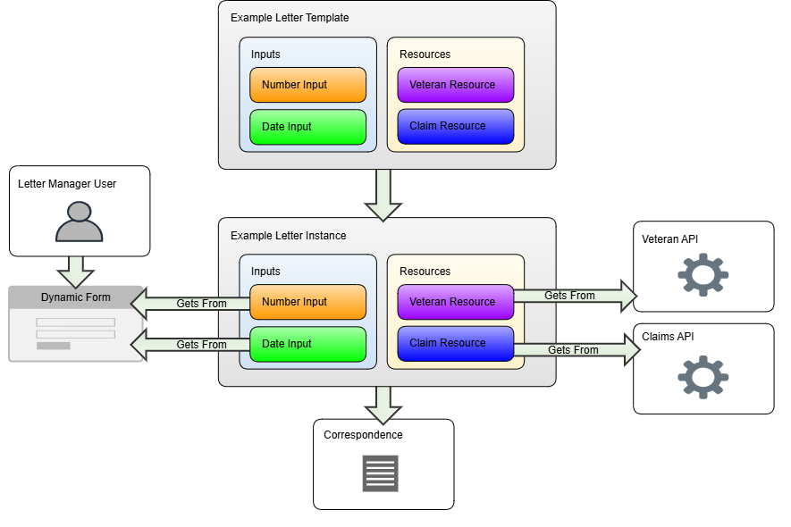

*Image 238: Extracted from page 8*

*Image 239: Extracted from page 8*

*Image 240: Extracted from page 8*

*Image 241: Extracted from page 8*

*Image 242: Extracted from page 8*

*Image 243: Extracted from page 8*

*Image 244: Extracted from page 8*

*Image 245: Extracted from page 8*

*Image 246: Extracted from page 8*

*Image 247: Extracted from page 8*

*Image 248: Extracted from page 8*

*Image 249: Extracted from page 8*

*Image 250: Extracted from page 8*

*Image 251: Extracted from page 8*

*Image 252: Extracted from page 8*

*Image 253: Extracted from page 8*

*Image 254: Extracted from page 8*

*Image 255: Extracted from page 8*

*Image 256: Extracted from page 8*

*Image 257: Extracted from page 8*

*Image 258: Extracted from page 8*

### Vector Graphics on Page 8

*This page contains 64 vector graphic elements (diagrams, shapes, lines)*

---

## Page 9

The Four Major ECM-L Components
The ECM-L ecosystem is made up of four sibling components that work together to provide Lines of Business all the tools and power they need to manage 
and maintain correspondence at a streamlined enterprise level.  These components interact with each other via a robust "event" based architecture that 
allows for external systems to listen for and react to specific events to cover and address needs that are specific to their own use cases, such as the need 
to generate "Tracked Items" based on content in a Letter Instance as it is Finalized.
Name
Purpose
Resour
ce 
Manager
Most of the correspondence we send out includes data that the Lines of Business have already collected.  Things like the Veteran's name, 
their periods of service, their beneficiaries.  The Resource Manager allows Lines of Business to create "Resources" that allow us to pull that 
information in to our generated correspondence.
Templat
e 
Manager
This is where all of the different correspondence are managed by the individual Lines of Business.  Using this tool they're able to update, test, 
schedule, and publish changes to their correspondence on their own time, using their own unique business processes.
Letter 
Manager
Much of the correspondence that gets sent out is user-driven.  Users are identifying what type of correspondence should be sent, inputting 
data relevant to the correspondence, reviewing it, approving it, finalizing it, and sending it out to its intended audience.  The Letter Manager is 
where all of that takes place.
ECM-L 
API
There are times when correspondence should be sent out without user interaction.  Automated systems like the Pension Automation project 
or the Automated Document Generation (ADG) project will provide all of the information needed to generate the correspondence 
 of a 
instead
human user.  The ECM-L API is the outward facing "gatekeeper" of the ECM-L eco-system, that these automated systems will communicate 
with.
It's also where the PDF rendering engine lives, where we combine the fruits of the Template Manager and the Letter Manager into the actual 
correspondence.

### Images on Page 9

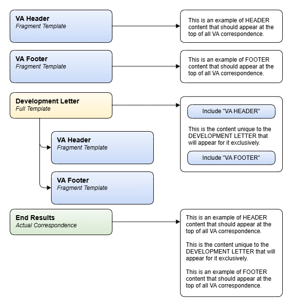

*Image 259: Extracted from page 9*

*Image 260: Extracted from page 9*

*Image 261: Extracted from page 9*

*Image 262: Extracted from page 9*

*Image 263: Extracted from page 9*

*Image 264: Extracted from page 9*

*Image 265: Extracted from page 9*

*Image 266: Extracted from page 9*

*Image 267: Extracted from page 9*

*Image 268: Extracted from page 9*

*Image 269: Extracted from page 9*

*Image 270: Extracted from page 9*

*Image 271: Extracted from page 9*

*Image 272: Extracted from page 9*

*Image 273: Extracted from page 9*

*Image 274: Extracted from page 9*

*Image 275: Extracted from page 9*

*Image 276: Extracted from page 9*

*Image 277: Extracted from page 9*

*Image 278: Extracted from page 9*

*Image 279: Extracted from page 9*

*Image 280: Extracted from page 9*

*Image 281: Extracted from page 9*

*Image 282: Extracted from page 9*

*Image 283: Extracted from page 9*

*Image 284: Extracted from page 9*

*Image 285: Extracted from page 9*

*Image 286: Extracted from page 9*

*Image 287: Extracted from page 9*

*Image 288: Extracted from page 9*

*Image 289: Extracted from page 9*

*Image 290: Extracted from page 9*

*Image 291: Extracted from page 9*

### Vector Graphics on Page 9

*This page contains 106 vector graphic elements (diagrams, shapes, lines)*

---

## Page 10

Glossary of Terminology
Use this glossary as a guide as you navigate through these documents to better understand some of the core concepts and terms that we use in the ECM-
L ecosystem.
Key 
Term
Description
Changeset
A collection of Template-related content that a user wants to publish at a specifically scheduled time. This can include new Template 
Versions, File Versions, or the retirement of one or more pieces of versioned content.
This is the mechanism for managing all of the content within the Template Manager, including creating, testing and publishing, and 
retiring Template Versions and all other versioned content.
Connection
Configurati
on
A collection of the Configuration information necessary for the ECM-L components to access another system's API so that it's Resources 
can be used by Templates and Letters.
Data 
Resource
Any information that we want to collect for a Template that will be provided by an external Line of Business specific system instead of 
being collected directly from a user.  These are defined in the Resource Manager and configured by a Line of Business administrator, 
and the actual data is provided by an endpoint in a Connection Configuration.
Dynamic 
Form
The Template-driven form in the Letter Manager that users utilize to provide information needed for the pieces of correspondence they 
are working on. This same form is provided to Template Manager users when crafting Test Scenarios that are used to test their content 
before publication.
File
Any file-based assets that can be used by a Template such as a PDF or an Image.  These live within the ECM-L eco-system and are 
managed within Changesets in the Template Manager like a Template, as opposed to File Resources which point to Files hosted 
externally.
File 
Resource
A type of Resource used to pull in different file-based assets for use in a Template, such as an Image or PDF.
File 
Version
A specific version of a File within the ECM-L.
Fragment 
Template
A 
that represents a piece of re-usable content that can be included inside of another 
.  Fragment Templates are a 
Template 
Template
useful way to handle things like common headers and footers.  A Fragment 
cannot be instantiated as a Letter Instance on its 
Template 
own.
Full 
Template
The structured layout and all necessary components, including configuration information (e.g., resources, input types, conditions, 
restrictions, attachments, etc.) and content required to create a Letter Instance.
Image
A graphical File that can be inserted into Template content and rendered with a Letter Instance as a part of the PDF.
Label
Concise descriptive tags used by Changeset Editors to categorize and organize 
s.
Template
Legacy 
Correspon
dence 
Manageme
nt
All of the different legacy methods that the different Lines of Business used to manage their correspondence, that the ECM-L ecosystem 
seeks to replace, consolidate, and streamline.
Letter 
Instance
Letter Instances point to a specific Template Version and represent all of the information the Template requires for the generation of 
correspondence.  ECM-L can return a Letter Instance as JSON data for situations where a Line of Business needs to evaluate that data 
or render it as a PDF.
Letter 
Instance 
Metadata
A subset of the data related to a Letter Instance that helps a user differentiate it from other Letter Instances, but that does not contain any 
data collected from Resources or users, and can not on its own produce a generated PDF.  Contains information such as the name of the 
Template that Letter Instance was created for, and the date was created.
Line of 
Business
An organizational segment of operational and strategic activities.  Each of the Templates and Changesets belong to a Line of Business.
Major 
Version
The Major Version of a Template is the number that precedes the decimal.  For Version "3.2", the Major Version is "3".
Minor 
Version
The Minor Version of a Template is the number that follows the decimal.  For Version "3.2", the Minor Version is "2".
Any new Version of a Template that only updates the Template's Content, becomes a new Minor Version of the Template.
PDF
Portable Document File, a type of File that can be used by a Template as an Attachment.

### Images on Page 10

*Image 292: Extracted from page 10*

*Image 293: Extracted from page 10*

*Image 294: Extracted from page 10*

*Image 295: Extracted from page 10*

*Image 296: Extracted from page 10*

*Image 297: Extracted from page 10*

*Image 298: Extracted from page 10*

*Image 299: Extracted from page 10*

*Image 300: Extracted from page 10*

*Image 301: Extracted from page 10*

*Image 302: Extracted from page 10*

*Image 303: Extracted from page 10*

*Image 304: Extracted from page 10*

*Image 305: Extracted from page 10*

*Image 306: Extracted from page 10*

*Image 307: Extracted from page 10*

*Image 308: Extracted from page 10*

*Image 309: Extracted from page 10*

*Image 310: Extracted from page 10*

*Image 311: Extracted from page 10*

*Image 312: Extracted from page 10*

*Image 313: Extracted from page 10*

*Image 314: Extracted from page 10*

*Image 315: Extracted from page 10*

*Image 316: Extracted from page 10*

*Image 317: Extracted from page 10*

*Image 318: Extracted from page 10*

*Image 319: Extracted from page 10*

*Image 320: Extracted from page 10*

*Image 321: Extracted from page 10*

*Image 322: Extracted from page 10*

*Image 323: Extracted from page 10*

### Vector Graphics on Page 10

*This page contains 228 vector graphic elements (diagrams, shapes, lines)*

---

## Page 11

Resource
Content that needs to be retrieved from a Connection Configuration, which allows the ECM-L components to communicate with outside 
systems.  There are Data Resources which cover any data that might be returned by one of these systems and File Resources that 
represent file-based assets.
Retirement 
Action
Retirement Actions point to versioned content such as a File Version or a Template Version and upon publication will retire that specific 
version of that content.  (See 
)
Retirement
Template
A versioned representation of a type of correspondence, potentially containing reusable content such as Fragment Templates and 
contextual data provided by Data Resource placeholders, necessary to successfully instantiate and render a Letter Instance.  Templates 
belong to a specific Line of Business.
There are two types of Templates - Full Templates and Fragment Templates.
Template 
Version
A specific version of a Template, composed of a combination of a Major and Minor Version number.  If the Major Version of a Template is 
"3", and it's Minor Version is "2", then the Version is "3.2"., composed of a combination of a Major and Minor Version number.  
Terminal 
State
A state that an element of the ECM-L system can enter into it that indicates user activity for that element has ended, such as a Letter 
Instance entering into the DELETED or CANCELLED or FINALIZED state, from which it can not return.
Test 
Scenarios
Test Scenarios are a way for Template Manager users to create sets of sample data that can be used to create example PDF's using the 
Templates they've created so they can confirm they are working as expected before publication.  Users can add any number of Test 
Scenarios to a Template Version in a Changeset to test out the different permutations of the content based on different example data.
Workflow
The LoB-specific business process context in which the Letter Manager MFE operates by organizing and categorizing Full Templates 
and associating specific Key Parameters required for letter generation.  An example of a workflow might be, "Developing a C&P Claim," 
or "Rating a Disability."  It describes what we're doing and the purpose of the related correspondence generation.
Other Important Concepts
Letter Instance Archival
Why do we need Letter Instance archival?
This tiered storage approach optimizes costs by matching storage expenses to access patterns - keeping frequently accessed letter data in fast, 
moderately-priced S3 storage while moving rarely accessed historical records to cost-effective Glacier archiving, while maintaining compliance with VA 
record retention policies and keeping the transactional database lean and performant.
How long before a Letter Instance is archived?
Letter Instances will be archived based on the Line of Business configuration - by default, it will transition into Archived status after 60 days.  Lines of 
Business can request that this default configuration be overridden to a custom number of days instead.
How do we handle Letter Instance archival?
Letter Instances that have entered a 
 will be stored in an S3 bucket for immediate access during the active period when reprints, disputes, or 
Terminal State
audits are most likely, and will then be automatically migrated to Amazon Glacier storage after a configurable retention period that varies by Line of 
Business based on their specific regulatory and operational requirements.  This configuration of the retention period takes place during the Line of 
Business intake process and updating the configuration is managed through a Change Request.
The 
 will remain and users within the Letter Manager will be able to see that the Letter Instance exists and was moved into the 
Letter Instance Metadata
ARCHIVED state, which will allow them to file a ticket, if necessary, to move the rest of the Letter Instance data back from Glacier so that it can be 
accessed again.
Retirement
Why do we need the concept of Retirement in the ECM-L?
The idea behind Retirement is that different Lines of Business will have different business processes that outline how a specific piece of correspondence, 
such as a Letter Template, might be discontinued.  Based on the need for an enterprise level solution that is business agnostic, we've adopted a 
Retirement philosophy that allows for these LOB's to come up with a plan to discontinue and / or replace a Template on its own time, using its own 
business processes.
When a LOB decides they no longer want a specific version of a Template to go out to its audience, they can have their users go in and Retire that 
Template Version.  Now that it has been Retired, the Line of Business can rest assured that no new Letter Instances will be created based on that 
Template – it has in effect been turned "off" and is no longer available for use. 
What happens when something gets Retired?
Once an element of the ECM-L ecosystem has been 
, it can no longer be used for anything 
.
Retired
new

### Images on Page 11

*Image 324: Extracted from page 11*

*Image 325: Extracted from page 11*

*Image 326: Extracted from page 11*

*Image 327: Extracted from page 11*

*Image 328: Extracted from page 11*

*Image 329: Extracted from page 11*

*Image 330: Extracted from page 11*

*Image 331: Extracted from page 11*

*Image 332: Extracted from page 11*

*Image 333: Extracted from page 11*

*Image 334: Extracted from page 11*

*Image 335: Extracted from page 11*

*Image 336: Extracted from page 11*

*Image 337: Extracted from page 11*

*Image 338: Extracted from page 11*

*Image 339: Extracted from page 11*

*Image 340: Extracted from page 11*

*Image 341: Extracted from page 11*

*Image 342: Extracted from page 11*

*Image 343: Extracted from page 11*

*Image 344: Extracted from page 11*

*Image 345: Extracted from page 11*

*Image 346: Extracted from page 11*

*Image 347: Extracted from page 11*

*Image 348: Extracted from page 11*

*Image 349: Extracted from page 11*

*Image 350: Extracted from page 11*

*Image 351: Extracted from page 11*

*Image 352: Extracted from page 11*

*Image 353: Extracted from page 11*

*Image 354: Extracted from page 11*

*Image 355: Extracted from page 11*

### Vector Graphics on Page 11

*This page contains 128 vector graphic elements (diagrams, shapes, lines)*

---

## Page 12

It no longer appears for selection in any lists that would include it as an option, and no new items can be created using that item – however, any pre-
existing configurations or places that already made use of the retired item will continue to function just as before.  This ensures safety and continuity for 
current configurations while preventing the use of outdated or deprecated options moving forward.
Item
Retirement Impact
File 
Version
New Template Versions can no longer be configured to use this File Version - it is no longer available for use inside of the content of a 
Template in the case of Images, or as an attachment in the case of PDF's.  Existing Template Versions already configured with this File 
Version can continue to use it as before.
Key 
Parameter
New Resource Versions and Workflows can no longer be configured to use this Key Parameter - it does not appear in the list of available 
Key Parameters.  Existing Resources and Workflows already configured with this Key Parameter can continue to use it as before.
Resource 
Version
New Template Versions can no longer be configured to use this Resource Version - it does not appear in the list of available 
Resources.  Existing Template Versions already configured with this Resource Version can continue to use it as before.
Template 
Version
New Letter Instances can no longer be instantiated using this Template Version.  Existing Letter Instances instantiated from this Template 
prior to its Retirement can still be worked and viewed as before.
Workflow
New Letter Instances can no longer be created within this Workflow.  Existing Letter Instances created before the Workflow was Retired 
can still be worked and viewed as before.
Connectio
n 
Configura
tion
New Resource Versions can no longer be configured to use this Connection Configuration - it does not appear in the list of available 
Connection Configuration(s).  Existing Resource Versions already configured with this Connection Configuration can continue to use it as 
before.
How does ECM-L handle Template Versions with Retired components / dependencies within a Changeset?
A Template Version cannot be marked as Completed while it contains Retired components / dependencies.
After completion, the Template Version has moved passed the gate, so to speak.  If after it moves through that gate, into the Completed status, something 
it uses is Retired, we will allow the Line of Business to continue to move it onwards through to Publication, but will alert those viewing the Changeset that 
it's using Retired components along the way.
This way the Line of Business can decide if they want to send the Template Version back to Draft so that those Retired components can be removed, or 
move forward with the Publication anyway.
While a Template Manager user is in a screen where they are Testing, Approving, or Scheduling a Template Version for Publication, a warning banner will 
appear if it is using Retired Components.
Versioning
Versioning of Material
Versioning the material managed in the Template Manager allows us to see exactly which ingredients were combined to create a given piece of 
correspondence.  By maintaining a running historical record of all of the versions of these materials we can recreate correspondence today exactly as it 
was created yesterday, allowing us to compare changes against old versions and audit historical data when necessary.
Major and Minor Template Versions
When a user is modifying a Template, there are certain non-breaking changes that are superficial and cosmetic, such as fixing a typo, and there are 
deeper changes, breaking changes, that alter the shape of the Letter Data in ways that could cause problems for downstream systems.
We help to mitigate this and identify when a user is making a breaking or a non-breaking change.  For breaking changes, the new version of the Template 
is given a new Major Version.  For non-breaking changes, the new version of the Template is given a new Minor Version instead.
Prior to the Changeset being marked as Approved, the version number for the Template Version will be set to and rendered as "TBD" (To Be Determined).

### Images on Page 12

*Image 356: Extracted from page 12*

*Image 357: Extracted from page 12*

*Image 358: Extracted from page 12*

*Image 359: Extracted from page 12*

*Image 360: Extracted from page 12*

*Image 361: Extracted from page 12*

*Image 362: Extracted from page 12*

*Image 363: Extracted from page 12*

*Image 364: Extracted from page 12*

*Image 365: Extracted from page 12*

*Image 366: Extracted from page 12*

*Image 367: Extracted from page 12*

*Image 368: Extracted from page 12*

*Image 369: Extracted from page 12*

*Image 370: Extracted from page 12*

*Image 371: Extracted from page 12*

*Image 372: Extracted from page 12*

*Image 373: Extracted from page 12*

*Image 374: Extracted from page 12*

*Image 375: Extracted from page 12*

*Image 376: Extracted from page 12*

*Image 377: Extracted from page 12*

*Image 378: Extracted from page 12*

*Image 379: Extracted from page 12*

*Image 380: Extracted from page 12*

*Image 381: Extracted from page 12*

*Image 382: Extracted from page 12*

*Image 383: Extracted from page 12*

*Image 384: Extracted from page 12*

*Image 385: Extracted from page 12*

*Image 386: Extracted from page 12*

*Image 387: Extracted from page 12*

### Vector Graphics on Page 12

*This page contains 122 vector graphic elements (diagrams, shapes, lines)*

---

## Page 13

Template Version Duplication and "Restoring" Retired or cancelled Template Versions
When a user is creating a new Template or Template Version they're able to choose an existing Template Version to base it on – giving them the ability to 
duplicate Template content, restore Retired content, and to improve the speed at which they can manage and deliver new correspondence.
New Template Versions
Users in the Template Manager are able, when creating a new Template Version, to base that new Version on any of the pre-existing Versions of the 
Template that they so choose.  The user is even able to choose Versions that had been Retired.
By default, the new Template Version will be based on the last Version that was published, but if they wanted to create a new Version based on a Version 
that pre-dates that, the user can choose to do that.
Completely New Templates
They are also, when creating a completely new Template, able to base that on a Version of an already existing Template – which gives users the power to 
make copies of Templates, or base a new Template on one that already exists.
Changeset Locking
Templates that are actively being worked on in a Changeset are essentially "Locked" and cannot be used in other Changesets.
When a Changeset is in a Non-Terminal State, the Templates in that Changeset are "Locked" and can only exist in that single Changeset and cannot be 
included in any new Changesets until that Changeset is either cancelled or Published.
"Terminal" Changeset States:
cancelled
Published
Certain content may not be able to copy over into the new Template Version – for example, if the version we want to copy from contains a 
Retired Data Resource, we will not be able to pull that Data Resource in to our new Version, and any usages of the Retired Data Resource may 
need to be cleaned up by the Template Editor. 

### Images on Page 13

*Image 388: Extracted from page 13*

*Image 389: Extracted from page 13*

*Image 390: Extracted from page 13*

*Image 391: Extracted from page 13*

*Image 392: Extracted from page 13*

*Image 393: Extracted from page 13*

*Image 394: Extracted from page 13*

*Image 395: Extracted from page 13*

*Image 396: Extracted from page 13*

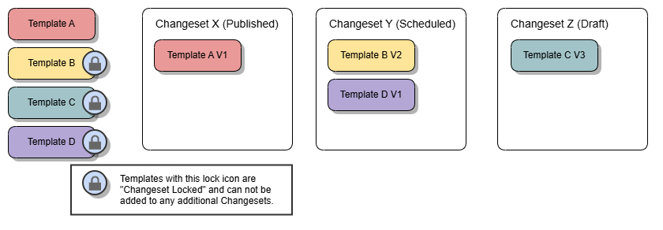

*Image 397: Extracted from page 13*

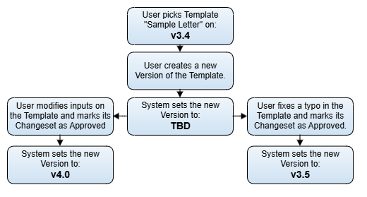

*Image 398: Extracted from page 13*

*Image 399: Extracted from page 13*

*Image 400: Extracted from page 13*

*Image 401: Extracted from page 13*

*Image 402: Extracted from page 13*

*Image 403: Extracted from page 13*

*Image 404: Extracted from page 13*

*Image 405: Extracted from page 13*

*Image 406: Extracted from page 13*

*Image 407: Extracted from page 13*

*Image 408: Extracted from page 13*

*Image 409: Extracted from page 13*

*Image 410: Extracted from page 13*

*Image 411: Extracted from page 13*

*Image 412: Extracted from page 13*

*Image 413: Extracted from page 13*

*Image 414: Extracted from page 13*

*Image 415: Extracted from page 13*

*Image 416: Extracted from page 13*

*Image 417: Extracted from page 13*

*Image 418: Extracted from page 13*

*Image 419: Extracted from page 13*

*Image 420: Extracted from page 13*

*Image 421: Extracted from page 13*

### Vector Graphics on Page 13

*This page contains 67 vector graphic elements (diagrams, shapes, lines)*

---

## Page 14

Workflows
What is a Workflow?
A Workflow answers the question: Why are we sending out this correspondence?  The user can indicate that they are "Developing a Claim," or "Rating a 
Claim," or "Awarding a Claim," and we can cater the Templates available to them based on that chosen Workflow.
These relationships between Full Templates and Workflows are managed in the Template Manager so that ECM-L users are empowered to control those 
relationships on their own.
When a Letter Manager user goes to create a piece of correspondence, the first thing they need to do is choose from a list of optional Templates to base 
that Correspondence on - the Workflow they are in will help to shape that list of options, so that they're only shown options that are relevant to what they 
are currently trying to accomplish.
Example
This diagram illustrates the relationship between Workflows and Full 
within a Line of Business.
Templates 
 
Full Templates A, B, and C, are aligned to Workflow A1, so a user accessing the Letter Manager through that Workflow will be able to choose from those 
Templates when creating a Letter Instance.  Even though Full Template D is a part of the same Line of Business, since it is not aligned to Workflow A1, it 
will not appear in the list of available Templates for that Workflow.
Line of Business
Workflow
Available 
s 
Template
A
A1
A, B, C
A2
C, D, E, F
A3
None
System Actors and Automated Activities
The ECM-L components provide the perfect platform for Lines of Business to integrate with for any sort of automated letter generation needs.
Automatic Letter Generation

### Images on Page 14

*Image 422: Extracted from page 14*

*Image 423: Extracted from page 14*

*Image 424: Extracted from page 14*

*Image 425: Extracted from page 14*

*Image 426: Extracted from page 14*

*Image 427: Extracted from page 14*

*Image 428: Extracted from page 14*

*Image 429: Extracted from page 14*

*Image 430: Extracted from page 14*

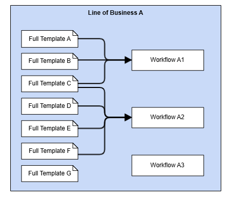

*Image 431: Extracted from page 14*

*Image 432: Extracted from page 14*

*Image 433: Extracted from page 14*

*Image 434: Extracted from page 14*

*Image 435: Extracted from page 14*

*Image 436: Extracted from page 14*

*Image 437: Extracted from page 14*

*Image 438: Extracted from page 14*

*Image 439: Extracted from page 14*

*Image 440: Extracted from page 14*

*Image 441: Extracted from page 14*

*Image 442: Extracted from page 14*

*Image 443: Extracted from page 14*

*Image 444: Extracted from page 14*

*Image 445: Extracted from page 14*

*Image 446: Extracted from page 14*

*Image 447: Extracted from page 14*

*Image 448: Extracted from page 14*

*Image 449: Extracted from page 14*

*Image 450: Extracted from page 14*

*Image 451: Extracted from page 14*

*Image 452: Extracted from page 14*

*Image 453: Extracted from page 14*

*Image 454: Extracted from page 14*

### Vector Graphics on Page 14

*This page contains 107 vector graphic elements (diagrams, shapes, lines)*

---

## Page 15

The ECM-L API provides an interface that your systems can use to interact with the ECM-L components as if they were a human end-user.  Systems are 
able to Create a Letter Instance, and Finalize a Letter Instance, and even to run a Letter Instance all the way through its lifecycle from Creation to 
Finalization in a single request.
Auto-Finalize / Fast-Tracking
System Actors can use the ECM-L API's "createLetterInstance" with the "autoFinalize" flag set to true in the request to in one action create a Letter 
Instance and move it all the way through to Finalization.  This is for Systems that want to create a Letter Instance and get a PDF without user interaction.
They would first hit this "createLetterInstance" endpoint which would result in a Finalized Letter Instance, and then they would hit the ECM-L endpoint to 
Render the Letter Instance as a PDF ("renderLetterInstance").
Other System Actor Activities
An external system may want to take other actions within the ECM-L components based on user interaction in their own system, or on something else like 
a rules engine, and all of that is possible via the ECM-L API as well.  All of the operations in the ECM-L API are available for use by System Actors.
Eventing
The ECM-L components emit Kafka Events as actions are taken throughout the system.  When a Letter Instance is Finalized, for example, an event is 
emitted that indicates this has happened.  A Line of Business system can be updated to listen for those Finalization Events and to take actions that will be 
triggered when those Events take place.
Because we've provided these enterprise tools for the Lines of Business to handle these things on their own, specialized LOB-specific behavior no longer 
constitutes development work and code changes within the ECM-L components, and all of these changes occur within those external components instead.
Eventing Use Case Example
A Line of Business needs to create something called a "Tracked Item" based on the Letter Data that was entered in by its Letter Manager end-users, 
anytime a Letter is Finalized.  They can update their system to listen for Letter Finalization Events and have their system hit the ECM-L API's "getLetterInst
ance" endpoint to get the Letter Instance data.  Their system can now get the information from the Letter Instance data and use that to create their Tracked 
Items.
Examples of Events
The Eventing framework is robust and we essentially produce an Event for any life-cycle change for any element within the ECM-L components.  This 
allows for Lines of Business to automate  specialized activities based on any changes to their Templates, Letters, and other content.
d
The Lifecycle Diagrams elaborate on the Element-specific Events that exist, but here are some examples:
Connection Configuration Published Event
Key Parameter Type Retired Event
Changeset Submitted for Approval Event
Template Version Retired Event
Letter Instance Finalized Event
Style Guide and Special Characters
Style Guide
The underlying stylesheets and the styling / formatting options provided to Template Manager users to create documents generated by the ECM-L 
components are based on the VA Style Guide.  There is no way to update or deviate from the provided styling options without an enhancement and 
development time to address it.  For more information about the VA Style Guide, see here: 
.
2019 VA Style Guide
Special Characters
The content of Correspondence can be complex and can require special characters that other more normalized data inputs allow.  For the ECM-L 
components we have created a whitelist of special characters that are allowed and have outlined situations in which those allowable characters might 
change or vary.  Any updates to this list of acceptable special characters will require an enhancement and development time to address.
Navigate here to view the details about which Special Characters are allowed: 
.
Special Character Allowances in the ECM-L Components
JSON Path Expression Examples
He is a list of some example JSON Path expressions, which our users would use during the configuration process for a Data Resource, for example.
Expression
Description
Example JSON
Result
$.veteranName
Simple property 
access
{"veteranName": "John Smith", "serviceNumber": 
"123456789"}
"John Smith"
$.address.city
Nested property 
access
{"address": {"city": "Richmond", "state": "VA", 
"zip": "23230"}}
"Richmond"

### Images on Page 15

*Image 455: Extracted from page 15*

*Image 456: Extracted from page 15*

*Image 457: Extracted from page 15*

*Image 458: Extracted from page 15*

*Image 459: Extracted from page 15*

*Image 460: Extracted from page 15*

*Image 461: Extracted from page 15*

*Image 462: Extracted from page 15*

*Image 463: Extracted from page 15*

*Image 464: Extracted from page 15*

*Image 465: Extracted from page 15*

*Image 466: Extracted from page 15*

*Image 467: Extracted from page 15*

*Image 468: Extracted from page 15*

*Image 469: Extracted from page 15*

*Image 470: Extracted from page 15*

*Image 471: Extracted from page 15*

*Image 472: Extracted from page 15*

*Image 473: Extracted from page 15*

*Image 474: Extracted from page 15*

*Image 475: Extracted from page 15*

*Image 476: Extracted from page 15*

*Image 477: Extracted from page 15*

*Image 478: Extracted from page 15*

*Image 479: Extracted from page 15*

*Image 480: Extracted from page 15*

*Image 481: Extracted from page 15*

*Image 482: Extracted from page 15*

*Image 483: Extracted from page 15*

*Image 484: Extracted from page 15*

*Image 485: Extracted from page 15*

*Image 486: Extracted from page 15*

### Vector Graphics on Page 15

*This page contains 121 vector graphic elements (diagrams, shapes, lines)*

---

## Page 16

$.claims[0]
Array element by 
index
{"claims": ["disability", "education", "healthcare"]}
"disability"
$.claims[*]
All array elements
{"claims": ["disability", "education", "healthcare"]}
["disability", 
"education", 
"healthcare"]
$.claims[-1]
Last array element
{"claims": ["disability", "education", "healthcare"]}
"healthcare"
$.veterans[*].name
Property from all 
array objects
{"veterans": [{"name": "John Smith"}, {"name": "Jane 
Doe"}]}
["John Smith", "Jane 
Doe"]
$..benefitType
Recursive descent 
(all benefitType 
properties)
{"veteran": {"benefitType": "disability"}, "spouse": 
{"benefitType": "survivor"}}
["disability", 
"survivor"]
$.veterans[?(@.
serviceYears > 10)]
Filter array by 
condition
{"veterans": [{"name": "John", "serviceYears": 15}, 
{"name": "Jane", "serviceYears": 5}]}
[{"name": "John", 
"serviceYears": 15}]
$.claims[?(@.amount > 
1000 && @.status == 
'approved')]
Multiple filter 
conditions
{"claims": [{"amount": 1500, "status": "approved"}, 
{"amount": 500, "status": "pending"}]}
[{"amount": 1500, 
"status": "approved"}]
$.benefits[?(@.type in 
['disability', 
'education'])]
Filter with IN operator
{"benefits": [{"id": 1, "type": "disability"}, 
{"id": 2, "type": "healthcare"}]}
[{"id": 1, "type": 
"disability"}]
$.veterans[?(@.awards[*] 
== 'Purple Heart')]
Filter by array content
{"veterans": [{"awards": ["Purple Heart", "Bronze 
Star"]}, {"awards": ["Good Conduct"]}]}
[{"awards": ["Purple 
Heart", "Bronze 
Star"]}]
$.veterans[0:2]
Array slice (first 2 
veterans)
{"veterans": ["Smith, John", "Doe, Jane", "Johnson, 
Bob", "Williams, Sue"]}
["Smith, John", "Doe, 
Jane"]
$.lineOfBusiness[?(@.name 
&& @.id)]
Filter objects with 
required fields
{"lineOfBusiness": [{"name": "Claims Processing", 
"id": "VBA-001"}, {"name": "Benefits 
Administration"}]}
[{"name": "Claims 
Processing", "id": 
"VBA-001"}]
Date Formatting
Throughout BIP and the ECM-L components the dates are passed around and stored in UTC format using 
to provide a single global 
ZonedDateTime 
reference point, ensure all timestamps are in the same timezone to provide reliable chronological ordering and records, and that this time zone is 
communicated properly to the consumers of our API's.
In the UI's, and in the generated PDF's, when these dates are presented to an end user, they are displayed for the "ET" time zone, also known as the 
"America / New York" time zone, to comply with VA standards and guidelines.
History and Audit Trail Tracking
Comprehensive timestamped history tracking across all three management systems allows us to maintain an audit trail of user activities and system 
changes that take place in the ECM-L components. In the Template Manager, the system maintains a historical record of all the Changesets and 
versioned content those Changesets manage, with a historical view that tracks their movement through their various lifecycles.  Similarly the Resource 
Manager and Letter manager maintain a timestamped historical record of the content they manage.
These historical records outline when a change was made, a description of the change, and who made it, creating a comprehensive audit trail that 
supports operational troubleshooting and regulatory compliance requirements.
System Level Key Parameter Types
While our goal is to keep the ECM-L components business level logic and concept agnostic, allowing for individual Lines of Business to define the shape 
and content of  their correspondence and the resources those pieces of correspondence use, to provide certain pieces of functionality we are required to 
introduce certain System Level concepts that are shared across the VA.
Changes to the VA's use of these Key Parameter Types could require development intervention, since there are ECM-L components designed specifically 
to work with them.
System Level Key 
Parameter Type
Reason for Inclusion
Participant ID
The Participant ID is a common thread across most of the Lines of Business and more importantly is required to support 
Claim Evidence and Package Manager functionality.
New Name Uniqueness
To prevent ambiguity, confusion, and avoid conflicts, we enforce name uniqueness restrictions throughout the ECM-L components.  In a general sense, 
names for things must be unique.
These restrictions apply whenever a new name is being decided, through the creation of something new, or through the renaming of something that 
already exists.

### Images on Page 16

*Image 487: Extracted from page 16*

*Image 488: Extracted from page 16*

*Image 489: Extracted from page 16*

*Image 490: Extracted from page 16*

*Image 491: Extracted from page 16*

*Image 492: Extracted from page 16*

*Image 493: Extracted from page 16*

*Image 494: Extracted from page 16*

*Image 495: Extracted from page 16*

*Image 496: Extracted from page 16*

*Image 497: Extracted from page 16*

*Image 498: Extracted from page 16*

*Image 499: Extracted from page 16*

*Image 500: Extracted from page 16*

*Image 501: Extracted from page 16*

*Image 502: Extracted from page 16*

*Image 503: Extracted from page 16*

*Image 504: Extracted from page 16*

*Image 505: Extracted from page 16*

*Image 506: Extracted from page 16*

*Image 507: Extracted from page 16*

*Image 508: Extracted from page 16*

*Image 509: Extracted from page 16*

*Image 510: Extracted from page 16*

*Image 511: Extracted from page 16*

*Image 512: Extracted from page 16*

*Image 513: Extracted from page 16*

*Image 514: Extracted from page 16*

*Image 515: Extracted from page 16*

*Image 516: Extracted from page 16*

*Image 517: Extracted from page 16*

*Image 518: Extracted from page 16*

### Vector Graphics on Page 16

*This page contains 258 vector graphic elements (diagrams, shapes, lines)*

---

## Page 17

New 
Name 
Type
New Name Uniqueness Restriction Details
Template 
Version 
Must not match any current Template Name or ACTIVE / DRAFT status Template Version Name within the same Line of Business.
Resource
Must not match any existing Resource Name within the same Line of Business.
Input
Must not match any existing Input Name that is a sibling of this input.  So if at the root level of a Template, there must be no other Inputs 
with that name at the root level, or if in an Input Group, there must be no other Inputs with that name in the Input Group, etc.
Workflow
Must not match any existing Workflow Name within the same Line of Business.
Key 
Paramete
r Type
Must not match any existing System Level Key Parameter Typeor any Key Parameter Type Name within the same Line of Business.
Solution Space and Discussion
The solution space describes the architectural context related to the problem/solution in a 4+1 style document. A 4+1 Design is a human-readable, 
standardized way of viewing an architecture from multiple perspectives. Each perspective is complementary, offering a different way to look at a particular 
architecture. Taken as a whole, a 4+1 Design is a comprehensive way to communicate an architecture. 
Use Case View
 (VASI Description)
Capability Viewpoint Vision (CV-1)
Enterprise Correspondence Management - Letters (ECM-L) will reside on the Benefits Integration Platform as a Service (#2295) and is under the Veterans 
Benefits Management System (VBMS #1728) Product. ECM-L is an enterprise-level system that streamlines the process of managing letter templates and 
generating letters across the Veterans Benefits Administration (VBA). It is accessible to multiple Lines of Business (LoBs) and allows each one to 
independently manage their own templates and generate correspondence from drafts through finalization. ECM-L can be integrated into the business logic 
of each LoB’s systems through APIs, predefined hooks, and other integration points, as its ecosystem is LoB-agnostic and highly extensible.
Capability Viewpoint Taxonomy (CV-2)
The following diagram provides an architectural description of the overall, high-level vision and for the capability of this component/tenant.
se
Use Ca
The following diagram visually represents the interactions between users, or actors, and the system. The diagram illustrates the functional requirements of 
the 
.
system

### Images on Page 17

*Image 519: Extracted from page 17*

*Image 520: Extracted from page 17*

*Image 521: Extracted from page 17*

*Image 522: Extracted from page 17*

*Image 523: Extracted from page 17*

*Image 524: Extracted from page 17*

*Image 525: Extracted from page 17*

*Image 526: Extracted from page 17*

*Image 527: Extracted from page 17*

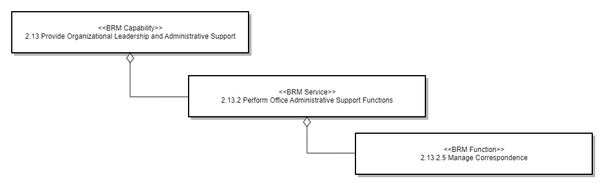

*Image 528: Extracted from page 17*

*Image 529: Extracted from page 17*

*Image 530: Extracted from page 17*

*Image 531: Extracted from page 17*

*Image 532: Extracted from page 17*

*Image 533: Extracted from page 17*

*Image 534: Extracted from page 17*

*Image 535: Extracted from page 17*

*Image 536: Extracted from page 17*

*Image 537: Extracted from page 17*

*Image 538: Extracted from page 17*

*Image 539: Extracted from page 17*

*Image 540: Extracted from page 17*

*Image 541: Extracted from page 17*

*Image 542: Extracted from page 17*

*Image 543: Extracted from page 17*

*Image 544: Extracted from page 17*

*Image 545: Extracted from page 17*

*Image 546: Extracted from page 17*

*Image 547: Extracted from page 17*

*Image 548: Extracted from page 17*

*Image 549: Extracted from page 17*

*Image 550: Extracted from page 17*

*Image 551: Extracted from page 17*

### Vector Graphics on Page 17

*This page contains 114 vector graphic elements (diagrams, shapes, lines)*

---

## Page 18

Main Actors
The following table describes the actors listed in the diagram above. An actor is user in the scope of this architecture and can be a human user or a 
"system actor" as appropriate.
Name
System
Description
Line of 
Busines
s 
Adminis
trator
Resource 
Manager
A User with the requisite roles and permissions to manage Resources and Connection Configurations. 
Line of 
Busines
s 
Adminis
trator
Template 
Manager 
A User that manages Workflows, including creating, modifying, and retiring Workflows, configuring them with Key Parameters, 
and aligning Full Templates to them.
Change
set 
Editor
Template 
Manager 
A User that manages Templates through Changesets, including creating, updating/modifying, testing, recalling, and 
 
cancelling
Changesets, to facilitate the publication and/or retirement of one or more Template Versions.  This user can interact with and 
manage Template Versions, File Versions and Retirement Actions in a Changeset, allowing for them to create (specifying a 
Template's content and configuration), read, update, test, cancel, and retire specific Template Versions.
This user can also add Labels to Templates.
Change
set 
Publish
er
Template 
Manager
A User responsible for Approving, Scheduling, and Publishing Changesets. Changesets can contain Template Versions, File 
Versions and Retirement Actions. When a Changeset Publisher Approves a Changeset all contents are APPROVED.

### Images on Page 18

*Image 552: Extracted from page 18*

*Image 553: Extracted from page 18*

*Image 554: Extracted from page 18*

*Image 555: Extracted from page 18*

*Image 556: Extracted from page 18*

*Image 557: Extracted from page 18*

*Image 558: Extracted from page 18*

*Image 559: Extracted from page 18*

*Image 560: Extracted from page 18*

*Image 561: Extracted from page 18*

*Image 562: Extracted from page 18*

*Image 563: Extracted from page 18*

*Image 564: Extracted from page 18*

*Image 565: Extracted from page 18*

*Image 566: Extracted from page 18*

*Image 567: Extracted from page 18*

*Image 568: Extracted from page 18*

*Image 569: Extracted from page 18*

*Image 570: Extracted from page 18*

*Image 571: Extracted from page 18*

*Image 572: Extracted from page 18*

*Image 573: Extracted from page 18*

*Image 574: Extracted from page 18*

*Image 575: Extracted from page 18*

*Image 576: Extracted from page 18*

*Image 577: Extracted from page 18*

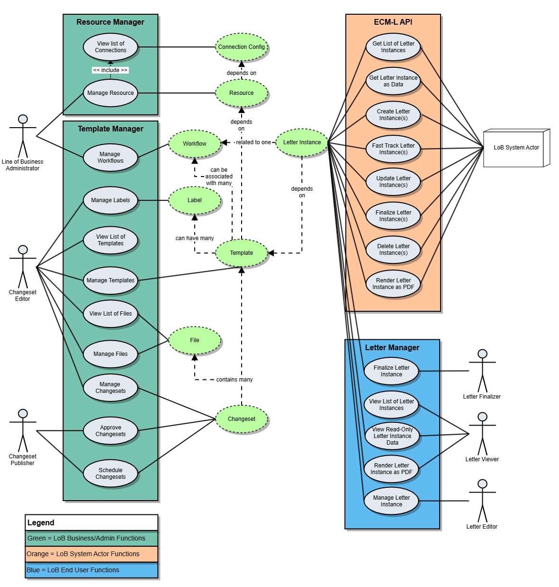

*Image 578: Extracted from page 18*

*Image 579: Extracted from page 18*

*Image 580: Extracted from page 18*

*Image 581: Extracted from page 18*

*Image 582: Extracted from page 18*

*Image 583: Extracted from page 18*

*Image 584: Extracted from page 18*

### Vector Graphics on Page 18

*This page contains 130 vector graphic elements (diagrams, shapes, lines)*

---

## Page 19

Line of 
Busines
s 
System 
Actor
ECM-L A
 
PI
External systems that interact with the 
to conduct automated operations such as sending out correspondence 
ECM-L ecosystem 
without user intervention.
Letter 
Finalizer
Letter 
Manager
A user with the ability to Finalize Letter Instances in the Letter Manager.
Letter 
Editor
Letter 
Manager
A user with the ability to create, read, update, and delete Letter Instances in the Letter Manager. 
Letter 
Viewer
Letter 
Manager
A user with the ability to view list of Letter Instances, Letter Instance Data, and the Rendered PDF in the Letter Manager.
System/Tenant/Application Description
The following table describes each system/tenant/application (rectangles) listed in the diagram above. 
System 
Name
Description
Resource 
Manager 
The tool that allows users to create and m
e Resources and Connection Configurations. 
anag
Template 
Manager 
The tool used to manage Changesets, Workflows, Labels and Templates.
ECM-L API
The ECM-L API is the outward face of the ECM-L system and allows for external system actors to interact with the ECM-L system in lieu 
of a human actor directly interacting with one of the individual components.
Letter 
Manager 
The tool used to manage Letter Instances.
Main User Functions (Use Cases)
The following table describes each of the use cases (ovals) in the diagram above. 
Actor(s)
System
Ability
Details
Line of 
Business 
Administrat
or
Resource 
Manager
Manage 
Resource
The Line of Business Administrator is able to create, modify, retire, and 
 Resources (Data/File). The Line of Business 
delete
Administrator will need to be able to view the list of AVAILABLE Connection Configurations to create Resources.
Template 
Manager
Manage 
Workflows
The LOB Admin accesses the Template Manager system and is able to create, modify, and retire Workflows, and add 
Workflow Key Parameters as well as align Full Templates to those Workflows.
Changeset 
Editor
Template 
Manager
Manage 
Templates
The Changeset 
 accesses the Template Manager to create, modify, and retire Templates.  This includes the ability to add 
Editor
or remove Resources for a Template. The Changeset Editor also has the ability to add Inputs to a Template and format the 
values, as well as add conditional Restrictions to a Template.
View List of 
Templates
The Changeset Editor is able to get a full list of all Templates and their respective Versions, for the Line of Business they are 
working in.
Manage 
Files
The Changeset Editor is able to manage, via a Changeset, different types of Files, such as PDFs that can be used as an 
Attachment and Images, that could be inserted into the content of a Template.
View List of 
Files
The Changeset Editor is able to get a full list of all Files and their respective Versions, for the Line of Business they are working 
in.
Manage 
Labels
The Changeset Editor accesses the Template Manager system and is able to create, modify, retire, and 
 Template 
delete
Labels, and add Labels to Templates.
Manage 
Changesets
A Changeset Editor is able to create, test, and cancel Changesets.  
Changeset 
Publisher
Template 
Manager
Approve 
Changesets
Once a Changeset is in "READY FOR APPROVAL" state, a user with the Changeset Publisher role can Approve the 
Changeset. Changesets can contain Template Versions, File Versions and Retirement Actions. When a Changeset Publisher 
Approves a Changeset all contents are APPROVED.
Schedule 
Changesets
The Changeset Publisher is able to Schedule Publication of the Changeset immediately or in the future.
Line of 
Business 
System 
Actor
ECM-L 
API
Get List of 
Letter 
Instances
A Line of Business System Actor is able to get Letter Instances based on a given Workflow and Key Parameters. 

### Images on Page 19

*Image 585: Extracted from page 19*

*Image 586: Extracted from page 19*

*Image 587: Extracted from page 19*

*Image 588: Extracted from page 19*

*Image 589: Extracted from page 19*

*Image 590: Extracted from page 19*

*Image 591: Extracted from page 19*

*Image 592: Extracted from page 19*

*Image 593: Extracted from page 19*

*Image 594: Extracted from page 19*

*Image 595: Extracted from page 19*

*Image 596: Extracted from page 19*

*Image 597: Extracted from page 19*

*Image 598: Extracted from page 19*

*Image 599: Extracted from page 19*

*Image 600: Extracted from page 19*

*Image 601: Extracted from page 19*

*Image 602: Extracted from page 19*

*Image 603: Extracted from page 19*

*Image 604: Extracted from page 19*

*Image 605: Extracted from page 19*

*Image 606: Extracted from page 19*

*Image 607: Extracted from page 19*

*Image 608: Extracted from page 19*

*Image 609: Extracted from page 19*

*Image 610: Extracted from page 19*

*Image 611: Extracted from page 19*

*Image 612: Extracted from page 19*

*Image 613: Extracted from page 19*

*Image 614: Extracted from page 19*

*Image 615: Extracted from page 19*

*Image 616: Extracted from page 19*

### Vector Graphics on Page 19

*This page contains 308 vector graphic elements (diagrams, shapes, lines)*

---

## Page 20

Get Letter 
Instance as 
Data
A Line of Business System Actor is able to get the Letter Instance as a JSON object.
Create 
Letter 
Instance(s)
A Line of Business System Actor is able to create a Letter Instance.
Fast Track 
Letter 
Instance(s)
A Line of Business System Actor creates a Letter Instance and "fast tracks" it through the Letter Instance lifecycle, through 
Finalization.  This makes use of the same operation as the "Create Letter Instance(s)" use case but passing in an optional 
"autoFinalize" flag.
Update 
Letter 
Instance(s)
A Line of Business System Actor has the ability to make modifications to a Letter Instance(s).
Finalize 
Letter 
Instance(s)
A Line of Business System Actor has the ability to Finalize a Letter Instance(s).
Delete 
Letter 
Instance(s)
A Line of Business System Actor has the ability to soft delete a Letter Instance(s).
Render 
Letter 
Instance(s) 
as PDF
A Line of Business System Actor is able to Render a Letter Instance as a PDF.
Letter 
Finalizer
Letter 
Manager
Finalize 
Letter 
Instance(s)
The Letter Finalizer has the ability to Finalize a Letter Instance.  Finalizing the Letter freezes its content and makes it 
immutable / unchanging.
Letter 
Viewer
Letter 
Manager
View Letter 
Instance(s) 
Data
The Letter Viewer has the ability to view Read-Only Letter Instance Data.
Render 
Letter 
Instance(s) 
as PDF
The Letter Viewer is able to Render a Letter Instance as a PDF.
View List of 
Letter 
Instance(s)
The Letter Viewer is able to view a List of available Letter Instances.
Letter 
Editor
Letter 
Manager
Manage 
Letter 
Instance(s)
The Letter Editor has the ability to create, read, update, and delete a Letter Instance.
Primary Systems High Level Operational Viewpoint (OV-1)
The diagram below is a high level overview of the main architectural components of ECM-L and the functions they facilitate in the value stream.
The first section of the value stream, the intake process, starts as a Jira ticket. This section consists of mainly manual processes provisioning space and 
storage, establishing user access requirements, and integrating with external systems. At this point in the process Line of Business (LoB) data needs will 
be identified and API connections will be established to accommodate those needs.
The ECM-L LoB Business User Processes box consists of two main values; creating Resources and creating Templates. Resources are assets that will 
point to LoB Data using the established API connections to populate Letter Instances as needed. The ability to create, test, and manage Resources is 
realized by the Resource Manager. Creating and managing Templates, or Letter Templates, is realized through the Template Manager. 
The ECM-L LoB End User Processes box represents end user interactions with the system to instantiate Letter Instances generated from Templates and 
populated by user Inputs and Resources.
LoB System Processes encapsulates the ability to access, store, and send Letters as the LoB sees fit. Access to the Letters is capable through the ECM-L 
API.

### Images on Page 20

*Image 617: Extracted from page 20*

*Image 618: Extracted from page 20*

*Image 619: Extracted from page 20*

*Image 620: Extracted from page 20*

*Image 621: Extracted from page 20*

*Image 622: Extracted from page 20*

*Image 623: Extracted from page 20*

*Image 624: Extracted from page 20*

*Image 625: Extracted from page 20*

*Image 626: Extracted from page 20*

*Image 627: Extracted from page 20*

*Image 628: Extracted from page 20*

*Image 629: Extracted from page 20*

*Image 630: Extracted from page 20*

*Image 631: Extracted from page 20*

*Image 632: Extracted from page 20*

*Image 633: Extracted from page 20*

*Image 634: Extracted from page 20*

*Image 635: Extracted from page 20*

*Image 636: Extracted from page 20*

*Image 637: Extracted from page 20*

*Image 638: Extracted from page 20*

*Image 639: Extracted from page 20*

*Image 640: Extracted from page 20*

*Image 641: Extracted from page 20*

*Image 642: Extracted from page 20*

*Image 643: Extracted from page 20*

*Image 644: Extracted from page 20*

*Image 645: Extracted from page 20*

*Image 646: Extracted from page 20*

*Image 647: Extracted from page 20*

*Image 648: Extracted from page 20*

### Vector Graphics on Page 20

*This page contains 196 vector graphic elements (diagrams, shapes, lines)*

---

## Page 21

System 
(VASI)
System 
Item
Interaction
ECM-L 
(3000)
Resource 
Manager
Uses the LoB connection to create and manage Resources.
ECM-L 
(3000)
Template 
Manager
Creates and Manages the LoB Templates.
ECM-L 
(3000)
Letter 
Manager
Creates and Manages the LoB Letter Instances.
ECM-L 
(3000)
ECM-L API
Accesses the LoB Data and Letters for the LoB.  Letter Instances are able to be stored in Claim Evidence and 
distributed via Package Manager.
VEFS (3023)
Claim 
Evidence
Stores the Finalized PDF related to a claim.
PacMan 
(2993)
Package 
Manager
Creates a package for mail distribution.
LoB System
LoB System
Uses its connection to establish Resources, Templates and populate Letter Instances with the appropriate data and 
access the Finalized Letter Instances.
Logical View
The Logical View describes the conceptual view of the functionality and of the systems that will participate. This view defines what nouns are involved and 
the relationship between them. For example, it may decompose the design into sub-systems and packages, and for significant packages, the 
decomposition into classes and class utilities. This section may include the Business Object Model, states and transitions for key objects, and other key 
details about classes and attributes.
Systems Interface Description (SV-1)
The following 
 provides a detailed view of system interfaces, depicting how systems and components interact with each other within the 
diagram
architecture.

### Images on Page 21

*Image 649: Extracted from page 21*

*Image 650: Extracted from page 21*

*Image 651: Extracted from page 21*

*Image 652: Extracted from page 21*

*Image 653: Extracted from page 21*

*Image 654: Extracted from page 21*

*Image 655: Extracted from page 21*

*Image 656: Extracted from page 21*

*Image 657: Extracted from page 21*

*Image 658: Extracted from page 21*

*Image 659: Extracted from page 21*

*Image 660: Extracted from page 21*

*Image 661: Extracted from page 21*

*Image 662: Extracted from page 21*

*Image 663: Extracted from page 21*

*Image 664: Extracted from page 21*

*Image 665: Extracted from page 21*

*Image 666: Extracted from page 21*

*Image 667: Extracted from page 21*

*Image 668: Extracted from page 21*

*Image 669: Extracted from page 21*

*Image 670: Extracted from page 21*

*Image 671: Extracted from page 21*

*Image 672: Extracted from page 21*

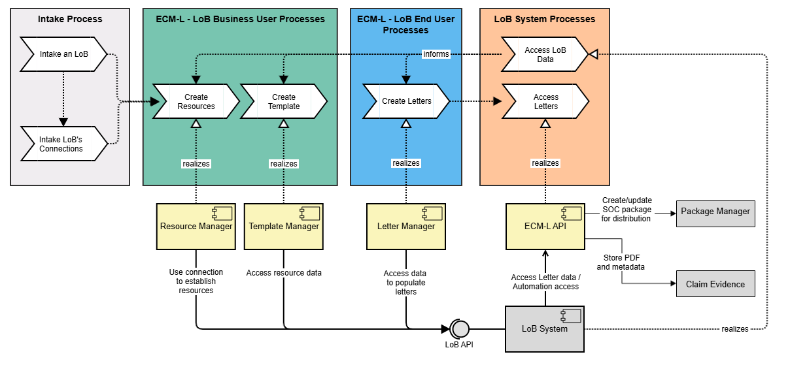

*Image 673: Extracted from page 21*

*Image 674: Extracted from page 21*

*Image 675: Extracted from page 21*

*Image 676: Extracted from page 21*

*Image 677: Extracted from page 21*

*Image 678: Extracted from page 21*

*Image 679: Extracted from page 21*

*Image 680: Extracted from page 21*

*Image 681: Extracted from page 21*

### Vector Graphics on Page 21

*This page contains 163 vector graphic elements (diagrams, shapes, lines)*

---

## Page 22

Legend
Gray Rectangle = External to core system(s)
White = Internal to core system(s)
Component References Table
Name
Description
 Port
 Protocol
ECM-L Content 
Database
Database containing all ECM-L related data. Database containing "dry" non-contextual data, uncontaminated with PII
/PHI/etc.
1521
TCP
ECM-L Letters 
Database
Database for storage of contextual data containing PII/PHI/etc.
1521
TCP
Resource Manager API
Internal API for the Resource Manager
443
HTTPS
/REST
Template Manager API
Internal API for the Template Manager
443
HTTPS
/REST
Letter Manager API
Internal API for the Letter Manager
443
HTTPS
/REST
ECM-L API
The API for the umbrella service for the ECM-L system, integrated with all of the internal components.
443
HTTPS
/REST
Claim Evidence
External API for storage of documents in a Veteran's EFolder.
443
HTTPS
/REST
Package Manager
External API for distributing packages of documents from a Veteran's EFolder.
443
HTTPS
/REST
FTI Environment Example SV-1

### Images on Page 22

*Image 682: Extracted from page 22*

*Image 683: Extracted from page 22*

*Image 684: Extracted from page 22*

*Image 685: Extracted from page 22*

*Image 686: Extracted from page 22*

*Image 687: Extracted from page 22*

*Image 688: Extracted from page 22*

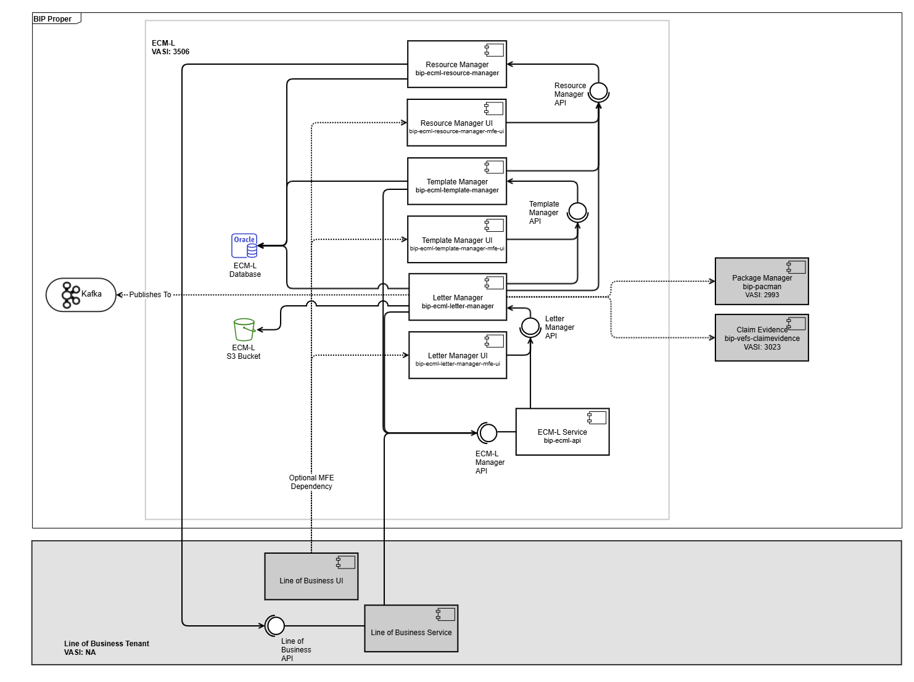

*Image 689: Extracted from page 22*

*Image 690: Extracted from page 22*

*Image 691: Extracted from page 22*

*Image 692: Extracted from page 22*

*Image 693: Extracted from page 22*

*Image 694: Extracted from page 22*

*Image 695: Extracted from page 22*

*Image 696: Extracted from page 22*

*Image 697: Extracted from page 22*

*Image 698: Extracted from page 22*

*Image 699: Extracted from page 22*

*Image 700: Extracted from page 22*

*Image 701: Extracted from page 22*

*Image 702: Extracted from page 22*

*Image 703: Extracted from page 22*

*Image 704: Extracted from page 22*

*Image 705: Extracted from page 22*

*Image 706: Extracted from page 22*

*Image 707: Extracted from page 22*

*Image 708: Extracted from page 22*

*Image 709: Extracted from page 22*

*Image 710: Extracted from page 22*

*Image 711: Extracted from page 22*

*Image 712: Extracted from page 22*

*Image 713: Extracted from page 22*

*Image 714: Extracted from page 22*

### Vector Graphics on Page 22

*This page contains 229 vector graphic elements (diagrams, shapes, lines)*

---

## Page 23

This diagram provides a detailed view of system interfaces with service providers and service consumers, depicting how ECM-L components interact with 
each other in BIP FTI Secure Enclave for creation and management of FTI-related correspondence. The FTI Secure Enclave is a protected environment 
within Veterans Benefits platform specifically designed to handle Federal Tax information in compliance with IRS security requirements.
Legend
Gray Rectangle = External to core system(s)
White = Internal to core system(s)
Component References Table
Name
Description
 Port
 Protocol
ECM-L Content 
Database
Database containing "dry" non-contextual data, uncontaminated with PII/PHI/etc.
1521
TCP
ECM-L Letters 
Database
Database containing contextual data contaminated with PII/PHI/etc.
1521
 TCP
Resource Manager 
API
Internal API for the Resource Manager
443
HTTPS
/REST
Template Manager 
API
Internal API for the Template Manager
443
HTTPS
/REST
Letter Manager API
Internal API for the Letter Manager
443
HTTPS
/REST
ECM-L API
The API for the umbrella service for the ECM-L system, integrated with all of the internal components.
443
HTTPS
/REST
FTI File Repo
FTI File Repository is the system of record for documents that contain Federal Tax Information and provides API access 
to those documents.
443
HTTPS
/REST
Services Context (SvcV-1) (VASI APIs)
The following diagram describes service compositions and interactions, and any immediate dependencies. The diagram highlights external system 
services that connect to the focal architecture.

### Images on Page 23

*Image 715: Extracted from page 23*

*Image 716: Extracted from page 23*

*Image 717: Extracted from page 23*

*Image 718: Extracted from page 23*

*Image 719: Extracted from page 23*

*Image 720: Extracted from page 23*

*Image 721: Extracted from page 23*

*Image 722: Extracted from page 23*

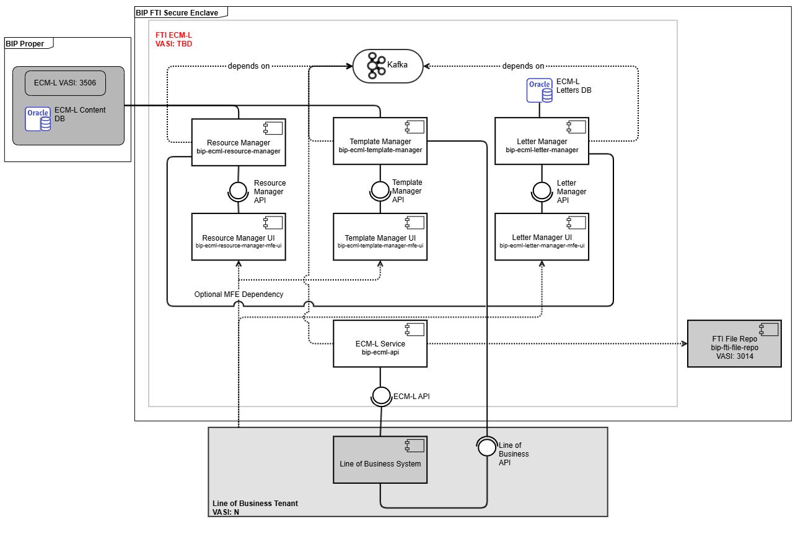

*Image 723: Extracted from page 23*

*Image 724: Extracted from page 23*

*Image 725: Extracted from page 23*

*Image 726: Extracted from page 23*

*Image 727: Extracted from page 23*

*Image 728: Extracted from page 23*

*Image 729: Extracted from page 23*

*Image 730: Extracted from page 23*

*Image 731: Extracted from page 23*

*Image 732: Extracted from page 23*

*Image 733: Extracted from page 23*

*Image 734: Extracted from page 23*

*Image 735: Extracted from page 23*

*Image 736: Extracted from page 23*

*Image 737: Extracted from page 23*

*Image 738: Extracted from page 23*

*Image 739: Extracted from page 23*

*Image 740: Extracted from page 23*

*Image 741: Extracted from page 23*

*Image 742: Extracted from page 23*

*Image 743: Extracted from page 23*

*Image 744: Extracted from page 23*

*Image 745: Extracted from page 23*

*Image 746: Extracted from page 23*

*Image 747: Extracted from page 23*

### Vector Graphics on Page 23

*This page contains 213 vector graphic elements (diagrams, shapes, lines)*

---

## Page 24

Legend
Gray Rectangle = External to core system(s)
White = Internal to core system(s)
Service 
/ API
Description
Resource 
Manager
Service providing LoB with the ability to create, test, replace, and retire Resources.
Template 
Manager
Service providing LoB with the ability to create, test and publish Changesets as well as create, test and retire Templates.
Letter 
Manager
Service providing ability to create Letter Instances, the Letter Manager will grab the Template and populate using Resources.
ECM-L 
API
ECM-L API provides the LoB system with access to the Letter Instances for sending and storing.  ECM-L API is an outward-facing API for 
external applications to use to interact with the ECM-L components; it can Render Letter Instances as PDFs as well as handle the storage 
(in Claim Evidence) and distribution (via Package Manager) of generated PDFs.
LoB API
LoB API is a placeholder for the connection that will be set up for Resources to point to and access data from when populating a Template.
Services Resource Flow (SvcV-2)
The following diagram specifies the Resource Flows between Services and may also list the protocol stacks used in connections, providing a precise 
specification of a connection between Services. 
Legend

### Images on Page 24

*Image 748: Extracted from page 24*

*Image 749: Extracted from page 24*

*Image 750: Extracted from page 24*

*Image 751: Extracted from page 24*

*Image 752: Extracted from page 24*

*Image 753: Extracted from page 24*

*Image 754: Extracted from page 24*

*Image 755: Extracted from page 24*

*Image 756: Extracted from page 24*

*Image 757: Extracted from page 24*

*Image 758: Extracted from page 24*

*Image 759: Extracted from page 24*

*Image 760: Extracted from page 24*

*Image 761: Extracted from page 24*

*Image 762: Extracted from page 24*

*Image 763: Extracted from page 24*

*Image 764: Extracted from page 24*

*Image 765: Extracted from page 24*

*Image 766: Extracted from page 24*

*Image 767: Extracted from page 24*

*Image 768: Extracted from page 24*

*Image 769: Extracted from page 24*

*Image 770: Extracted from page 24*

*Image 771: Extracted from page 24*

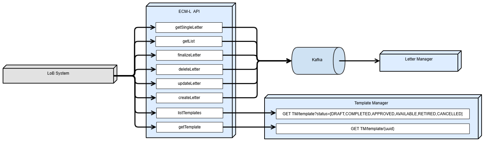

*Image 772: Extracted from page 24*

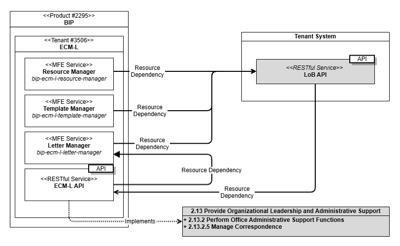

*Image 773: Extracted from page 24*

*Image 774: Extracted from page 24*

*Image 775: Extracted from page 24*

*Image 776: Extracted from page 24*

*Image 777: Extracted from page 24*

*Image 778: Extracted from page 24*

*Image 779: Extracted from page 24*

*Image 780: Extracted from page 24*

*Image 781: Extracted from page 24*

### Vector Graphics on Page 24

*This page contains 128 vector graphic elements (diagrams, shapes, lines)*

---

## Page 25

Gray Rectangle = External to core system(s)
White = Internal to core system(s)
API Operations Lists
Below are lists of the available operations for the different API's in the ECM-L components.
Operational Diagrams
We have a growing library of diagrams mapping out individual ECM-L operations that you can view here: 
.
ECM-L Operational Diagrams
Below are table-based representations of the operations for each component.
Resource Manager API Operations
      
 Click arrow to View Resource Manager Operations List.
Template Manager API Operations
      
 Click here to View Template Manager Operations List.
Letter Manager API Operations
      
 Click here to View Letter Manager Operations.
ECM-L API Operations
      
 Click here to View ECM-L API Operations.
 (OV-6b)
State Transitions
The following diagrams map out the various states of being for individual ECM-L elements and the flow patterns between those states, as well any events 
that are triggered as these elements transition from one state to the next.  These state transition diagrams represent the "heartbeat" of the ECM-L 
ecosystem and are grounded in an event-based architectural philosophy.
Lifecycle Interactions and Availability
This diagram helps to outline the concept of AVAILABILITY and how the different elements of the ECM-L components relate to one another in their 
Lifecycles.
Before an element of one of the ECM-L components is ready to be consumed and used, it must be made AVAILABLE.
Once a 
 is made AVAILABLE by a user, it can be used to create a new DRAFT 
.
Connection Configuration
Resource Version
Once a 
 is made AVAILABLE by a user, it can be used in the configuration of a new DRAFT 
Resource Version
Template Version.
Once a 
 is made AVAILABLE by a user, it can be used to create new DRAFT 
.
Template Version
Letter Instances
Resource Manager Elements
These are the lifecycle diagrams for elements belonging to the Resource Manager.
Connection Configuration Lifecycle

### Images on Page 25

*Image 782: Extracted from page 25*

*Image 783: Extracted from page 25*

*Image 784: Extracted from page 25*

*Image 785: Extracted from page 25*

*Image 786: Extracted from page 25*

*Image 787: Extracted from page 25*

*Image 788: Extracted from page 25*

*Image 789: Extracted from page 25*

*Image 790: Extracted from page 25*

*Image 791: Extracted from page 25*

*Image 792: Extracted from page 25*

*Image 793: Extracted from page 25*

*Image 794: Extracted from page 25*

*Image 795: Extracted from page 25*

*Image 796: Extracted from page 25*

*Image 797: Extracted from page 25*

*Image 798: Extracted from page 25*

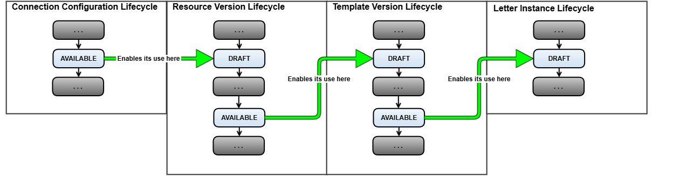

*Image 799: Extracted from page 25*

*Image 800: Extracted from page 25*

*Image 801: Extracted from page 25*

*Image 802: Extracted from page 25*

*Image 803: Extracted from page 25*

*Image 804: Extracted from page 25*

*Image 805: Extracted from page 25*

*Image 806: Extracted from page 25*

*Image 807: Extracted from page 25*

*Image 808: Extracted from page 25*

*Image 809: Extracted from page 25*

*Image 810: Extracted from page 25*

*Image 811: Extracted from page 25*

*Image 812: Extracted from page 25*

*Image 813: Extracted from page 25*

*Image 814: Extracted from page 25*

*Image 815: Extracted from page 25*

*Image 816: Extracted from page 25*

*Image 817: Extracted from page 25*

*Image 818: Extracted from page 25*

### Vector Graphics on Page 25

*This page contains 75 vector graphic elements (diagrams, shapes, lines)*

---

## Page 26

Connection configurations are entered into the system via an intake process through Jira, and then a user is able to move them through their lifecycle in 
the Resource Manager.
 
Jira Realm
These are not statuses that would surface within the ECM-L eco-system because they represent activity outside of it.  Events do not take place here since 
these activities are not a part of the ECM-L components.

### Images on Page 26

*Image 819: Extracted from page 26*

*Image 820: Extracted from page 26*

*Image 821: Extracted from page 26*

*Image 822: Extracted from page 26*

*Image 823: Extracted from page 26*

*Image 824: Extracted from page 26*

*Image 825: Extracted from page 26*

*Image 826: Extracted from page 26*

*Image 827: Extracted from page 26*

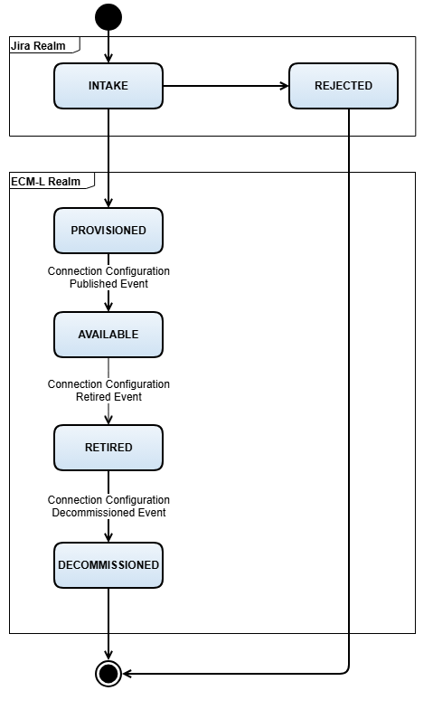

*Image 828: Extracted from page 26*

*Image 829: Extracted from page 26*

*Image 830: Extracted from page 26*

*Image 831: Extracted from page 26*

*Image 832: Extracted from page 26*

*Image 833: Extracted from page 26*

*Image 834: Extracted from page 26*

*Image 835: Extracted from page 26*

*Image 836: Extracted from page 26*

*Image 837: Extracted from page 26*

*Image 838: Extracted from page 26*

*Image 839: Extracted from page 26*

*Image 840: Extracted from page 26*

*Image 841: Extracted from page 26*

*Image 842: Extracted from page 26*

*Image 843: Extracted from page 26*

*Image 844: Extracted from page 26*

*Image 845: Extracted from page 26*

*Image 846: Extracted from page 26*

*Image 847: Extracted from page 26*

*Image 848: Extracted from page 26*

*Image 849: Extracted from page 26*

*Image 850: Extracted from page 26*

*Image 851: Extracted from page 26*

### Vector Graphics on Page 26

*This page contains 64 vector graphic elements (diagrams, shapes, lines)*

---

## Page 27

INTAKE
Dev Ops is processing the necessary intake documentation submitted by a Line of Business (LoB) to configure the ECM-L eco-system 
to interact with and integrate with the API submitted for the Connection Configuration. 
Transitions from this state:
TO 
DESCRIPTION
REJEC
TED
Something went wrong during the processing of the Intake Ticket and Line of Business (LoB) intervention is now needed 
to correct the information in the ticket.
PROVI
SIONED
The 
s have completed what is necessary to validate the integration with the Connection Configuration's targeted 
Dev Op
API. The PROVISIONED Connection Configuration will be visible in the Resource Manager. 
REJECTED
The intake process was unsuccessful.  The Line of Business and Dev Ops teams should work together to determine what caused the 
integration failure and work to address it.
ECM-L Realm
PROVISIONED
The Connection Configuration has made it through the intake process and is ready for a Line of Business Administrator to Test 
it and make it AVAILABLE for use. Should Testing fail, the LOB Admin will need to submit a Change Request for 
 to 
Dev Ops
fix the issue.
Transitions from this state:
EVENT
TO 
DESCRIPTION
ConnectionConfi
gurationPublishe
dEvent
AVAI
LABLE
The LoB Administrator has tested the PROVISIONED Connection and successfully connected 
from within the Resource Manager. The LOB Administrator has changed the Connection from 
PROVISIONED to AVAILABLE. 
AVAILABLE
The Connection Configuration has been properly PROVISIONED and Tested, and the LoB Administrator has made it 
AVAILABLE for use.  While in this state the Connection Configuration is AVAILABLE to be used by Resources. We 
recommend Connection Configuration persist unchanged and be immutable once made AVAILABLE and has been used by 
Resources. 
Transitions from this state:
EVENT
TO 
DESCRIPTION
ConnectionConfiguratio
nRetiredEvent
RETI
RED
An LoB Administrator has indicated that the Connection Configuration can no longer be 
used by the Resources configured to connect to it.
RETIRED
No longer available for use by anything new.
The Connection Configuration Version can no longer be used in the configuration of new Resources.  
Transitions from this state:
EVENT
TO 
DESCRIPTION
ConnectionCon
figurationDeco
mmissionedEve
nt
DEC
OMMI
SSIO
NED
An LoB Administrator will mark the Connection Configuration as Decommissioned. As a result of 
the decommissioning, the Connection will no longer respond/provide data to the Resources 
configured to connect to it and no new Resources can be configured to connect. 
DECOMMISSIONED
The API associated with this Connection Configuration is non-operational and can no longer respond to requests.
Key Parameter Type Lifecycle
Key Parameters have a very basic lifecycle where users in the Resource Manager create them to make them AVAILABLE, and then RETIRE them when 
they are no longer meant to be used.

### Images on Page 27

*Image 852: Extracted from page 27*

*Image 853: Extracted from page 27*

*Image 854: Extracted from page 27*

*Image 855: Extracted from page 27*

*Image 856: Extracted from page 27*

*Image 857: Extracted from page 27*

*Image 858: Extracted from page 27*

*Image 859: Extracted from page 27*

*Image 860: Extracted from page 27*

*Image 861: Extracted from page 27*

*Image 862: Extracted from page 27*

*Image 863: Extracted from page 27*

*Image 864: Extracted from page 27*

*Image 865: Extracted from page 27*

*Image 866: Extracted from page 27*

*Image 867: Extracted from page 27*

*Image 868: Extracted from page 27*

*Image 869: Extracted from page 27*

*Image 870: Extracted from page 27*

*Image 871: Extracted from page 27*

*Image 872: Extracted from page 27*

*Image 873: Extracted from page 27*

*Image 874: Extracted from page 27*

*Image 875: Extracted from page 27*

*Image 876: Extracted from page 27*

*Image 877: Extracted from page 27*

*Image 878: Extracted from page 27*

*Image 879: Extracted from page 27*

*Image 880: Extracted from page 27*

*Image 881: Extracted from page 27*

*Image 882: Extracted from page 27*

*Image 883: Extracted from page 27*

### Vector Graphics on Page 27

*This page contains 225 vector graphic elements (diagrams, shapes, lines)*

---

## Page 28

 
AVAILABLE
This Key Parameter Type has been added into the Resource Manager by a Line of Business (LoB) Administrator and is now 
AVAILABLE for use by Workflows and Resources.
Transitions from this state:
EVENT
TO 
DESCRIPTION
KeyParameterTypeRetired
Event
RETIR
ED
Key Parameter Type is no longer needed and has been RETIRED by a LoB Administrator.  
                       
RETIRED
No longer available for use by anything new.
This Key Parameter Type can no longer be selected as an option when choosing one during the configuration of a Workflow or a 
Resource.
Resource Version Lifecycle
Resource Versions are managed in the Resource Manager and can be worked on while in DRAFT, and then explicitly made AVAILABLE by a user when 
they are done. If a Resource Version is still in DRAFT it can be DELETED, and if we want to stop using one after it has been made AVAILABLE, we can 
move it to RETIRED.

### Images on Page 28

*Image 884: Extracted from page 28*

*Image 885: Extracted from page 28*

*Image 886: Extracted from page 28*

*Image 887: Extracted from page 28*

*Image 888: Extracted from page 28*

*Image 889: Extracted from page 28*

*Image 890: Extracted from page 28*

*Image 891: Extracted from page 28*

*Image 892: Extracted from page 28*

*Image 893: Extracted from page 28*

*Image 894: Extracted from page 28*

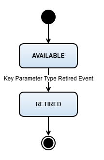

*Image 895: Extracted from page 28*

*Image 896: Extracted from page 28*

*Image 897: Extracted from page 28*

*Image 898: Extracted from page 28*

*Image 899: Extracted from page 28*

*Image 900: Extracted from page 28*

*Image 901: Extracted from page 28*

*Image 902: Extracted from page 28*

*Image 903: Extracted from page 28*

*Image 904: Extracted from page 28*

*Image 905: Extracted from page 28*

*Image 906: Extracted from page 28*

*Image 907: Extracted from page 28*

*Image 908: Extracted from page 28*

*Image 909: Extracted from page 28*

*Image 910: Extracted from page 28*

*Image 911: Extracted from page 28*

*Image 912: Extracted from page 28*

*Image 913: Extracted from page 28*

*Image 914: Extracted from page 28*

*Image 915: Extracted from page 28*

*Image 916: Extracted from page 28*

### Vector Graphics on Page 28

*This page contains 109 vector graphic elements (diagrams, shapes, lines)*

---

## Page 29

 
DRAFT
This Resource Version has been created by a Line of Business (LoB) Administrator using an AVAILABLE Connection Configuration 
and is in the process of configuring it.
Transitions to this state:
EVENT
TO
DESCRIPTION
ResourceVersionDraftCreatedEvent
DRAFT
The Resource Version has been created in the DRAFT state by a LoB 
Administrator.
Transitions from this state:
EVENT
TO 
DESCRIPTION
ResourceVersionDeleted
Event
DELET
ED
The Resource Version was never made AVAILABLE for use, is no longer needed, and has 
been DELETED by an LoB Administrator.  
ResourceVersionDraftCo
mpletedEvent
AVAIL
ABLE
The Resource Version has been completely configured and a LoB Administrator has made it 
AVAILABLE for use.   
AVAILABLE
This Resource Version is fully configured and a LoB Administrator has made it AVAILABLE for use in Template Versions. 
Transitions from this state:
EVENT
TO 
DESCRIPTION
ResourceVersionRetir
edEvent
RETIR
ED
The Resource Version is no longer needed, but has already been made AVAILABLE for use, so it 
is RETIRED.                              
RETIRED
No longer available for use by anything new.
This Resource Version can no longer be used in the configuration of a new Template Version.

### Images on Page 29

*Image 917: Extracted from page 29*

*Image 918: Extracted from page 29*

*Image 919: Extracted from page 29*

*Image 920: Extracted from page 29*

*Image 921: Extracted from page 29*

*Image 922: Extracted from page 29*

*Image 923: Extracted from page 29*

*Image 924: Extracted from page 29*

*Image 925: Extracted from page 29*

*Image 926: Extracted from page 29*

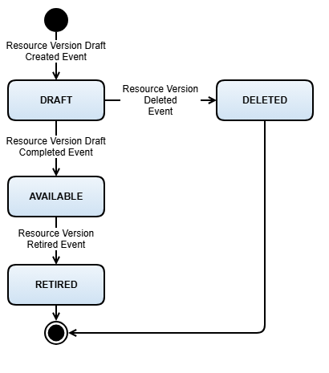

*Image 927: Extracted from page 29*

*Image 928: Extracted from page 29*

*Image 929: Extracted from page 29*

*Image 930: Extracted from page 29*

*Image 931: Extracted from page 29*

*Image 932: Extracted from page 29*

*Image 933: Extracted from page 29*

*Image 934: Extracted from page 29*

*Image 935: Extracted from page 29*

*Image 936: Extracted from page 29*

*Image 937: Extracted from page 29*

*Image 938: Extracted from page 29*

*Image 939: Extracted from page 29*

*Image 940: Extracted from page 29*

*Image 941: Extracted from page 29*

*Image 942: Extracted from page 29*

*Image 943: Extracted from page 29*

*Image 944: Extracted from page 29*

*Image 945: Extracted from page 29*

*Image 946: Extracted from page 29*

*Image 947: Extracted from page 29*

*Image 948: Extracted from page 29*

*Image 949: Extracted from page 29*

### Vector Graphics on Page 29

*This page contains 184 vector graphic elements (diagrams, shapes, lines)*

---

## Page 30

DELETED
This Resource Version was never made AVAILABLE for use, is no longer needed, and has been DELETED.  
Template Manager Elements
These are the lifecycle diagrams for elements belonging to the Template Manager.
Changeset Lifecycle
Changesets are worked on while they are in a DRAFT state, and then can be moved to READY FOR TEST, where their content can be tested.  Once all 
the testing is complete, they can be submitted for approval, moving them into the READY FOR APPROVAL state.  After that they can be APPROVED, and 
then SCHEDULED for publication.  Once the configured scheduling date arrives, the SCHEDULED Changeset is moved to PUBLISHED by the system, 
and its content becomes AVAILABLE for use.

### Images on Page 30

*Image 950: Extracted from page 30*

*Image 951: Extracted from page 30*

*Image 952: Extracted from page 30*

*Image 953: Extracted from page 30*

*Image 954: Extracted from page 30*

*Image 955: Extracted from page 30*

*Image 956: Extracted from page 30*

*Image 957: Extracted from page 30*

*Image 958: Extracted from page 30*

*Image 959: Extracted from page 30*

*Image 960: Extracted from page 30*

*Image 961: Extracted from page 30*

*Image 962: Extracted from page 30*

*Image 963: Extracted from page 30*

*Image 964: Extracted from page 30*

*Image 965: Extracted from page 30*

*Image 966: Extracted from page 30*

*Image 967: Extracted from page 30*

*Image 968: Extracted from page 30*

*Image 969: Extracted from page 30*

*Image 970: Extracted from page 30*

*Image 971: Extracted from page 30*

*Image 972: Extracted from page 30*

*Image 973: Extracted from page 30*

*Image 974: Extracted from page 30*

*Image 975: Extracted from page 30*

*Image 976: Extracted from page 30*

*Image 977: Extracted from page 30*

*Image 978: Extracted from page 30*

*Image 979: Extracted from page 30*

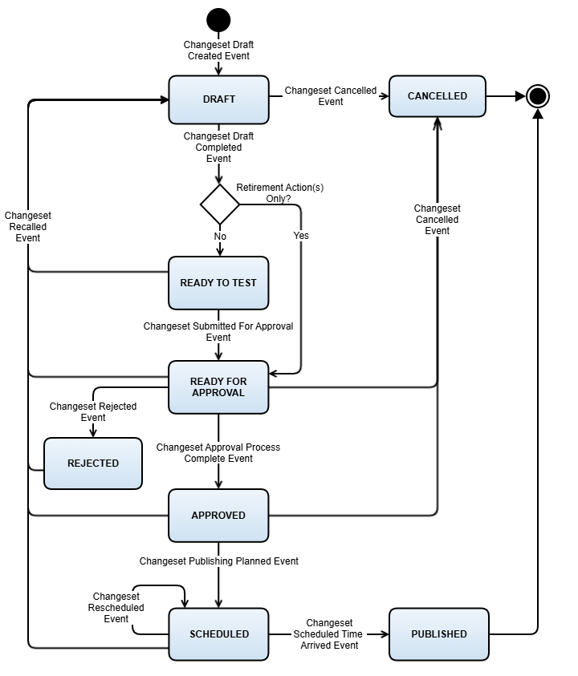

*Image 980: Extracted from page 30*

*Image 981: Extracted from page 30*

*Image 982: Extracted from page 30*

### Vector Graphics on Page 30

*This page contains 73 vector graphic elements (diagrams, shapes, lines)*

---

## Page 31

DRAFT
This Changeset has been created, named, and work has begun to prepare it for publication. During this state, Templates are being 
created, added/removed to/from the Changeset, and tested. During this state the Changeset and its content remain modifiable.  Test 
Scenarios can be created and executed to allow for incremental testing of a Template, but can not yet be marked as PASSED.
Transitions to this state:
EVENT
TO 
DESCRIPTION
ChangesetDraftCreatedEvent
DRAFT
The Changeset has been created in the DRAFT state by the Changeset Editor.
Transitions from this state:
EVENT
TO 
DESCRIPTION
ChangesetDraftCompletedE
vent
READY 
TO TEST
All Template Versions have been marked as Complete and the Changeset Editor has 
indicated that the Changeset is ready to be tested.
ChangesetCancellationProc
essCompleteEvent
CANCELL
ED
The Changeset and all of its contents have been cancelled by the Changeset Editor 
and will no longer be moved towards publication.
READY TO 
TEST
This Changeset and all of the work within its contents has been completed, there are Template Versions within the Changeset that 
need to be marked as Passed, and the Changeset Editor has indicated that the Changeset is READY TO TEST.  From this state, 
Template Versions must each have at least one Passed Test Scenario before the Changeset they contain can be submitted for 
approval.
This Status is skipped for a Changeset that contains only Retirement Actions, since Retirement Actions are not tested.
The Changeset Editor can continue to create and modify Test Scenarios, run them, and mark them as PASSED.  The content of the 
Template Versions can not be modified unless the Changeset is Recalled back to the DRAFT state.
Transitions from this state:
EVENT
TO 
DESCRIPTION
Changes
etSubmitt
edForAp
provalEv
ent
REA
DY 
FOR 
APP
ROV
AL
All Test Scenarios for COMPLETED Template Version(s) have been created and have PASSED, and 
Changeset Editor has submitted the Changeset for Approval. Marking a Test Scenario as PASSED means the 
Changeset Editor has created a Test Scenario, executed it, viewed the results, and verified that the Rendered 
PDF looks as expected. The Changeset Editor can create multiple Test Scenarios with different data as 
needed, however all must be marked as PASSED before this transition can take place.  
Changes
etRecalle
dEvent
DRA
FT
This Changeset has been recalled to allow for additional modification.
Changes
etCancell
ationProc
essComp
leteEvent
CAN
CELL
ED
The Changeset and all of its contents have been cancelled by the Changeset Editor and will no longer be 
moved towards publication.
If a user has both the Changeset Editor and Changeset Publisher roles, they cannot mark their own Changeset as 
APPROVED.

### Images on Page 31

*Image 983: Extracted from page 31*

*Image 984: Extracted from page 31*

*Image 985: Extracted from page 31*

*Image 986: Extracted from page 31*

*Image 987: Extracted from page 31*

*Image 988: Extracted from page 31*

*Image 989: Extracted from page 31*

*Image 990: Extracted from page 31*

*Image 991: Extracted from page 31*

*Image 992: Extracted from page 31*

*Image 993: Extracted from page 31*

*Image 994: Extracted from page 31*

*Image 995: Extracted from page 31*

*Image 996: Extracted from page 31*

*Image 997: Extracted from page 31*

*Image 998: Extracted from page 31*

*Image 999: Extracted from page 31*

*Image 1000: Extracted from page 31*

*Image 1001: Extracted from page 31*

*Image 1002: Extracted from page 31*

*Image 1003: Extracted from page 31*

*Image 1004: Extracted from page 31*

*Image 1005: Extracted from page 31*

*Image 1006: Extracted from page 31*

*Image 1007: Extracted from page 31*

*Image 1008: Extracted from page 31*

*Image 1009: Extracted from page 31*

*Image 1010: Extracted from page 31*

*Image 1011: Extracted from page 31*

*Image 1012: Extracted from page 31*

*Image 1013: Extracted from page 31*

*Image 1014: Extracted from page 31*

### Vector Graphics on Page 31

*This page contains 200 vector graphic elements (diagrams, shapes, lines)*

---

## Page 32

READY FOR 
APPROVAL
Every Template Version in the Changeset has at least one corresponding Test Scenario that has been marked as Passed, and a 
Changeset Editor has submitted the Changeset for Approval.
For Changesets that do not contain a Template Version, such as Changesets that only contain a Retirement Action, no Test 
Scenarios are required.
While within this state Test Scenarios can continue to be created, executed, and marked as PASSED to allow the Changeset Editor 
to create and run additional Test Scenarios.
Prior to Approving the Changeset, all of the contents of the Changeset, such as the Template Versions and Retirement Actions, must 
be individually APPROVED.
Transitions from this state:
EVENT
TO 
DESCRIPTION
ChangesetApprovalPro
cessCompletedEvent
APPR
OVED
The Changeset and its contents has moved through the applicable Approval processes and 
has been APPROVED by a Changeset Publisher.  
ChangesetRecalledEve
nt
DRAFT This Changeset has been recalled by a Changeset Editor to allow for additional modification.
ChangesetRejectedEve
nt
REJE
CTED
Changeset Publisher reviewed and REJECTED the Changeset.   Changeset Publisher must 
provide a Rejection Reason before the Changeset can transition to REJECTED state. 
ChangesetCancellation
ProcessCompleteEvent
CAN
CELL
ED
The Changeset and all of its contents have been cancelled by a Changeset Publisher and will 
no longer be moved towards publication.
REJECTED
This Changeset Publisher has reviewed the contents of the Changeset and REJECTED it.  They provide a Rejection Reason so that 
the Changeset Editor that owns the Changeset can review it and return it to the DRAFT state for additional modification.
Transitions from this state:
EVENT
TO 
DESCRIPTION
ChangesetRecalle
dEvent
DRA
FT
The Changeset Editor, after reviewing the REJECTED Changeset, moves it back to the DRAFT 
state for additional modification..
APPROVED
This Changeset Publisher has reviewed the contents of the Changeset and Approved it.  All of the contents of the Changeset must be 
Approved before the Changeset itself can be APPROVED.
Transitions from this state:
EVENT
TO 
DESCRIPTION
ChangesetRecalledEvent
DRAFT
Changeset Editor has determined that the APPROVED Changeset needs more work and 
so it is returned to the DRAFT state for additional modification.
ChangesetCancellationPro
cessCompleteEvent
CANC
ELLED
The Changeset and all of its contents have been cancelled by Changeset Publisher and 
will no longer be moved towards publication.
ChangesetPublishingPlann
edEvent
SCHE
DULED
The Changeset is set up to be Published, either immediately or for a specific date.
SCHEDULED
This Changeset Publisher has Scheduled it to be PUBLISHED at the Scheduled Date.
Transitions from this state:
EVENT
TO 
DESCRIPTION
ChangesetR
ecalledEvent
DRA
FT
Changeset Editor has determined that the SCHEDULED Changeset needs more work and so it is returned 
to the DRAFT state for additional modification.
ChangesetR
escheduledE
vent
SCH
EDU
LED
Changeset Publisher has changed the Scheduled Date, which emits a Changeset Rescheduled Event.
ChangesetS
cheduledTim
eArrivedEve
nt
PUBL
ISHED
The Scheduled time set for Publication has arrived and the Changeset is PUBLISHED and ready for use. 
This transition implies the transition of all new and included Templates to the AVAILABLE state and any 
AVAILABLE Templates targeted by a Retirement Action will transition to RETIRED. 

### Images on Page 32

*Image 1015: Extracted from page 32*

*Image 1016: Extracted from page 32*

*Image 1017: Extracted from page 32*

*Image 1018: Extracted from page 32*

*Image 1019: Extracted from page 32*

*Image 1020: Extracted from page 32*

*Image 1021: Extracted from page 32*

*Image 1022: Extracted from page 32*

*Image 1023: Extracted from page 32*

*Image 1024: Extracted from page 32*

*Image 1025: Extracted from page 32*

*Image 1026: Extracted from page 32*

*Image 1027: Extracted from page 32*

*Image 1028: Extracted from page 32*

*Image 1029: Extracted from page 32*

*Image 1030: Extracted from page 32*

*Image 1031: Extracted from page 32*

*Image 1032: Extracted from page 32*

*Image 1033: Extracted from page 32*

*Image 1034: Extracted from page 32*

*Image 1035: Extracted from page 32*

*Image 1036: Extracted from page 32*

*Image 1037: Extracted from page 32*

*Image 1038: Extracted from page 32*

*Image 1039: Extracted from page 32*

*Image 1040: Extracted from page 32*

*Image 1041: Extracted from page 32*

*Image 1042: Extracted from page 32*

*Image 1043: Extracted from page 32*

*Image 1044: Extracted from page 32*

*Image 1045: Extracted from page 32*

*Image 1046: Extracted from page 32*

### Vector Graphics on Page 32

*This page contains 292 vector graphic elements (diagrams, shapes, lines)*

---

## Page 33

PUBLISHED
This Changeset is now live and effective. All of the related Templates Versions are moved into the AVAILABLE and all of the related 
Retirement Actions are actualized by moving their respective Template Versions to the RETIRED status.  AVAILABLE Templates are 
available to create Letter Instances.
cancelled
This Changeset was deemed unnecessary and has been cancelled.  A PUBLISHED Changeset cannot be cancelled.
Label Lifecycle
Labels have a very basic lifecycle where users in the Template Manager create them to make them AVAILABLE, and then RETIRE them when they are no 
longer meant to be used.
 
AVAILABLE
This Label has been added into the Template Manager and is now AVAILABLE for use.
Transitions from this state:
EVENT
TO 
DESCRIPTION
LabelRetiredEvent
RETIRED
Label is no longer needed and has been RETIRED.                    
LabelDeletedEvent
DELETED
Label is not in use and can be completely discarded.
RETIRED
No longer available for use by anything new.
This Label can no longer be selected as an option when choosing one.
Transitions from this state:
EVENT
TO 
DESCRIPTION
LabelUnretiredEvent
Available
Label is no longer RETIRED and has been made AVAILABLE again.                    
DELETED
The Label has been deleted, can only be done when the Label is not in use.
Template Version Lifecycle
Template Versions are moved through their lifecycle while within a Changeset. Users can create new DRAFT Template Versions and then, within a 
Changeset, mark them as COMPLETED. After the Changeset moves into the READY TO TEST, the user can create and run Test Scenarios to mark the 
Template Versions as TESTED. During the approval process, the person approving the Changeset is able to mark each individual Template Version as 
APPROVED. Once a Changeset is PUBLISHED, the Template Versions within it are moved to AVAILABLE.
If a Retirement Action for a Template Version is in a Changeset that is PUBLISHED, the Template Version moves into the RETIRED state.

### Images on Page 33

*Image 1047: Extracted from page 33*

*Image 1048: Extracted from page 33*

*Image 1049: Extracted from page 33*

*Image 1050: Extracted from page 33*

*Image 1051: Extracted from page 33*

*Image 1052: Extracted from page 33*

*Image 1053: Extracted from page 33*

*Image 1054: Extracted from page 33*

*Image 1055: Extracted from page 33*

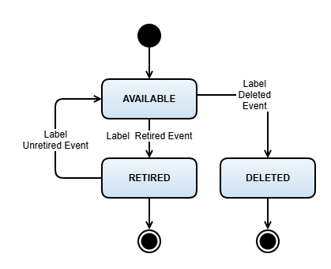

*Image 1056: Extracted from page 33*

*Image 1057: Extracted from page 33*

*Image 1058: Extracted from page 33*

*Image 1059: Extracted from page 33*

*Image 1060: Extracted from page 33*

*Image 1061: Extracted from page 33*

*Image 1062: Extracted from page 33*

*Image 1063: Extracted from page 33*

*Image 1064: Extracted from page 33*

*Image 1065: Extracted from page 33*

*Image 1066: Extracted from page 33*

*Image 1067: Extracted from page 33*

*Image 1068: Extracted from page 33*

*Image 1069: Extracted from page 33*

*Image 1070: Extracted from page 33*

*Image 1071: Extracted from page 33*

*Image 1072: Extracted from page 33*

*Image 1073: Extracted from page 33*

*Image 1074: Extracted from page 33*

*Image 1075: Extracted from page 33*

*Image 1076: Extracted from page 33*

*Image 1077: Extracted from page 33*

*Image 1078: Extracted from page 33*

*Image 1079: Extracted from page 33*

### Vector Graphics on Page 33

*This page contains 175 vector graphic elements (diagrams, shapes, lines)*

---

## Page 34

DRAFT
This Template Version has been created, named, and is editable. Entering this state, an incremented Version number is 
assigned.  Version numbers are unique to each individual Template Version. This is the only state in which the content and 
configuration of a Template Version can be modified.
 Transitions to this state:
EVENT
TO 
DESCRIPTION
TemplateVersionDraftCreatedEve
nt
DRAFT
The Template Version has been created in the DRAFT state by the Changeset 
Editor.
Transitions from this state:
EVENT
TO 
DESCRIPTION
TemplateVersionDraftComp
letedEvent
COMPLE
TED
The Changeset Editor is satisfied with their modifications to the Template Version and 
has marked it as COMPLETED.
TemplateVersionCancelled
Event
CANCEL
LED
This Template Version is no longer needed and has been cancelled.

### Images on Page 34

*Image 1080: Extracted from page 34*

*Image 1081: Extracted from page 34*

*Image 1082: Extracted from page 34*

*Image 1083: Extracted from page 34*

*Image 1084: Extracted from page 34*

*Image 1085: Extracted from page 34*

*Image 1086: Extracted from page 34*

*Image 1087: Extracted from page 34*

*Image 1088: Extracted from page 34*

*Image 1089: Extracted from page 34*

*Image 1090: Extracted from page 34*

*Image 1091: Extracted from page 34*

*Image 1092: Extracted from page 34*

*Image 1093: Extracted from page 34*

*Image 1094: Extracted from page 34*

*Image 1095: Extracted from page 34*

*Image 1096: Extracted from page 34*

*Image 1097: Extracted from page 34*

*Image 1098: Extracted from page 34*

*Image 1099: Extracted from page 34*

*Image 1100: Extracted from page 34*

*Image 1101: Extracted from page 34*

*Image 1102: Extracted from page 34*

*Image 1103: Extracted from page 34*

*Image 1104: Extracted from page 34*

*Image 1105: Extracted from page 34*

*Image 1106: Extracted from page 34*

*Image 1107: Extracted from page 34*

*Image 1108: Extracted from page 34*

*Image 1109: Extracted from page 34*

*Image 1110: Extracted from page 34*

*Image 1111: Extracted from page 34*

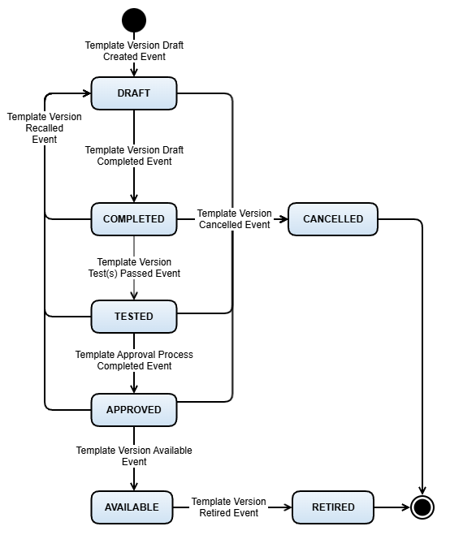

*Image 1112: Extracted from page 34*

### Vector Graphics on Page 34

*This page contains 139 vector graphic elements (diagrams, shapes, lines)*

---

## Page 35

COMPLETED
This Template Version's updates and modifications are finished and the Changeset Editor has marked it as COMPLETED. The 
content and the configuration of the Template Version can no longer be modified.
Transitions from this state:
EVENT
TO 
DESCRIPTION
TemplateVersionRecall
edEvent
DRAFT
The Changeset Editor has decided that this Template Version needs more work and moves 
it back to DRAFT for further modification.
TemplateVersionTestP
assedEvent
TESTED
All of the Test Scenarios for this Template Version have been run and have been marked as 
PASSED.
TemplateVersionCance
lledEvent
CANCE
LLED
This Template Version is no longer needed and has been cancelled.
TESTED
This Template Version's Test Scenarios have all been reviewed and marked as PASSED by a Changeset Editor.
New Test Scenarios can be added to this Template Version while the Changeset is in the Ready for Approval state if the Changeset 
Publisher decides to add in additional testing during the approval process.
In this state the content and configuration of the Template Version can no longer be modified. If a user wishes to make additional 
modifications to the Template Version they must Recall it back to the DRAFT state.
Transitions from this state:
EVENT
TO
DESCRIPTION
TemplateVersionApprovalProce
ssCompletedEvent
APPRO
VED
The Template Version has gone through the applicable approval process and been 
APPROVED. 
TemplateVersionRecalledEvent
DRAFT
The Changeset Editor has decided that this Template Version needs more work and 
moves it back to DRAFT for further modification.
TemplateVersionCancelledEve
nt
CANCE
LLED
This Template Version is no longer needed and has been cancelled.
APPROVED
This Template Version has passed testing and been approved by the Changeset Publisher. Test Scenarios can no longer be added 
to this Template Version.
In this state it can no longer be modified. If a Changeset Editor wishes to make additional modifications to it they must Recall it back 
to the DRAFT state.
Transitions from this state:
EVENT
TO 
DESCRIPTION
TemplateVer
sionAvailable
Event
AVAI
LABLE
This Template Version was in a Changeset that has been PUBLISHED.
TemplateVer
sionCancelle
dEvent
CAN
CELL
ED
This Template Version is no longer needed and has been cancelled.
TemplateVer
sionRecalled
Event
DRA
FT
The Changeset Editor has reviewed Template Version and recalls the 
. The 
Changeset for modifications
Changeset Editor has determined that the Template Version needs more work and moves it back to 
DRAFT for further modification.
The Changeset Publisher must first reject the Changeset, and then the Changeset Editor can recall the Changeset to the 
DRAFT state, which allows for the Template Version to be recalled back to DRAFT and cancelled.
The Changeset Publisher must first reject the Changeset, and then the Changeset Editor can recall the Changeset to the 
DRAFT state, which allows for the Template Version to be recalled back to DRAFT and cancelled.

### Images on Page 35

*Image 1113: Extracted from page 35*

*Image 1114: Extracted from page 35*

*Image 1115: Extracted from page 35*

*Image 1116: Extracted from page 35*

*Image 1117: Extracted from page 35*

*Image 1118: Extracted from page 35*

*Image 1119: Extracted from page 35*

*Image 1120: Extracted from page 35*

*Image 1121: Extracted from page 35*

*Image 1122: Extracted from page 35*

*Image 1123: Extracted from page 35*

*Image 1124: Extracted from page 35*

*Image 1125: Extracted from page 35*

*Image 1126: Extracted from page 35*

*Image 1127: Extracted from page 35*

*Image 1128: Extracted from page 35*

*Image 1129: Extracted from page 35*

*Image 1130: Extracted from page 35*

*Image 1131: Extracted from page 35*

*Image 1132: Extracted from page 35*

*Image 1133: Extracted from page 35*

*Image 1134: Extracted from page 35*

*Image 1135: Extracted from page 35*

*Image 1136: Extracted from page 35*

*Image 1137: Extracted from page 35*

*Image 1138: Extracted from page 35*

*Image 1139: Extracted from page 35*

*Image 1140: Extracted from page 35*

*Image 1141: Extracted from page 35*

*Image 1142: Extracted from page 35*

*Image 1143: Extracted from page 35*

*Image 1144: Extracted from page 35*

### Vector Graphics on Page 35

*This page contains 247 vector graphic elements (diagrams, shapes, lines)*

---

## Page 36

AVAILABLE
This Template Version has been Published and is live and AVAILABLE for the instantiation of Letter Instances. 
In this state it can no longer be modified. It can also no longer be Recalled.
If a user wishes to make additional modifications to it they must create a new Version.
Transitions from this state:
EVENT
TO 
DESCRIPTION
TemplateVersion
RetiredEvent
RETI
RED
A Retirement Action targeting this Template Version has been published through a Changeset that 
results in this Template Version moving into a RETIRED state.
CANCELLED
This Template Version is no longer needed and has been cancelled.
RETIRED
No longer available for use by anything new.
This Template Version can no longer be used to instantiate new Letter Instances.
File Version Lifecycle
File Versions are moved through their lifecycle while within a Changeset.  Users can create new DRAFT File Versions and then, within a Changeset, mark 
them as COMPLETED.  File Versions, unlike Template Versions, do not require formal testing. During the approval process, the person approving the 
Changeset is able to mark each individual File Version as APPROVED.  Once a Changeset is PUBLISHED, the File Versions within it are moved to 
AVAILABLE.
If a Retirement Action for a File Version is in a Changeset that is PUBLISHED, the File Version moves into the RETIRED state.
Only the most recently Published Template Version will be flagged in Template Manager to indicate that it is the Template 
Version AVAILABLE in the Letter Manager to create Letter Instances.

### Images on Page 36

*Image 1145: Extracted from page 36*

*Image 1146: Extracted from page 36*

*Image 1147: Extracted from page 36*

*Image 1148: Extracted from page 36*

*Image 1149: Extracted from page 36*

*Image 1150: Extracted from page 36*

*Image 1151: Extracted from page 36*

*Image 1152: Extracted from page 36*

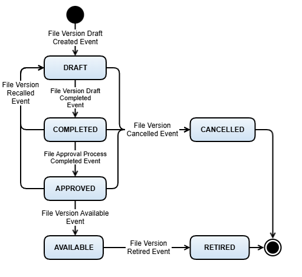

*Image 1153: Extracted from page 36*

*Image 1154: Extracted from page 36*

*Image 1155: Extracted from page 36*

*Image 1156: Extracted from page 36*

*Image 1157: Extracted from page 36*

*Image 1158: Extracted from page 36*

*Image 1159: Extracted from page 36*

*Image 1160: Extracted from page 36*

*Image 1161: Extracted from page 36*

*Image 1162: Extracted from page 36*

*Image 1163: Extracted from page 36*

*Image 1164: Extracted from page 36*

*Image 1165: Extracted from page 36*

*Image 1166: Extracted from page 36*

*Image 1167: Extracted from page 36*

*Image 1168: Extracted from page 36*

*Image 1169: Extracted from page 36*

*Image 1170: Extracted from page 36*

*Image 1171: Extracted from page 36*

*Image 1172: Extracted from page 36*

*Image 1173: Extracted from page 36*

*Image 1174: Extracted from page 36*

*Image 1175: Extracted from page 36*

*Image 1176: Extracted from page 36*

*Image 1177: Extracted from page 36*

### Vector Graphics on Page 36

*This page contains 119 vector graphic elements (diagrams, shapes, lines)*

---

## Page 37

DRAFT
This File Version has been created, named, and is editable. Entering this state, an incremented Version number is assigned. Version 
numbers are unique to each individual File Version. This is the only state in which the content and configuration of a File Version can 
be modified.
Transitions to this state:
EVENT
TO 
DESCRIPTION
FileVersionDraftCreatedEvent
DRAFT
The File Version has been created in the DRAFT state by the Changeset Editor.
Transitions from this state:
EVENT
TO 
DESCRIPTION
FileVersionDraftComplet
edEvent
COMPLE
TED
The Changeset Editor is satisfied with their modifications to the File Version and has 
marked it as COMPLETED.
FileVersionCancelledEve
nt
CANCELL
ED
This File Version is no longer needed and has been cancelled.
COMPLETED
This File Version's updates and modifications are finished and the Changeset Editor has marked it as COMPLETED.
In this state it can no longer be modified. If a Changeset Editor wishes to make additional modifications to it they must Recall it back 
to the DRAFT state.
Transitions from this state:
EVENT
TO 
DESCRIPTION
FileVersionRecalle
dEvent
DRAFT
The Changeset Editor has decided that this File Version needs more work and moves it back to 
DRAFT for further modification.
FileVersionCancell
edEvent
CANCEL
LED
This File Version is no longer needed and has been cancelled.
FileVersionApprove
dEvent
APPROV
ED
This File Version has been COMPLETED and can moved to APPROVED.  
APPROVED
This File Version has been APPROVED by the Changeset Publisher.  
In this state it can no longer be modified. If additional modifications are needed the File Version must be Recall back to a DRAFT 
state.
Transitions from this state:
EVENT
TO 
DESCRIPTION
FileVersionAvailabl
eEvent
AVAILAB
LE
This File Version was in a Changeset that has been PUBLISHED.
FileVersionRecalle
dEvent
DRAFT
The Changeset Editor has decided that this File Version needs more work and moves it back to 
DRAFT for further modification.
FileVersionCancell
edEvent
CANCEL
LED
This File Version is no longer needed and has been cancelled.
Unlike Template Versions, there is no need for testing a File Version.

### Images on Page 37

*Image 1178: Extracted from page 37*

*Image 1179: Extracted from page 37*

*Image 1180: Extracted from page 37*

*Image 1181: Extracted from page 37*

*Image 1182: Extracted from page 37*

*Image 1183: Extracted from page 37*

*Image 1184: Extracted from page 37*

*Image 1185: Extracted from page 37*

*Image 1186: Extracted from page 37*

*Image 1187: Extracted from page 37*

*Image 1188: Extracted from page 37*

*Image 1189: Extracted from page 37*

*Image 1190: Extracted from page 37*

*Image 1191: Extracted from page 37*

*Image 1192: Extracted from page 37*

*Image 1193: Extracted from page 37*

*Image 1194: Extracted from page 37*

*Image 1195: Extracted from page 37*

*Image 1196: Extracted from page 37*

*Image 1197: Extracted from page 37*

*Image 1198: Extracted from page 37*

*Image 1199: Extracted from page 37*

*Image 1200: Extracted from page 37*

*Image 1201: Extracted from page 37*

*Image 1202: Extracted from page 37*

*Image 1203: Extracted from page 37*

*Image 1204: Extracted from page 37*

*Image 1205: Extracted from page 37*

*Image 1206: Extracted from page 37*

*Image 1207: Extracted from page 37*

*Image 1208: Extracted from page 37*

*Image 1209: Extracted from page 37*

### Vector Graphics on Page 37

*This page contains 260 vector graphic elements (diagrams, shapes, lines)*

---

## Page 38

AVAILABLE
This File Version has been PUBLISHED via Changeset and is available for use.
In this state it can no longer be modified.  It can also no longer be Recalled.
If a Changeset Editor wishes to make additional modifications to it they must create a new Version.
Transitions from this state:
EVENT
TO 
DESCRIPTION
FileVersionRetir
edEvent
RETI
RED
A Retirement Action targeting this File Version has been published through a Changeset that results in 
this File Version moving into a RETIRED state.
cancelled
This File Version is no longer needed and has been cancelled.
RETIRED
No longer available for use by anything new.
This File Version can no longer be used in new Template Versions.
Retirement Action Lifecycle
Retirement Actions are created in the DRAFT state by the Changeset Editor to retire a Template or File Version. Once completed, they are submitted for 
approval; if approved they move to PUBLISHED and retire their contents, otherwise they can be rejected, recalled for changes, or cancelled before 
publication. A Changeset can contain multiple Retirement Actions.

### Images on Page 38

*Image 1210: Extracted from page 38*

*Image 1211: Extracted from page 38*

*Image 1212: Extracted from page 38*

*Image 1213: Extracted from page 38*

*Image 1214: Extracted from page 38*

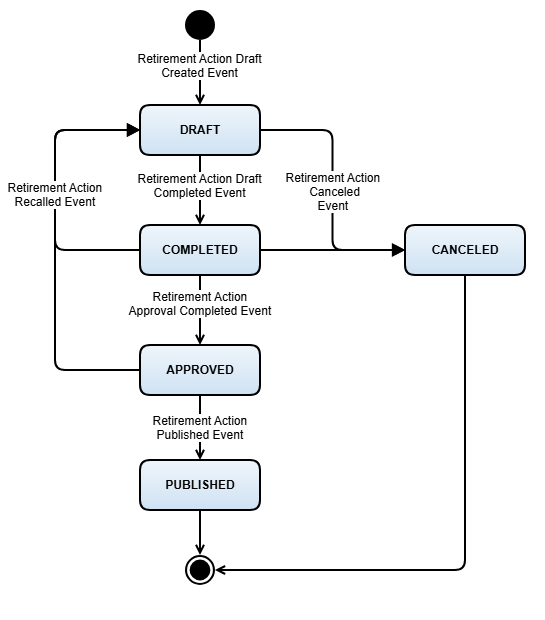

*Image 1215: Extracted from page 38*

*Image 1216: Extracted from page 38*

*Image 1217: Extracted from page 38*

*Image 1218: Extracted from page 38*

*Image 1219: Extracted from page 38*

*Image 1220: Extracted from page 38*

*Image 1221: Extracted from page 38*

*Image 1222: Extracted from page 38*

*Image 1223: Extracted from page 38*

*Image 1224: Extracted from page 38*

*Image 1225: Extracted from page 38*

*Image 1226: Extracted from page 38*

*Image 1227: Extracted from page 38*

*Image 1228: Extracted from page 38*

*Image 1229: Extracted from page 38*

*Image 1230: Extracted from page 38*

*Image 1231: Extracted from page 38*

*Image 1232: Extracted from page 38*

*Image 1233: Extracted from page 38*

*Image 1234: Extracted from page 38*

*Image 1235: Extracted from page 38*

*Image 1236: Extracted from page 38*

*Image 1237: Extracted from page 38*

*Image 1238: Extracted from page 38*

*Image 1239: Extracted from page 38*

*Image 1240: Extracted from page 38*

*Image 1241: Extracted from page 38*

*Image 1242: Extracted from page 38*

### Vector Graphics on Page 38

*This page contains 118 vector graphic elements (diagrams, shapes, lines)*

---

## Page 39

DRAFT
This Retirement Action is created by a Changeset Editor and added to a Changeset. During this state the Changeset Editor is 
adding an AVAILABLE Template Version or File Version to retire. 
Transitions to this state:
EVENT
TO 
DESCRIPTION
RetirementActionDraftCreatedEv
ent
DRAFT
The Retirement Action has been created in the DRAFT state by the Changeset 
Editor.
Transitions from this state:
RetirementActioncancelledEve
nt
cancelled
The Retirement Action content has been cancelled and will no longer be moved 
towards publication.
RetirementActionDraftComplet
edEvent
COMPLE
TED
The Retirement Action has been created and is ready to be APPROVED.   
COMPLETED
In this state the Changeset Editor has added the item they decided to RETIRE, they mark the Retirement Action as 
COMPLETED, indicating the item is ready to be APPROVED by the Changeset Publisher.
Transitions from this state:
RetirementActionApprov
alCompletedEvent
APPR
OVED
Retirement Action is reviewed for Retirement, the Changeset Publisher agrees with the 
action, so it is APPROVED.
RetirementActionRecalle
dEvent
DRAFT The Changeset Editor has decided to change the Retirement Reason of the Retirement 
Action and moves it back to DRAFT for further modification.
RetirementActioncancell
edEvent
cancel
led
The Retirement Action content has been cancelled and will no longer be moved towards 
publication.
APPROVED
Retirement Action has been reviewed for Retirement and APPROVED by Changeset Publisher.    
Transitions from this state:
RetirementAct
ionPublished
Event
PUB
LIS
HED
The Scheduled time set for Publication has arrived and the Changeset is PUBLISHED. This transition 
also moves the Retirement Action to PUBLISHED and the content transitions from AVAILABLE to a 
RETIRED state.
RetirementAct
ionRecalledE
vent
DRA
FT
The Changeset Editor has decided that the content of the Retirement Action needs more work and 
moves it back to DRAFT for further modification.
PUBLISHED
The Retirement Action is actualized and the Templates Version or File Version is moved to a RETIRED state.
cancelled
The Retirement Action has been cancelled and will no longer be moved towards publication.
Test Scenario Lifecycle
Test Scenarios are unique to Template Versions and can be worked on while they are in the DRAFT state.  Once a user is finished working on a Test 
Scenario they can mark it as READY FOR REVIEW.  It can then be marked as PASSED or FAILED, or recalled back to DRAFT from these states.

### Images on Page 39

*Image 1243: Extracted from page 39*

*Image 1244: Extracted from page 39*

*Image 1245: Extracted from page 39*

*Image 1246: Extracted from page 39*

*Image 1247: Extracted from page 39*

*Image 1248: Extracted from page 39*

*Image 1249: Extracted from page 39*

*Image 1250: Extracted from page 39*

*Image 1251: Extracted from page 39*

*Image 1252: Extracted from page 39*

*Image 1253: Extracted from page 39*

*Image 1254: Extracted from page 39*

*Image 1255: Extracted from page 39*

*Image 1256: Extracted from page 39*

*Image 1257: Extracted from page 39*

*Image 1258: Extracted from page 39*

*Image 1259: Extracted from page 39*

*Image 1260: Extracted from page 39*

*Image 1261: Extracted from page 39*

*Image 1262: Extracted from page 39*

*Image 1263: Extracted from page 39*

*Image 1264: Extracted from page 39*

*Image 1265: Extracted from page 39*

*Image 1266: Extracted from page 39*

*Image 1267: Extracted from page 39*

*Image 1268: Extracted from page 39*

*Image 1269: Extracted from page 39*

*Image 1270: Extracted from page 39*

*Image 1271: Extracted from page 39*

*Image 1272: Extracted from page 39*

*Image 1273: Extracted from page 39*

*Image 1274: Extracted from page 39*

### Vector Graphics on Page 39

*This page contains 220 vector graphic elements (diagrams, shapes, lines)*

---

## Page 40

DRAFT
A Changeset Editor has created a Test Scenario for a 
Version and is in the process of configuring it, filling out all of the fields 
Template 
necessary to hydrate the document for rendering it based on the provided input. While in this state, the Changeset Editor can create and 
run Test Scenarios for Template Versions and can view the rendered PDF. However, Test Scenarios cannot be marked as PASSED or 
FAILED in the DRAFT state. The option to mark the Scenario as PASSED or FAILED is only available once the Scenario moves to the 
'Ready for Review' state.
Transitions to this state:
EVENT
TO 
DESCRIPTION
TestScenarioDraftCreatedEvent
DRAFT
The Test Scenario has been created in the DRAFT state by the Changeset Editor.
Transitions from this state:
EVENT
TO 
DESCRIPTION
TestScenarioDeletedEvent
DELETED
Test Scenario is deemed no longer needed and is DELETED by a Changeset 
Editor. 
TestScenarioCompletedEve
nt
READY FOR 
REVIEW
Test Scenario has been successfully run and the results are READY FOR 
REVIEW.

### Images on Page 40

*Image 1275: Extracted from page 40*

*Image 1276: Extracted from page 40*

*Image 1277: Extracted from page 40*

*Image 1278: Extracted from page 40*

*Image 1279: Extracted from page 40*

*Image 1280: Extracted from page 40*

*Image 1281: Extracted from page 40*

*Image 1282: Extracted from page 40*

*Image 1283: Extracted from page 40*

*Image 1284: Extracted from page 40*

*Image 1285: Extracted from page 40*

*Image 1286: Extracted from page 40*

*Image 1287: Extracted from page 40*

*Image 1288: Extracted from page 40*

*Image 1289: Extracted from page 40*

*Image 1290: Extracted from page 40*

*Image 1291: Extracted from page 40*

*Image 1292: Extracted from page 40*

*Image 1293: Extracted from page 40*

*Image 1294: Extracted from page 40*

*Image 1295: Extracted from page 40*

*Image 1296: Extracted from page 40*

*Image 1297: Extracted from page 40*

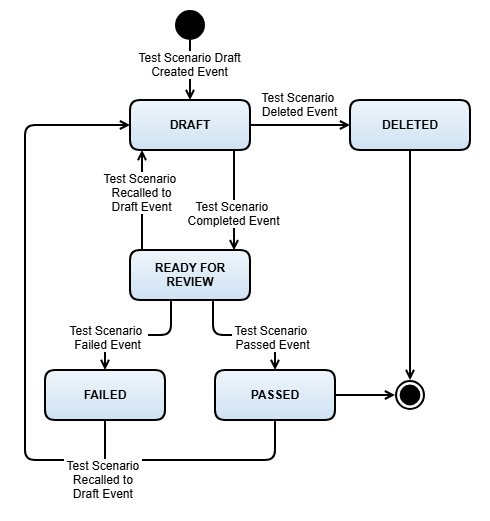

*Image 1298: Extracted from page 40*

*Image 1299: Extracted from page 40*

*Image 1300: Extracted from page 40*

*Image 1301: Extracted from page 40*

*Image 1302: Extracted from page 40*

*Image 1303: Extracted from page 40*

*Image 1304: Extracted from page 40*

*Image 1305: Extracted from page 40*

*Image 1306: Extracted from page 40*

*Image 1307: Extracted from page 40*

### Vector Graphics on Page 40

*This page contains 139 vector graphic elements (diagrams, shapes, lines)*

---

## Page 41

READY 
FOR 
REVIEW
In the READY FOR REVIEW state, the Changeset Editor evaluates the rendered PDF results produced by the Test Scenario execution 
and marks the Test Scenario as PASSED or FAILED, they may recall the Test Scenario for further editing.
Transitions from this state:
EVENT
TO
DESCRIPTION
TestScenarioFailedEvent
FAILED
The Changeset Editor has reviewed the rendered PDF results and has marked the Test 
Scenario as FAILED.
TestScenarioPassedEvent
PASS
ED
The Changeset Editor has reviewed the rendered PDF results and has marked the Test 
Scenario as PASSED.
TestScenarioRecalledtoDraft
Event
DRAFT
Test Scenario has been recalled for additional modification or review.
FAILED
After evaluation by a Changeset Editor, the Test Scenario has been deemed unacceptable. From here, the Test Scenario can be 
recalled back to DRAFT, by either the Changeset Editor, for further modification.
Transitions from this state:
EVENT
TO
DESCRIPTION
TestScenarioRecalledEve
nt
DRAFT
The Changeset Editor recalled the Failed Test Scenario back to DRAFT to make changes as 
needed.
PASSED
After evaluation by a Changeset Editor, the Test Scenario has been deemed acceptable and has been marked as PASSED. If 
necessary, the Test Scenario can also be recalled back to DRAFT, by either the Changeset Editor, for further modification.
EVENT
TO
DESCRIPTION
TestScenarioRecalledEve
nt
DRAFT
The Changeset Editor recalled the Passed Test Scenario back to DRAFT to make changes as 
needed.
DELETED
This Test Scenario is no longer needed and has been DELETED.  
Workflow Lifecycle
The Workflow Lifecycle is pretty basic and managed via the Template Manager.  Users are able to either create a DRAFT, mark it as AVAILABLE, or 
RETIRE them when they are no longer meant to be used. If a Workflow is still in the DRAFT state it can be DELETED.

### Images on Page 41

*Image 1308: Extracted from page 41*

*Image 1309: Extracted from page 41*

*Image 1310: Extracted from page 41*

*Image 1311: Extracted from page 41*

*Image 1312: Extracted from page 41*

*Image 1313: Extracted from page 41*

*Image 1314: Extracted from page 41*

*Image 1315: Extracted from page 41*

*Image 1316: Extracted from page 41*

*Image 1317: Extracted from page 41*

*Image 1318: Extracted from page 41*

*Image 1319: Extracted from page 41*

*Image 1320: Extracted from page 41*

*Image 1321: Extracted from page 41*

*Image 1322: Extracted from page 41*

*Image 1323: Extracted from page 41*

*Image 1324: Extracted from page 41*

*Image 1325: Extracted from page 41*

*Image 1326: Extracted from page 41*

*Image 1327: Extracted from page 41*

*Image 1328: Extracted from page 41*

*Image 1329: Extracted from page 41*

*Image 1330: Extracted from page 41*

*Image 1331: Extracted from page 41*

*Image 1332: Extracted from page 41*

*Image 1333: Extracted from page 41*

*Image 1334: Extracted from page 41*

*Image 1335: Extracted from page 41*

*Image 1336: Extracted from page 41*

*Image 1337: Extracted from page 41*

*Image 1338: Extracted from page 41*

*Image 1339: Extracted from page 41*

### Vector Graphics on Page 41

*This page contains 209 vector graphic elements (diagrams, shapes, lines)*

---

## Page 42

 
DRAFT
The Workflow has been created in a DRAFT state by a Line of Business (LoB) Administrator. In this state, Name and Key Parameter 
are required to create a Workflow. Additional configurations, such as adding Full Templates and Storage and Distribution options, can 
optionally be included.
Transitions to this state:
EVENT
TO 
DESCRIPTION
WorkflowDraftCreatedEvent
DRAFT
The Workflow has been created in the DRAFT state by the LoB Administrator.
Transitions from this state:
EVENT
TO 
DESCRIPTION
WorkflowDraftCompletedE
vent
AVAILAB
LE
The Workflow has been created and marked by the LoB Administrator as available for 
use.               
WorkflowDraftDeletedEvent
DELETED
The Workflow has been deleted by the LoB Administrator and is no longer needed.
AVAILABLE
This Workflow has been created by a Line of Business (LoB) Administrator and is AVAILABLE for use.  In this state Templates can be 
aligned to the Workflow and Letter Instances can be created within it.
Transitions from this state:
EVENT
TO 
DESCRIPTION
WorkflowRetiredEvent
RETIRED
Workflow is no longer needed and RETIRED from use.                           
RETIRED
No longer available for use by anything new.
No new Letter Instances can be created within this Workflow, and no more Templates can be aligned to it.

### Images on Page 42

*Image 1340: Extracted from page 42*

*Image 1341: Extracted from page 42*

*Image 1342: Extracted from page 42*

*Image 1343: Extracted from page 42*

*Image 1344: Extracted from page 42*

*Image 1345: Extracted from page 42*

*Image 1346: Extracted from page 42*

*Image 1347: Extracted from page 42*

*Image 1348: Extracted from page 42*

*Image 1349: Extracted from page 42*

*Image 1350: Extracted from page 42*

*Image 1351: Extracted from page 42*

*Image 1352: Extracted from page 42*

*Image 1353: Extracted from page 42*

*Image 1354: Extracted from page 42*

*Image 1355: Extracted from page 42*

*Image 1356: Extracted from page 42*

*Image 1357: Extracted from page 42*

*Image 1358: Extracted from page 42*

*Image 1359: Extracted from page 42*

*Image 1360: Extracted from page 42*

*Image 1361: Extracted from page 42*

*Image 1362: Extracted from page 42*

*Image 1363: Extracted from page 42*

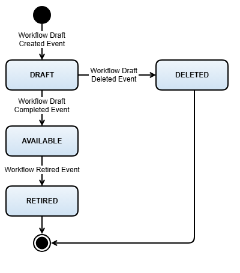

*Image 1364: Extracted from page 42*

*Image 1365: Extracted from page 42*

*Image 1366: Extracted from page 42*

*Image 1367: Extracted from page 42*

*Image 1368: Extracted from page 42*

*Image 1369: Extracted from page 42*

*Image 1370: Extracted from page 42*

*Image 1371: Extracted from page 42*

*Image 1372: Extracted from page 42*

### Vector Graphics on Page 42

*This page contains 184 vector graphic elements (diagrams, shapes, lines)*

---

## Page 43

DELETED
The Workflow has been deleted by the LoB Administrator is no longer available.
Letter Manager Elements
These are the lifecycle diagrams for elements belonging to the Letter Manager.
Letter Instance Lifecycle
Letter Instances begin in the DRAFT state, and will remain there while they are being modified by a user.  When a user is happy with their modifications 
they can submit it for READY FOR REVIEW, and then after review and approval, it can be moved to FINALIZED.
With the right permissions, users are able to bypass the READY FOR REVIEW state, to accommodate automated and system users that need to generate 
correspondence without human intervention, as well as Lines of Business that do not have an approval process for Letter Instances.
As a part of our archival process, the Letter Instance can move into the ARCHIVED state.  (See 
.)
Letter Instance Archival

### Images on Page 43

*Image 1373: Extracted from page 43*

*Image 1374: Extracted from page 43*

*Image 1375: Extracted from page 43*

*Image 1376: Extracted from page 43*

*Image 1377: Extracted from page 43*

*Image 1378: Extracted from page 43*

*Image 1379: Extracted from page 43*

*Image 1380: Extracted from page 43*

*Image 1381: Extracted from page 43*

*Image 1382: Extracted from page 43*

*Image 1383: Extracted from page 43*

*Image 1384: Extracted from page 43*

*Image 1385: Extracted from page 43*

*Image 1386: Extracted from page 43*

*Image 1387: Extracted from page 43*

*Image 1388: Extracted from page 43*

*Image 1389: Extracted from page 43*

*Image 1390: Extracted from page 43*

*Image 1391: Extracted from page 43*

*Image 1392: Extracted from page 43*

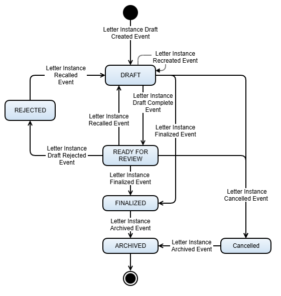

*Image 1393: Extracted from page 43*

*Image 1394: Extracted from page 43*

*Image 1395: Extracted from page 43*

*Image 1396: Extracted from page 43*

*Image 1397: Extracted from page 43*

*Image 1398: Extracted from page 43*

*Image 1399: Extracted from page 43*

*Image 1400: Extracted from page 43*

*Image 1401: Extracted from page 43*

*Image 1402: Extracted from page 43*

*Image 1403: Extracted from page 43*

*Image 1404: Extracted from page 43*

*Image 1405: Extracted from page 43*

### Vector Graphics on Page 43

*This page contains 73 vector graphic elements (diagrams, shapes, lines)*

---

## Page 44

DRAFT
This Letter Instance has been instantiated based on an AVAILABLE 
. Upon entering and exiting from this state, the 
Template Version
ECM-L system will pull in everything needed from Resources configured in the 
Version.  In the Letter Manager, when a 
Template 
Letter Editor is creating a new Letter Instance, it will always be instantiated based on the most recent AVAILABLE Template 
Version.  System Actors are able to generate Letter Instances based on older AVAILABLE Template Versions so that they have 
access to a reliable API data model.
Transitions to this state:
EVENT
TO 
DESCRIPTION
LetterInstanceDraftCreatedEvent
DRAFT
The Letter Instance has been created in the DRAFT state by the Letter Editor.
Transitions from this state:
EVENT
TO 
DESCRIPTION
LetterInst
anceRecr
eatedEve
nt
DRA
FT
This Letter Instance has been re-instantiated based on a newer Version of the Template.  This is optional after 
a Changeset Publisher has published a newer Version of the Template. 
If a newer Template Version becomes AVAILABLE while the Letter Instance is in this state (i.e., Changeset 
containing Template Version X+1 published while Letter Instance based on Template Version X in DRAFT 
state), Letter Editor is given the option to Recreate the Letter Instance using the newer Version of the 
Template.  If the Letter Editor chooses to take this action, any DRAFT content will be deleted. 
LetterInst
anceCan
celledEv
ent
CAN
CELL
ED
Letter Instance no longer needed and has been CANCELLED.
LetterInst
anceDraf
tComplet
eEvent
REA
DY 
FOR 
REVI
EW
Letter Instance based on AVAILABLE 
Version created and marked READY FOR REVIEW.
Template 
LetterInst
anceFina
lizedEve
nt
FINA
LIZED
The Letter Instance has been reviewed, and the resulting rendered PDF has been deemed acceptable. User
(s) that have both the Letter Editor and Letter Finalizer roles are able to "Fast Track" directly from DRAFT to 
AVAILABLE state.
When a user has both the Letter Editor and Letter Finalizer roles assigned, they are able to move a DRAFT Letter Instance 
directly to the FINALIZED state, effectively bypassing the READY FOR REVIEW state.
DRAFT Letter Instances can be rendered as a PDF but will be contain a "DRAFT" watermark.

### Images on Page 44

*Image 1406: Extracted from page 44*

*Image 1407: Extracted from page 44*

*Image 1408: Extracted from page 44*

*Image 1409: Extracted from page 44*

*Image 1410: Extracted from page 44*

*Image 1411: Extracted from page 44*

*Image 1412: Extracted from page 44*

*Image 1413: Extracted from page 44*

*Image 1414: Extracted from page 44*

*Image 1415: Extracted from page 44*

*Image 1416: Extracted from page 44*

*Image 1417: Extracted from page 44*

*Image 1418: Extracted from page 44*

*Image 1419: Extracted from page 44*

*Image 1420: Extracted from page 44*

*Image 1421: Extracted from page 44*

*Image 1422: Extracted from page 44*

*Image 1423: Extracted from page 44*

*Image 1424: Extracted from page 44*

*Image 1425: Extracted from page 44*

*Image 1426: Extracted from page 44*

*Image 1427: Extracted from page 44*

*Image 1428: Extracted from page 44*

*Image 1429: Extracted from page 44*

*Image 1430: Extracted from page 44*

*Image 1431: Extracted from page 44*

*Image 1432: Extracted from page 44*

*Image 1433: Extracted from page 44*

*Image 1434: Extracted from page 44*

*Image 1435: Extracted from page 44*

*Image 1436: Extracted from page 44*

*Image 1437: Extracted from page 44*

### Vector Graphics on Page 44

*This page contains 165 vector graphic elements (diagrams, shapes, lines)*

---

## Page 45

READY FOR 
REVIEW
This Letter Instance contains all elements required by the 
Version (e.g., inputs, attachments, inclusions, etc.) and has been 
Template 
submitted for review.
Transitions from this state:
EVENT
TO 
DESCRIPTION
LetterInstanceD
raftRejectedEve
nt
REJE
CTED
Changes need to be made to the Letter Instance before it can pass review and start the finalization 
process, so a Letter Finalizer has REJECTED the Letter Instance to DRAFT for further modification.
LetterInstanceR
ecalledEvent
DRA
FT
This Letter Editor has decided that the Letter Instance needs further modifications and moves it back to 
the DRAFT state to pull out of the review process.
LetterInstanceFi
nalizedEvent
FINA
LIZED
The Letter Instance has been reviewed, and the resulting rendered PDF has been deemed acceptable.
LetterInstanceC
ancelledEvent
CAN
CELL
ED
Letter Instance no longer needed and has been CANCELLED
REJECTED
This Letter Instance has been REJECTED for further modification. In this state the Letter Instance will be recalled back to the 
DRAFT state.
Transitions from this state:
EVENT
TO
DESCRIPTION
LetterInstanc
eRecalledEv
ent
DRA
FT
The Letter Finalizer has reviewed the Letter Instance and it has been REJECTED for further 
modifications. The Letter Instance will need to be recalled to DRAFT state by the Letter Editor for 
modifications.
FINALIZED
This Letter Instance has been approved and made Final.  In this state the Letter Instance is immutable and will persist 
unchanged for historical purposes, and every subsequent rendering of the Letter Instance will have the same result for all time.
CANCELLED
This Letter Instance is no longer needed and has been CANCELLED.
ARCHIVED
After a given period of time, the Letter Instance will be ARCHIVED as per applicable 
.
archival procedure
Data Models
Conceptual Data Models (DIV-1)
The following diagrams capture high level data concepts of ECM-L. 
For some Lines of Business a single user will move the Letter Instance all the way through the lifecycle to Finalization 
without a separate user approving the Letter Instance.
READY FOR REVIEW Letter Instances can be rendered as a PDF but will contain a "READY FOR REVIEW" watermark.
FINALIZED Letter Instances can be rendered as a PDF with no watermark.
CANCELLED Letter Instances can no longer be rendered.

### Images on Page 45

*Image 1438: Extracted from page 45*

*Image 1439: Extracted from page 45*

*Image 1440: Extracted from page 45*

*Image 1441: Extracted from page 45*

*Image 1442: Extracted from page 45*

*Image 1443: Extracted from page 45*

*Image 1444: Extracted from page 45*

*Image 1445: Extracted from page 45*

*Image 1446: Extracted from page 45*

*Image 1447: Extracted from page 45*

*Image 1448: Extracted from page 45*

*Image 1449: Extracted from page 45*

*Image 1450: Extracted from page 45*

*Image 1451: Extracted from page 45*

*Image 1452: Extracted from page 45*

*Image 1453: Extracted from page 45*

*Image 1454: Extracted from page 45*

*Image 1455: Extracted from page 45*

*Image 1456: Extracted from page 45*

*Image 1457: Extracted from page 45*

*Image 1458: Extracted from page 45*

*Image 1459: Extracted from page 45*

*Image 1460: Extracted from page 45*

*Image 1461: Extracted from page 45*

*Image 1462: Extracted from page 45*

*Image 1463: Extracted from page 45*

*Image 1464: Extracted from page 45*

*Image 1465: Extracted from page 45*

*Image 1466: Extracted from page 45*

*Image 1467: Extracted from page 45*

*Image 1468: Extracted from page 45*

*Image 1469: Extracted from page 45*

### Vector Graphics on Page 45

*This page contains 222 vector graphic elements (diagrams, shapes, lines)*

---

## Page 46

Key Concepts
This is a diagram illustrating the basic high level concepts and how they relate to one another.
Entity Relationship Diagram
This Entity Relationship Diagram illustrates how the high level concepts of the ECM-L systems interact with and relate to one another.

### Images on Page 46

*Image 1470: Extracted from page 46*

*Image 1471: Extracted from page 46*

*Image 1472: Extracted from page 46*

*Image 1473: Extracted from page 46*

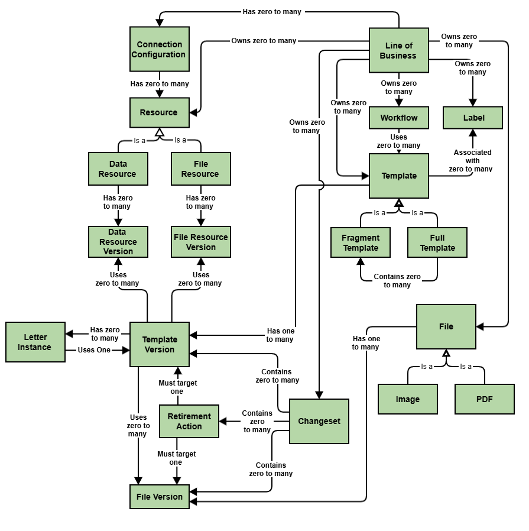

*Image 1474: Extracted from page 46*

*Image 1475: Extracted from page 46*

*Image 1476: Extracted from page 46*

*Image 1477: Extracted from page 46*

*Image 1478: Extracted from page 46*

*Image 1479: Extracted from page 46*

*Image 1480: Extracted from page 46*

*Image 1481: Extracted from page 46*

*Image 1482: Extracted from page 46*

*Image 1483: Extracted from page 46*

*Image 1484: Extracted from page 46*

*Image 1485: Extracted from page 46*

*Image 1486: Extracted from page 46*

*Image 1487: Extracted from page 46*

*Image 1488: Extracted from page 46*

*Image 1489: Extracted from page 46*

*Image 1490: Extracted from page 46*

*Image 1491: Extracted from page 46*

*Image 1492: Extracted from page 46*

*Image 1493: Extracted from page 46*

*Image 1494: Extracted from page 46*

*Image 1495: Extracted from page 46*

*Image 1496: Extracted from page 46*

*Image 1497: Extracted from page 46*

*Image 1498: Extracted from page 46*

*Image 1499: Extracted from page 46*

*Image 1500: Extracted from page 46*

*Image 1501: Extracted from page 46*

*Image 1502: Extracted from page 46*

### Vector Graphics on Page 46

*This page contains 64 vector graphic elements (diagrams, shapes, lines)*

---

## Page 47

Resource Manager
Line of Business
An organization serving a specific customer need or business function. Changesets, Template Versions, Workflows, Resources, Key Parameter Types, 
and Connection Configurations all belong to a specific Line of Business.
Attribute Name
Description
ID
Its immutable UUID.
Name
Its user-friendly name.
CSS Identifier
An abbreviated name of the Line of Business (6 character max) for CSS Functions.
Connection Configuration
All of the configuration information necessary for the ECM-L to successfully interact and integrate with a specific external API. These are loaded into the 
Resource Manager via a configuration file and then are made available for use by Resources via the Resource Manager.
Attribute Name
Description
ID
Its immutable UUID.
Name
Its user-friendly name.
URL
The environment-specific URL for the API.
Secret Path
The path to the secret in Vault.
Issuer Path
The path to the issuer in Vault.
Line of Business ID
The UUID of the Line of Business to which it belongs.
Resource
The information necessary to gather content and data from outside of the ECM-L system that can be used within the documents that it creates and renders.
Attribute Name
Description
ID
Its immutable UUID.
Name
The user friendly name of a Resource.

### Images on Page 47

*Image 1503: Extracted from page 47*

*Image 1504: Extracted from page 47*

*Image 1505: Extracted from page 47*

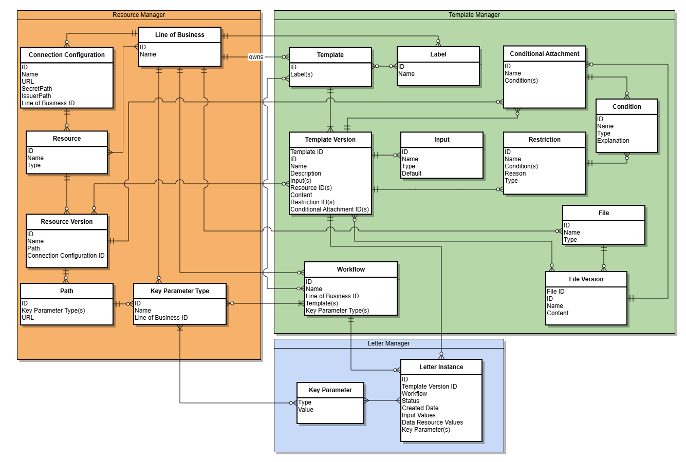

*Image 1506: Extracted from page 47*

*Image 1507: Extracted from page 47*

*Image 1508: Extracted from page 47*

*Image 1509: Extracted from page 47*

*Image 1510: Extracted from page 47*

*Image 1511: Extracted from page 47*

*Image 1512: Extracted from page 47*

*Image 1513: Extracted from page 47*

*Image 1514: Extracted from page 47*

*Image 1515: Extracted from page 47*

*Image 1516: Extracted from page 47*

*Image 1517: Extracted from page 47*

*Image 1518: Extracted from page 47*

*Image 1519: Extracted from page 47*

*Image 1520: Extracted from page 47*

*Image 1521: Extracted from page 47*

*Image 1522: Extracted from page 47*

*Image 1523: Extracted from page 47*

*Image 1524: Extracted from page 47*

*Image 1525: Extracted from page 47*

*Image 1526: Extracted from page 47*

*Image 1527: Extracted from page 47*

*Image 1528: Extracted from page 47*

*Image 1529: Extracted from page 47*

*Image 1530: Extracted from page 47*

*Image 1531: Extracted from page 47*

*Image 1532: Extracted from page 47*

*Image 1533: Extracted from page 47*

*Image 1534: Extracted from page 47*

*Image 1535: Extracted from page 47*

### Vector Graphics on Page 47

*This page contains 182 vector graphic elements (diagrams, shapes, lines)*

---

## Page 48

Type
The type of the Resource.
Resource Version
A specific Version of a Resource.
Attribute Name
Description
ID
Its immutable UUID.
Paths
A list of paths that can be used to access the Resource, depending on the given Key Parameter Type.
Connection Configuration ID
The ID of the Connection Configuration it uses.
Path
The information related to a specific operation / API path that will allow the ECM-L System to access the information in a Resource Version.
Attribute Name
Description
ID
Its immutable UUID.
Key Parameter Type(s)
The IDs of the Key Parameters required for this path.
URL
The path to the endpoint in the API represented by the chosen Connection Configuration.
Key Parameter Type
A Line of Business specific data type used to organize and contextualize correspondence and used as a Parameter to gather contextual data from a 
Resource.
Attribute Name
Description
ID
Its immutable UUID.
Name
Its user-friendly name.
Line of Business ID
The UUID of the Line of Business to which it belongs.
 Manager
Template
Workflow
The Workflow or sub process in which Letters are created within a given Line of Business.
Attribute Name
Description
ID
Its immutable UUID.
Name
Its user-friendly name.
Line of Business ID
The UUID of the Line of Business to which it belongs.
Templates
The UUIDs of any Templates associated with this Workflow.
Key Parameter Type(s)
The type(s) of Key Parameter given for the context.
Template Label
A label is used to help users assign meaning and organizational order to their Templates.
Attribute Name
Description
ID
Its immutable UUID.
Name
Its user-friendly name.
File

### Images on Page 48

*Image 1536: Extracted from page 48*

*Image 1537: Extracted from page 48*

*Image 1538: Extracted from page 48*

*Image 1539: Extracted from page 48*

*Image 1540: Extracted from page 48*

*Image 1541: Extracted from page 48*

*Image 1542: Extracted from page 48*

*Image 1543: Extracted from page 48*

*Image 1544: Extracted from page 48*

*Image 1545: Extracted from page 48*

*Image 1546: Extracted from page 48*

*Image 1547: Extracted from page 48*

*Image 1548: Extracted from page 48*

*Image 1549: Extracted from page 48*

*Image 1550: Extracted from page 48*

*Image 1551: Extracted from page 48*

*Image 1552: Extracted from page 48*

*Image 1553: Extracted from page 48*

*Image 1554: Extracted from page 48*

*Image 1555: Extracted from page 48*

*Image 1556: Extracted from page 48*

*Image 1557: Extracted from page 48*

*Image 1558: Extracted from page 48*

*Image 1559: Extracted from page 48*

*Image 1560: Extracted from page 48*

*Image 1561: Extracted from page 48*

*Image 1562: Extracted from page 48*

*Image 1563: Extracted from page 48*

*Image 1564: Extracted from page 48*

*Image 1565: Extracted from page 48*

*Image 1566: Extracted from page 48*

*Image 1567: Extracted from page 48*

### Vector Graphics on Page 48

*This page contains 250 vector graphic elements (diagrams, shapes, lines)*

---

## Page 49

A piece of file-based content.  These are versioned and each File Version is managed by a Changeset, similar to Templates.  There are two different types 
of Files - PDF's and Images
Attribute Name
Description
ID
Its immutable UUID.
Name
Its user-friendly name.
Type
The type of the File - either a PDF or an Image.
Version
File 
The versioned File content.
Attribute Name
Description
File ID
The immutable UUID of the 
this is Versioning.
File
ID
Its immutable UUID.
Name
Its user-friendly name.
Content
The actual content of the File.
Template
A collection of versioned configuration information and content required to manage a specific type of correspondence.  There are two different types of 
Templates - Full 
s and Fragment 
s.
Template
Template
Attribute Name
Description
ID
Its immutable UUID.
Labels
The labels to which this 
has been aligned.
Template 
Version
Template 
The versioned configuration information and content required to manage a specific type of correspondence.
Attribute Name
Description
Template ID
The immutable UUID of the 
this is Versioning.
Template 
ID
Its immutable UUID.
Name
Its user-friendly name.
Inputs
A collection of inputs that can be used to hydrate the content of the 
with user created data.
Template 
Resource IDs
The UUID's of any Resources that are aligned to this 
, that can be used to hydrate the content of the 
with 
Template
Template 
contextual data.
Content
The actual FreeMarker and textual content of the 
.
Template
Restriction IDs
The UUID's of any restrictions that should be applied to correspondence created based on this 
.
Template
Conditional Attachment 
IDs
The UUID's of any attachments that should be conditionally added to correspondence created based on this 
.
Template
Conditional Attachment
Files like PDF's that are attached to correspondence if certain conditions are met.
Attribute Name
Description
ID
Its immutable UUID.
Name
Its user-friendly name.
Conditions
A list of conditions that once met will result in it being attached to the correspondence.
Condition

### Images on Page 49

*Image 1568: Extracted from page 49*

*Image 1569: Extracted from page 49*

*Image 1570: Extracted from page 49*

*Image 1571: Extracted from page 49*

*Image 1572: Extracted from page 49*

*Image 1573: Extracted from page 49*

*Image 1574: Extracted from page 49*

*Image 1575: Extracted from page 49*

*Image 1576: Extracted from page 49*

*Image 1577: Extracted from page 49*

*Image 1578: Extracted from page 49*

*Image 1579: Extracted from page 49*

*Image 1580: Extracted from page 49*

*Image 1581: Extracted from page 49*

*Image 1582: Extracted from page 49*

*Image 1583: Extracted from page 49*

*Image 1584: Extracted from page 49*

*Image 1585: Extracted from page 49*

*Image 1586: Extracted from page 49*

*Image 1587: Extracted from page 49*

*Image 1588: Extracted from page 49*

*Image 1589: Extracted from page 49*

*Image 1590: Extracted from page 49*

*Image 1591: Extracted from page 49*

*Image 1592: Extracted from page 49*

*Image 1593: Extracted from page 49*

*Image 1594: Extracted from page 49*

*Image 1595: Extracted from page 49*

*Image 1596: Extracted from page 49*

*Image 1597: Extracted from page 49*

*Image 1598: Extracted from page 49*

*Image 1599: Extracted from page 49*

### Vector Graphics on Page 49

*This page contains 274 vector graphic elements (diagrams, shapes, lines)*

---

## Page 50

A comparison or check used in Restrictions and Conditional Attachments. 
Attribute Name
Description
ID
Its immutable UUID.
Name
Its user-friendly name.
Type
The condition type, such as a string-match or a boolean condition.
Explanation
A user friendly explanation that describes the condition in plain English.
Restriction
A condition based restriction on creating correspondence related to a specific 
Version.
Template 
Attribute 
Name
Description
ID
Its immutable UUID.
Name
Its user-friendly name.
Conditions
A list of the UUIDs for conditions that if met result in a 
Version being restricted.
Template 
Reason
A user-friendly description of the reason for this restriction.
Type
Determines the impact of this restriction - such as hiding it from the list of available Templates, or disabling it and indicating why using 
the given Reason.
Input
A way to collect data from a user that can be used to hydrate the content of a 
.
Template
Attribute 
Name
Description
ID
Its immutable UUID.
Name
Its user-friendly name.
Type
Determines the type of input, which informs things like the formatting options in the Content Editor of the 
Manager and which 
Template 
form elements to present to the user in the Edit Letter screen.
Default
The optional default value of the Input.
Letter Manager
Letter Instance
An instantiated Letter based on the content and configuration options outlined in a specific version of a Full Template.
Attribute Name
Description
ID
Its immutable UUID.
Template Version ID
The UUID of the 
Version for which this instance was created and will be rendered against.
Template 
Workflow
The Workflow in which this Letter Instance was created.
Created Date
The date this instance was created.
Input Values
A collection of the data collected from users based on the Inputs defined in the 
 Version.
Template
Data Resource Values
A collection of the data collected from data resources based on the Resources defined in the 
Version.
Template 
Key Parameter
A type / value pair that informs us of the context in which a Letter Instance was created.
Attribute Name
Description

### Images on Page 50

*Image 1600: Extracted from page 50*

*Image 1601: Extracted from page 50*

*Image 1602: Extracted from page 50*

*Image 1603: Extracted from page 50*

*Image 1604: Extracted from page 50*

*Image 1605: Extracted from page 50*

*Image 1606: Extracted from page 50*

*Image 1607: Extracted from page 50*

*Image 1608: Extracted from page 50*

*Image 1609: Extracted from page 50*

*Image 1610: Extracted from page 50*

*Image 1611: Extracted from page 50*

*Image 1612: Extracted from page 50*

*Image 1613: Extracted from page 50*

*Image 1614: Extracted from page 50*

*Image 1615: Extracted from page 50*

*Image 1616: Extracted from page 50*

*Image 1617: Extracted from page 50*

*Image 1618: Extracted from page 50*

*Image 1619: Extracted from page 50*

*Image 1620: Extracted from page 50*

*Image 1621: Extracted from page 50*

*Image 1622: Extracted from page 50*

*Image 1623: Extracted from page 50*

*Image 1624: Extracted from page 50*

*Image 1625: Extracted from page 50*

*Image 1626: Extracted from page 50*

*Image 1627: Extracted from page 50*

*Image 1628: Extracted from page 50*

*Image 1629: Extracted from page 50*

*Image 1630: Extracted from page 50*

*Image 1631: Extracted from page 50*

### Vector Graphics on Page 50

*This page contains 268 vector graphic elements (diagrams, shapes, lines)*

---

## Page 51

Type
The ID of the Key Parameter Type that relates to the given value.
Value
The value provided either automatically by the Line of Business system or manually entered by an end user.
Logical Data Viewpoint Model 
 
(DIV-2)
The following diagram defines relationships between data elements, providing a structured representation of data flows, entities, and attributes.
Physical Data Viewpoint Model (DIV-3) 
N/A

### Images on Page 51

*Image 1632: Extracted from page 51*

*Image 1633: Extracted from page 51*

*Image 1634: Extracted from page 51*

*Image 1635: Extracted from page 51*

*Image 1636: Extracted from page 51*

*Image 1637: Extracted from page 51*

*Image 1638: Extracted from page 51*

*Image 1639: Extracted from page 51*

*Image 1640: Extracted from page 51*

*Image 1641: Extracted from page 51*

*Image 1642: Extracted from page 51*

*Image 1643: Extracted from page 51*

*Image 1644: Extracted from page 51*

*Image 1645: Extracted from page 51*

*Image 1646: Extracted from page 51*

*Image 1647: Extracted from page 51*

*Image 1648: Extracted from page 51*

*Image 1649: Extracted from page 51*

*Image 1650: Extracted from page 51*

*Image 1651: Extracted from page 51*

*Image 1652: Extracted from page 51*

*Image 1653: Extracted from page 51*

*Image 1654: Extracted from page 51*

*Image 1655: Extracted from page 51*

*Image 1656: Extracted from page 51*

*Image 1657: Extracted from page 51*

*Image 1658: Extracted from page 51*

*Image 1659: Extracted from page 51*

*Image 1660: Extracted from page 51*

*Image 1661: Extracted from page 51*

*Image 1662: Extracted from page 51*

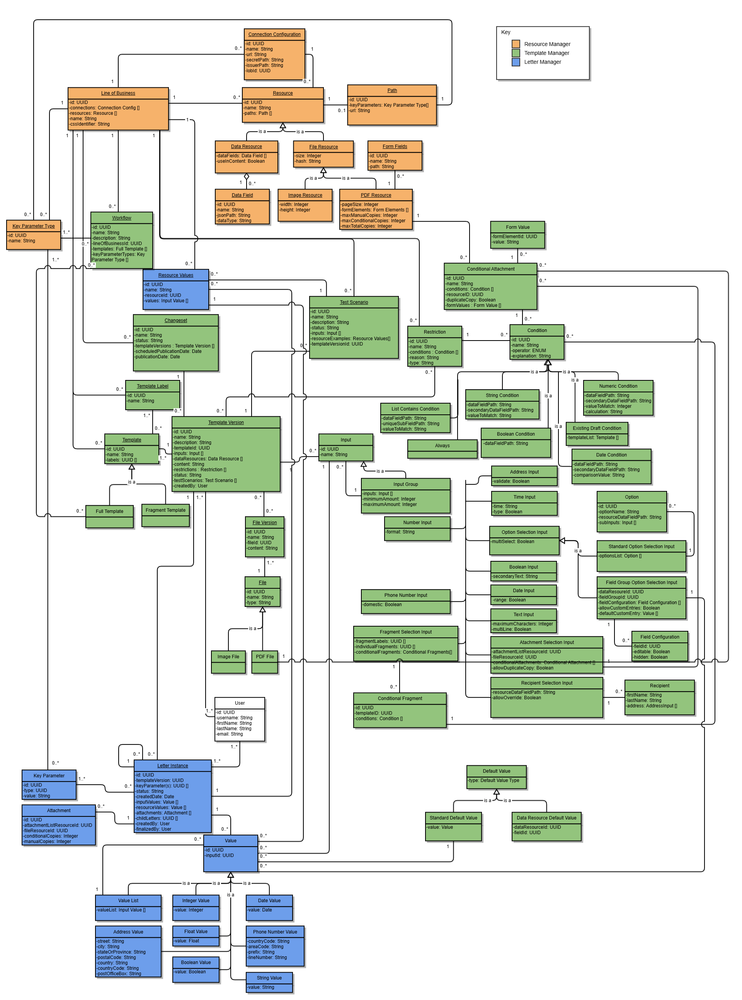

*Image 1663: Extracted from page 51*

*Image 1664: Extracted from page 51*

### Vector Graphics on Page 51

*This page contains 80 vector graphic elements (diagrams, shapes, lines)*

---

## Page 52

Transitioning Concepts From Legacy Correspondence Management
This section visually translates the reimagination of terms from legacy correspondence management applications into ways easier to consume within ECM-
L.
ECM-L reduces the complexity and learning curve for new users by consolidating fragmented concepts into elegant, intuitive abstractions that leverage 
planned architectural complexity behind the scenes, reducing difficult operations to point-and-click activities and transforming technical complexity into a 
streamlined and simplified user experience.
High Level Concept Changes
Low Level Concept Changes

### Images on Page 52

*Image 1665: Extracted from page 52*

*Image 1666: Extracted from page 52*

*Image 1667: Extracted from page 52*

*Image 1668: Extracted from page 52*

*Image 1669: Extracted from page 52*

*Image 1670: Extracted from page 52*

*Image 1671: Extracted from page 52*

*Image 1672: Extracted from page 52*

*Image 1673: Extracted from page 52*

*Image 1674: Extracted from page 52*

*Image 1675: Extracted from page 52*

*Image 1676: Extracted from page 52*

*Image 1677: Extracted from page 52*

*Image 1678: Extracted from page 52*

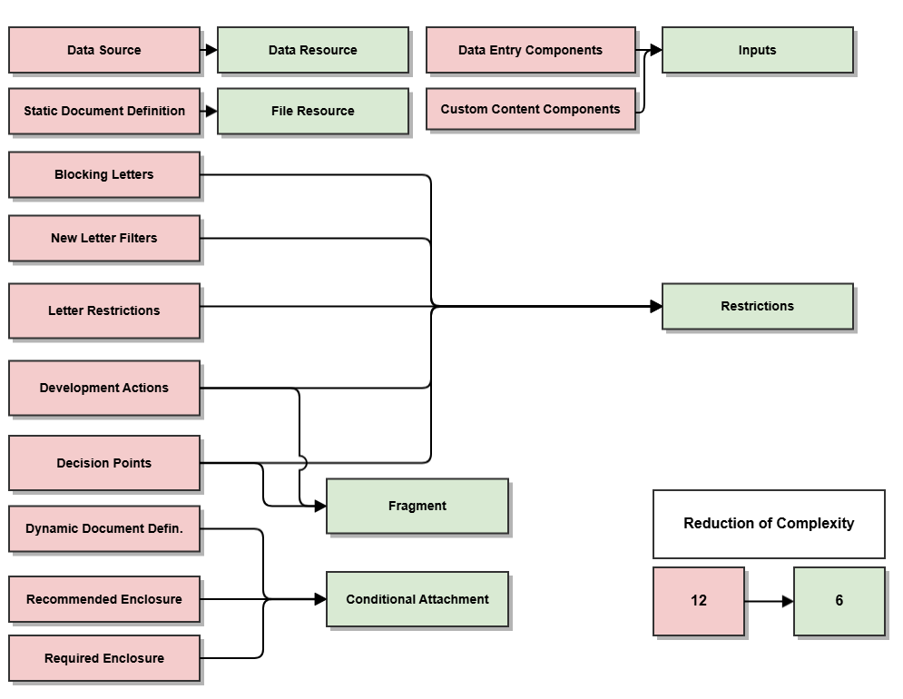

*Image 1679: Extracted from page 52*

*Image 1680: Extracted from page 52*

*Image 1681: Extracted from page 52*

*Image 1682: Extracted from page 52*

*Image 1683: Extracted from page 52*

*Image 1684: Extracted from page 52*

*Image 1685: Extracted from page 52*

*Image 1686: Extracted from page 52*

*Image 1687: Extracted from page 52*

*Image 1688: Extracted from page 52*

*Image 1689: Extracted from page 52*

*Image 1690: Extracted from page 52*

*Image 1691: Extracted from page 52*

*Image 1692: Extracted from page 52*

*Image 1693: Extracted from page 52*

*Image 1694: Extracted from page 52*

*Image 1695: Extracted from page 52*

*Image 1696: Extracted from page 52*

*Image 1697: Extracted from page 52*

### Vector Graphics on Page 52

*This page contains 64 vector graphic elements (diagrams, shapes, lines)*

---

## Page 53

Claim Evidence and Package Manager Integration
All Lines of Business are encouraged to use Claim Evidence for document storage and Package 
Manager for correspondence distribution.
What Are Claim Evidence and Package Manager?
 is a system that manages and stores documents related to a specific Veteran 
Claim Evidence
and 
 is a system that allows for the mailing and distribution of the documents 
Package Manager
stored within Claim Evidence.
Lines of Business are able to configure specific Workflows to use Claim Evidence and / or 
Package Manager, and if they have opted to use them, they are able to override those 
configurations for specific types of correspondence.
Workflow Configuration
Line of Business Administrators are able to configure their Workflows so that they function in specific ways.
Package Manager Distributions
Packages created by the ECM-L components are NOT automatically sent, but are ready for review within the Package Manager interface.  This 
is allows for the user to confirm and validate all of the information before sending the packages out to their distribution lists.

### Images on Page 53

*Image 1698: Extracted from page 53*

*Image 1699: Extracted from page 53*

*Image 1700: Extracted from page 53*

*Image 1701: Extracted from page 53*

*Image 1702: Extracted from page 53*

*Image 1703: Extracted from page 53*

*Image 1704: Extracted from page 53*

*Image 1705: Extracted from page 53*

*Image 1706: Extracted from page 53*

*Image 1707: Extracted from page 53*

*Image 1708: Extracted from page 53*

*Image 1709: Extracted from page 53*

*Image 1710: Extracted from page 53*

*Image 1711: Extracted from page 53*

*Image 1712: Extracted from page 53*

*Image 1713: Extracted from page 53*

*Image 1714: Extracted from page 53*

*Image 1715: Extracted from page 53*

*Image 1716: Extracted from page 53*

*Image 1717: Extracted from page 53*

*Image 1718: Extracted from page 53*

*Image 1719: Extracted from page 53*

*Image 1720: Extracted from page 53*

*Image 1721: Extracted from page 53*

*Image 1722: Extracted from page 53*

*Image 1723: Extracted from page 53*

*Image 1724: Extracted from page 53*

*Image 1725: Extracted from page 53*

*Image 1726: Extracted from page 53*

*Image 1727: Extracted from page 53*

*Image 1728: Extracted from page 53*

*Image 1729: Extracted from page 53*

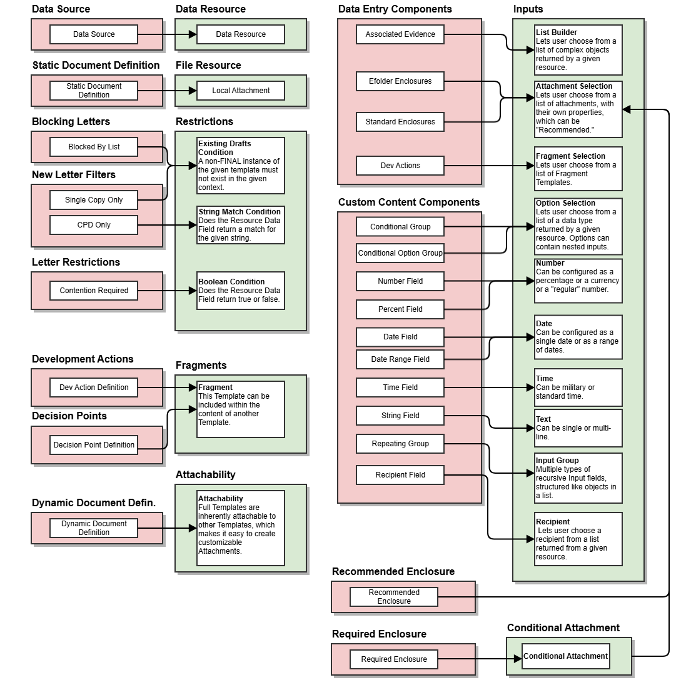

*Image 1730: Extracted from page 53*

### Vector Graphics on Page 53

*This page contains 65 vector graphic elements (diagrams, shapes, lines)*

---

## Page 54

Key Parameter Types
Workflows should be configured with one or more Key Parameter Types.  These will help shape the list of Letters a user is presented with when they 
access that Workflow in the Letter Manager.
Example:
Workflow Name: Developing a Claim
Key Parameter Type: C&P Claim ID
In this situation the Letter Manager user would be, within this workflow, looking at a list of Letter Instances that relate to a specific C&P Claim ID.
Storage and Distribution
Users can configure a specific Workflow to use Claim Evidence for document storage.  For any Workflows that have been configured to use Claim 
Evidence, they can optionally configure them to create packages for them in Package Manager.
Template Association
Workflows have a list of Templates (Templates, not Template Versions), that are associated to them.  This represents the list of Templates that a Letter 
Manager is able to create while within that Workflow.
Each of the Templates in this list can be configured, at the Workflow level, to be Claim Evidence or Package Manager exempt, which would prevent them 
from being sent to Claim Evidence or Package Manager.  These options will appear conditionally, depending on the configuration of the Workflow as a 
whole.
Document Type
For Workflows configured to use Claim Evidence storage, Templates must be configured with a Claim Evidence Document Type, unless they are marked 
as Claim Evidence Exempt (see below).
Claim Evidence Exempt
For Workflows configured to use Claim Evidence storage, Templates can be configured as Exempt from Claim Evidence, which means that even though 
the Workflow is configured to store the PDF of the Finalized Letter in Claim Evidence, that specific Template will not be stored.
Package Manager Exempt
For Workflows configured to use Package Manager distribution, Templates can be configured as Exempt from Package Manager, which means that even 
though the Workflow is configured to distribute the stored PDF via Package Manager, that specific Template will not be distributed.
Intake
Initial Evaluation
The initial evaluation during the intake process will evaluate how the Line of Business intends to interact with the ECM-L components, or in situations 
where the Line of Business is migrating from another correspondence management system, will evaluate how it currently interacts with that.  Based on this 
evaluation the ECM-L team can help to outline a strategy that adapts their intended and expected needs, creating a plan for them to interact with the ECM-
L framework.
Factors to consider during the evaluation include:
Integration Points - An evaluation of when and how Lines of Business systems could and should interact with the ECM-L components to provide 
the best user experience. 
Are their steps in the process that are not initiated by a user?
Do the Lines of Business systems need to process Finalized Letter Data for post-Finalization work?
Is there a need to embed the Letter Manage MFE in one of the Line of Business system interfaces?
Letter Migration - An evaluation of specific pieces of correspondence, providing advice on how to adapt those in terms of the ECM-L Template 
framework.
Any Workflow that is configured to use Claim Evidence will require the system-level "Participant ID" Key Parameter.  In addition to this, each 
Template must be assigned a Workflow-level Claim Evidence Document Type, and the user will not be able to save a Workflow configured to 
use Claim Evidence if there are any Templates with an unassigned Claim Evidence Document Type (Unless that Template is marked as Claim 
Evidence Exempt, which means it doesn't need a Claim Evidence Document Type.)
Package Manager Requires Claim Evidence
You can not use Package Manager without Claim Evidence, because Package Manager only creates packages of documents that are already 
in Claim Evidence.

### Images on Page 54

*Image 1731: Extracted from page 54*

*Image 1732: Extracted from page 54*

*Image 1733: Extracted from page 54*

*Image 1734: Extracted from page 54*

*Image 1735: Extracted from page 54*

*Image 1736: Extracted from page 54*

*Image 1737: Extracted from page 54*

*Image 1738: Extracted from page 54*

*Image 1739: Extracted from page 54*

*Image 1740: Extracted from page 54*

*Image 1741: Extracted from page 54*

*Image 1742: Extracted from page 54*

*Image 1743: Extracted from page 54*

*Image 1744: Extracted from page 54*

*Image 1745: Extracted from page 54*

*Image 1746: Extracted from page 54*

*Image 1747: Extracted from page 54*

*Image 1748: Extracted from page 54*

*Image 1749: Extracted from page 54*

*Image 1750: Extracted from page 54*

*Image 1751: Extracted from page 54*

*Image 1752: Extracted from page 54*

*Image 1753: Extracted from page 54*

*Image 1754: Extracted from page 54*

*Image 1755: Extracted from page 54*

*Image 1756: Extracted from page 54*

*Image 1757: Extracted from page 54*

*Image 1758: Extracted from page 54*

*Image 1759: Extracted from page 54*

*Image 1760: Extracted from page 54*

*Image 1761: Extracted from page 54*

*Image 1762: Extracted from page 54*

### Vector Graphics on Page 54

*This page contains 72 vector graphic elements (diagrams, shapes, lines)*

---

## Page 55

Security and Roles - An evaluation of any Line of Business specific security policy needs.
Line of Business Intake
The intake process for a new Line of Business involves an ECM-Line of Business Intake Form, which outlines how the new Line of Business interacts with 
ECM-L system and its components, and identifies any Connection Configurations the Line of Business wants to include in the intake process.
Line of Business Intake Form
Enterprise Correspondence Management - Line of Business Intake Form
The Line of Business will submit the Line of Business Intake Form, and Connection Configuration Intake Form if needed, and create a Jira ticket. After 
submission of the Intake Form(s), there will be an Integration Meeting with stakeholders to introduce ECM-L capabilities, integration points and connection 
configurations. 
Intake Processing
This form ultimately results in the configuration information being loaded in to the Config repo for the Resource Manager where it becomes accessible to 
the rest of the ECM-L components.
System Registry
As a part of the Intake Process the ECM-L team will determine if the Line of Business will need to interact with the components with a non-human system 
actor, for processes that are automated.  We need to collect enough information to contact Lines of Business to inform them of when Major Changes to a 
Template they use could necessitate changes to their downstream systems.
Information we'd need to collect from them:
System Name
Points of Contact
Name
Email Address
We will use this registry to alert users to actions that could negatively impact downstream systems so that they can take action to coordinate with the 
necessary teams to prepare for those changes.
For example, if a new version of a Template is marked as Approved during the Changeset approval process, and that Template is known to be generated 
by a registered system, the user will be alerted.
Connection Configuration Intake
The connection configuration intake process results in a successful integration between the ECM-L applications and an external Line of Business 
API.  This process begins with a Connection Configuration Intake Form filled out by the Line of Business, which results in a Change Request that loads the 
necessary Secret / Issuer key pair into the external API and into the individual ECM-L components, and ultimately ends with a Connection Configuration in 
the Provisioned status, ready to be used.
Connection Configuration Intake Form
Here is an example Change Request ticket that can be cloned in Jira:  
 . 
 - 
 
 
BPS-66120
Getting issue details...
STATUS
The Connection Configuration intake form for a new LoB requesting connection to ECM-L will require the following:
Line of Business
Point of Contact
Name
Email Address
Connection Name
Integration Information
Vault Secret Locations
URL
User Roles and Permissions / Intake
ECM-L has a robust and well organized system for dealing with Line of Business specific user permissions and roles.
For more information, see: 
.
ECM-L User Accounts and Permissions
Process View (
 Process Model)
Business

### Images on Page 55

*Image 1763: Extracted from page 55*

*Image 1764: Extracted from page 55*

*Image 1765: Extracted from page 55*

*Image 1766: Extracted from page 55*

*Image 1767: Extracted from page 55*

*Image 1768: Extracted from page 55*

*Image 1769: Extracted from page 55*

*Image 1770: Extracted from page 55*

*Image 1771: Extracted from page 55*

*Image 1772: Extracted from page 55*

*Image 1773: Extracted from page 55*

*Image 1774: Extracted from page 55*

*Image 1775: Extracted from page 55*

*Image 1776: Extracted from page 55*

*Image 1777: Extracted from page 55*

*Image 1778: Extracted from page 55*

*Image 1779: Extracted from page 55*

*Image 1780: Extracted from page 55*

*Image 1781: Extracted from page 55*

*Image 1782: Extracted from page 55*

*Image 1783: Extracted from page 55*

*Image 1784: Extracted from page 55*

*Image 1785: Extracted from page 55*

*Image 1786: Extracted from page 55*

*Image 1787: Extracted from page 55*

*Image 1788: Extracted from page 55*

*Image 1789: Extracted from page 55*

*Image 1790: Extracted from page 55*

*Image 1791: Extracted from page 55*

*Image 1792: Extracted from page 55*

*Image 1793: Extracted from page 55*

*Image 1794: Extracted from page 55*

### Vector Graphics on Page 55

*This page contains 87 vector graphic elements (diagrams, shapes, lines)*

---

## Page 56

The Process View describes the behavior of the systems, the sequence of events, and how various tasks combine to the functionality described in the Use-
Case View. It decomposes the systems into lightweight processes (single threads of control) and heavyweight processes (groupings of lightweight 
processes). The Process View describes how systems interact, detailing the timing of messages or events.
Main Business Process Model (OV-6d)
Intake Processes
The following diagrams delineate the key processes and workflows within ECM-L, mapping the sequence of activities and information flow that drive 
operations.
Connection Configuration Process Workflows
Process Workflow for Connection 
 Intake
Configuration
This process guides the intake and integration of new connections. It includes submission, approval, configuration, and confirmation across multiple 
systems.
Task
Description
Start Intake Process
Initiate the process for a new connection configuration request.

### Images on Page 56

*Image 1795: Extracted from page 56*

*Image 1796: Extracted from page 56*

*Image 1797: Extracted from page 56*

*Image 1798: Extracted from page 56*

*Image 1799: Extracted from page 56*

*Image 1800: Extracted from page 56*

*Image 1801: Extracted from page 56*

*Image 1802: Extracted from page 56*

*Image 1803: Extracted from page 56*

*Image 1804: Extracted from page 56*

*Image 1805: Extracted from page 56*

*Image 1806: Extracted from page 56*

*Image 1807: Extracted from page 56*

*Image 1808: Extracted from page 56*

*Image 1809: Extracted from page 56*

*Image 1810: Extracted from page 56*

*Image 1811: Extracted from page 56*

*Image 1812: Extracted from page 56*

*Image 1813: Extracted from page 56*

*Image 1814: Extracted from page 56*

*Image 1815: Extracted from page 56*

*Image 1816: Extracted from page 56*

*Image 1817: Extracted from page 56*

*Image 1818: Extracted from page 56*

*Image 1819: Extracted from page 56*

*Image 1820: Extracted from page 56*

*Image 1821: Extracted from page 56*

*Image 1822: Extracted from page 56*

*Image 1823: Extracted from page 56*

*Image 1824: Extracted from page 56*

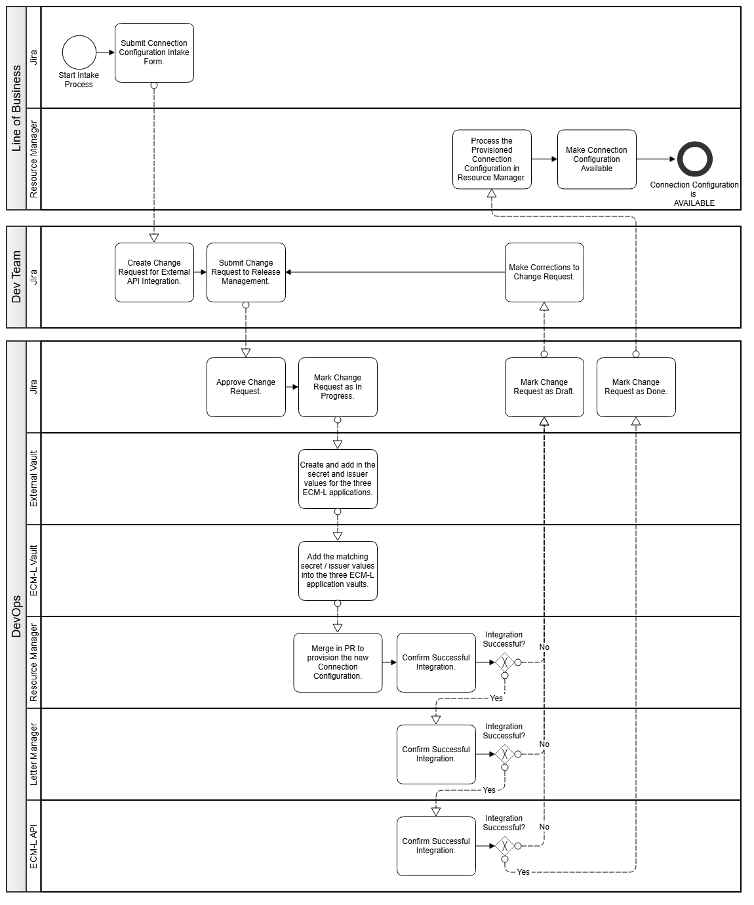

*Image 1825: Extracted from page 56*

*Image 1826: Extracted from page 56*

*Image 1827: Extracted from page 56*

### Vector Graphics on Page 56

*This page contains 82 vector graphic elements (diagrams, shapes, lines)*

---

## Page 57

Submit Connection Configuration Intake 
Form
Resource Manager submits the intake form to begin provisioning.
Create Change Request for External API 
Integration
Dev Team creates a change request for required API integration.
Submit Change Request to Release 
Management
Dev Team submits the change request for approval and release tracking.
Approve Change Request
Release Manager reviews and approves the submitted change request.
Mark Change Request as In Progress
Release Manager (or Dev Team) marks change request as actively being worked on.
Make Corrections to Change Request
Dev Team revises the change request as needed based on feedback or errors.
Create and add secret/issuer values (ECM 
Vault)
External Vault team generates and adds secret/issuer values for ECM applications.
Add secret/issuer values to ECM application 
vaults
ECM Vault team updates ECM application vaults with the required secret/issuer values.
Merge in PR to provision new Connection 
Config
Resource Manager merges pull request to provision the connection configuration.
Confirm Successful Integration
Various teams (Resource Manager, Ledger Manager, ECM API) confirm that the integration was 
completed successfully.
Integration Successful?
Confirmation step checks if integration was successful; if not, process returns to correction steps.
Make Connection Configuration Available
Once integration is successful, configuration is made available for use.
Connection Configuration is AVAILABLE
The configuration is fully provisioned and available for business needs.
Make Connection Available 
The Line of Business Administrator is able to make a Connection Configuration available.
Task
Description
View List of Connection Configuration(s)
LOB Admin views available connection configurations, filtered by their assigned line of business.
Select Appropriate PROVISIONED Connection
LOB Admin selects the provisioned connection to be made available.
Test PROVISIONED Connection by checking API
LOB Admin tests the selected connection by verifying its API functionality.
Connection Successful?
Decision point to confirm if the connection test was successful.
User makes PROVISIONED Connection 
AVAILABLE
If successful, the admin publishes the connection, making it available.
Connection Configuration Published Event
System records and completes the publication event, moving the connection to AVAILABLE 
state.
Display message open a ticket for DevOps
If unsuccessful, system prompts user to open a support ticket for DevOps intervention.
Connection Configuration Intake Process
Process returns to intake for troubleshooting and resolution if integration fails.
Connection Configuration Decommissioning Process

### Images on Page 57

*Image 1828: Extracted from page 57*

*Image 1829: Extracted from page 57*

*Image 1830: Extracted from page 57*

*Image 1831: Extracted from page 57*

*Image 1832: Extracted from page 57*

*Image 1833: Extracted from page 57*

*Image 1834: Extracted from page 57*

*Image 1835: Extracted from page 57*

*Image 1836: Extracted from page 57*

*Image 1837: Extracted from page 57*

*Image 1838: Extracted from page 57*

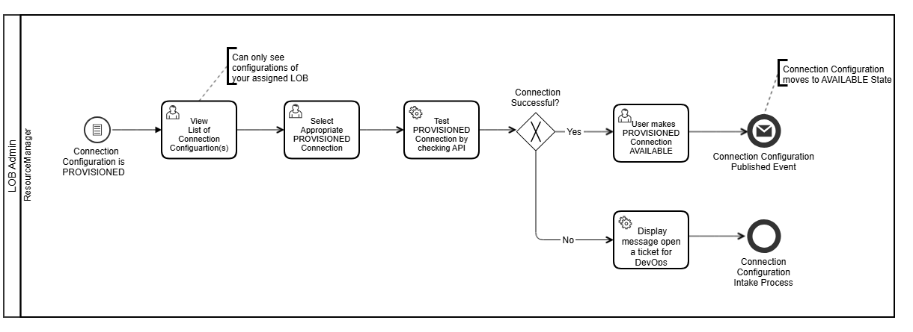

*Image 1839: Extracted from page 57*

*Image 1840: Extracted from page 57*

*Image 1841: Extracted from page 57*

*Image 1842: Extracted from page 57*

*Image 1843: Extracted from page 57*

*Image 1844: Extracted from page 57*

*Image 1845: Extracted from page 57*

*Image 1846: Extracted from page 57*

*Image 1847: Extracted from page 57*

*Image 1848: Extracted from page 57*

*Image 1849: Extracted from page 57*

*Image 1850: Extracted from page 57*

*Image 1851: Extracted from page 57*

*Image 1852: Extracted from page 57*

*Image 1853: Extracted from page 57*

*Image 1854: Extracted from page 57*

*Image 1855: Extracted from page 57*

*Image 1856: Extracted from page 57*

*Image 1857: Extracted from page 57*

*Image 1858: Extracted from page 57*

*Image 1859: Extracted from page 57*

*Image 1860: Extracted from page 57*

### Vector Graphics on Page 57

*This page contains 244 vector graphic elements (diagrams, shapes, lines)*

---

## Page 58

The process of Decommissioning a Connection Configuration starts with the LOB Admin Retiring the Connection Configuration first and then marking it as 
'Decommission' in the Resource Manager. Retirement ensures that the Connection Configuration can not be used to create new Resources. 
After the Connection Configuration is Retired it can be Decommissioned which will only show a message that the API is non-operational. The actual 
Decommissioning happens outside of ECML.
Task 
Description 
LOB Admin Login
The LOB Admin logs in to the system to manage Connection Configurations.
View Connection Configuration Status
The LOB Admin views the status of available Connection Configurations.
Is Connection Configuration Available?
Decision Point: Is the Connection Configuration available for retirement?
If No  End
If no Connection Configuration is available, the process ends.
If Yes  Select in UI to Retire
The LOB Admin selects the Connection Configuration in the UI to retire it.
Fire ConnectionConfigurationRetiredEvent
The system fires the ConnectionConfigurationRetiredEvent to initiate retirement.
Update Connection Configuration Status to 
'Retired'
The Connection Configuration status is updated to 'Retired'.
Is Connection Configuration Retired?
Decision Point: Has the Connection Configuration been successfully retired?
If No  Select in UI to Retire
If not retired, the process reverts back to the User to select in the UI to Retire.
If Yes  Select in UI to Decommission
The LOB Admin selects the retired Connection Configuration in the UI to decommission it.
Fire 
ConnectionConfigurationDecommissionedEvent
The system fires the ConnectionConfigurationDecommissionedEvent to initiate decommissioning.
Display Connection Decommissioned message to 
user
The system displays a message to the user confirming the Connection Configuration is 
decommissioned.
Connection Configuration is Decommissioned
The Connection Configuration is fully decommissioned and removed from use for new resources.
Connection Configuration Replacement Process
The model demonstrates the best practice for replacement of a Connection Configuration that has been or is planned on being Decommissioned. This 
includes replacing the Connection Configuration's Template Versions and Resource Versions by creating new Versions of each as desired. Additionally, all 
Resource and Templates Versions that used the old Connection Configuration should be Retired as they are no longer needed.
Task
Description

### Images on Page 58

*Image 1861: Extracted from page 58*

*Image 1862: Extracted from page 58*

*Image 1863: Extracted from page 58*

*Image 1864: Extracted from page 58*

*Image 1865: Extracted from page 58*

*Image 1866: Extracted from page 58*

*Image 1867: Extracted from page 58*

*Image 1868: Extracted from page 58*

*Image 1869: Extracted from page 58*

*Image 1870: Extracted from page 58*

*Image 1871: Extracted from page 58*

*Image 1872: Extracted from page 58*

*Image 1873: Extracted from page 58*

*Image 1874: Extracted from page 58*

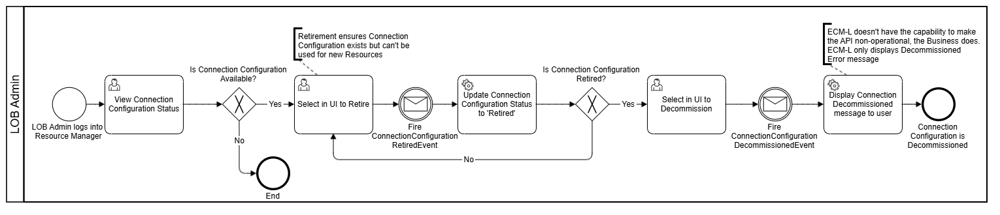

*Image 1875: Extracted from page 58*

*Image 1876: Extracted from page 58*

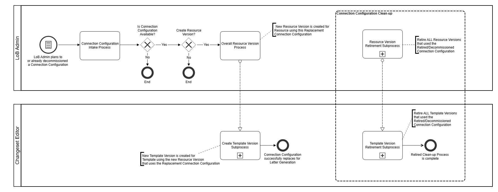

*Image 1877: Extracted from page 58*

*Image 1878: Extracted from page 58*

*Image 1879: Extracted from page 58*

*Image 1880: Extracted from page 58*

*Image 1881: Extracted from page 58*

*Image 1882: Extracted from page 58*

*Image 1883: Extracted from page 58*

*Image 1884: Extracted from page 58*

*Image 1885: Extracted from page 58*

*Image 1886: Extracted from page 58*

*Image 1887: Extracted from page 58*

*Image 1888: Extracted from page 58*

*Image 1889: Extracted from page 58*

*Image 1890: Extracted from page 58*

*Image 1891: Extracted from page 58*

*Image 1892: Extracted from page 58*

*Image 1893: Extracted from page 58*

*Image 1894: Extracted from page 58*

### Vector Graphics on Page 58

*This page contains 190 vector graphic elements (diagrams, shapes, lines)*

---

## Page 59

LoB Admin plans to or already decommissioned a Connection 
Configuration
The LoB Admin identifies a Connection Configuration that is planned for or already 
decommissioned.
Connection Configuration Intake Process
The LoB Admin initiates the intake process to evaluate and process the 
replacement Connection Configuration.
Is Connection Configuration Available?
Decision Point: Determine if a replacement Connection Configuration is available.
If No  End
If no replacement is available, the process ends.
Create Resource Version?
Decision Point: Determine if a new Resource Version should be created using the 
replacement Connection Configuration.
If No  End
If not creating a Resource Version, the process ends.
Overall Resource Version Process
If yes, initiate the process to create a new Resource Version using the 
replacement Connection Configuration.
New Resource Version is created for Resource using this 
Replacement Connection Configuration
A new Resource Version is created using the replacement Connection 
Configuration.
Create Template Version Subprocess
The Changeset Editor initiates the subprocess to create a new Template Version 
using the new Resource Version.
New Template Version is created for Template using the new 
Resource Version
A new Template Version is created for the Template that uses the replacement 
Connection Configuration.
Connection Configuration successfully replaces for Letter 
Generation
The new Connection Configuration is now successfully used for letter generation.
Connection Configuration Clean-up
Initiate clean-up process for the retired/decommissioned Connection Configuration.
Resource Version Retirement Subprocess
Retire ALL Resource Versions that used the retired/decommissioned Connection 
Configuration.
Template Version Retirement Subprocess
Retire ALL Template Versions that used the retired/decommissioned Connection 
Configuration.
Retired Clean-up Process is complete
The process of cleaning up retired Resource and Template Versions is complete.
Overall Resource Version Process
The model demonstrates the creation, update and retirement of a Resource Version within Resource Manager. Two types of Resources can be added, 
each requiring testing before they become available for use.
Task
Description
Log in to Resource Manager
The LOB Admin logs into the Resource Manager to manage resource versions.
View AVAILABLE Connection List
The LOB Admin views the list of available connections for resource creation, update, or retirement.
Create, Update, or Retire Resource Version?
Decision Point: Determine if the action is to create, update, or retire a resource version.
Create New Resource Version DRAFT
If creating, the LOB Admin initiates a new resource version in DRAFT state.
Select Resource Type
The LOB Admin selects the type of resource to create (Data or File).
Select Data Resource Type
For data resources, select the specific data resource type.
Select Resource Parameter(s)
Input the parameters for the data resource version.

### Images on Page 59

*Image 1895: Extracted from page 59*

*Image 1896: Extracted from page 59*

*Image 1897: Extracted from page 59*

*Image 1898: Extracted from page 59*

*Image 1899: Extracted from page 59*

*Image 1900: Extracted from page 59*

*Image 1901: Extracted from page 59*

*Image 1902: Extracted from page 59*

*Image 1903: Extracted from page 59*

*Image 1904: Extracted from page 59*

*Image 1905: Extracted from page 59*

*Image 1906: Extracted from page 59*

*Image 1907: Extracted from page 59*

*Image 1908: Extracted from page 59*

*Image 1909: Extracted from page 59*

*Image 1910: Extracted from page 59*

*Image 1911: Extracted from page 59*

*Image 1912: Extracted from page 59*

*Image 1913: Extracted from page 59*

*Image 1914: Extracted from page 59*

*Image 1915: Extracted from page 59*

*Image 1916: Extracted from page 59*

*Image 1917: Extracted from page 59*

*Image 1918: Extracted from page 59*

*Image 1919: Extracted from page 59*

*Image 1920: Extracted from page 59*

*Image 1921: Extracted from page 59*

*Image 1922: Extracted from page 59*

*Image 1923: Extracted from page 59*

*Image 1924: Extracted from page 59*

*Image 1925: Extracted from page 59*

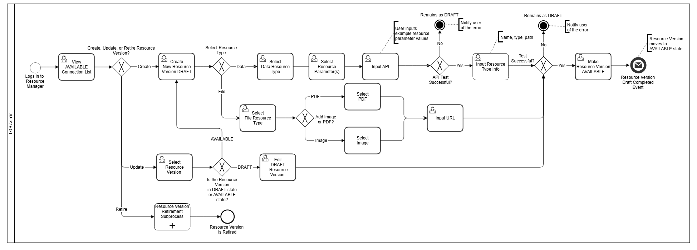

*Image 1926: Extracted from page 59*

*Image 1927: Extracted from page 59*

### Vector Graphics on Page 59

*This page contains 252 vector graphic elements (diagrams, shapes, lines)*

---

## Page 60

Input API
Enter API details if required for the resource type.
API Test Successful?
Decision Point: Test the API with sample values to confirm it works as expected.
If No  Remains as DRAFT
If the API test is unsuccessful, the resource version remains in DRAFT and the user is notified of the 
error.
If Yes  Input Resource Type Info
If the API test is successful, input resource type information (name, type, path).
Test Successful?
Decision Point: Test resource type information for success.
If No  Remains as DRAFT
If not successful, the resource version remains in DRAFT and the user is notified of the error.
If Yes  Make Resource Version AVAILABLE
If successful, make the resource version AVAILABLE.
Resource Version Draft Completed Event
The system triggers the Resource Version Draft Completed Event and moves the resource version to 
AVAILABLE state.
Select File Resource Type
For file resources, select the specific file resource type.
Add Image or PDF?
Decision Point: Determine if the file resource is an image or PDF.
Select PDF
If PDF, select the PDF file to add.
Select Image
If image, select the image file to add.
Input URL
Enter the URL for the file resource if required.
Update
For updates, select the resource version to modify.
Is the Resource Version in DRAFT or 
AVAILABLE state?
Decision Point: Is the resource version in DRAFT or AVAILABLE state?
Edit DRAFT Resource Version
If DRAFT, edit the resource version details.
Resource Version Retirement Subprocess
If retiring, initiate the Resource Version Retirement Subprocess.
Resource Version is Retired
The resource version is retired and no longer available for use.
Resource Version Retirement Subprocess
This model demonstrates LOB admin viewing list of Resource Versions for a Connection Configuration and retiring each Resource Version which updates 
the Resource Version to RETIRED state.
Retiring the Resource Version ensures no new Resources can be created using this retired Connection Configuration. 
Task
Description
LOB Log in
The Line of Business (LOB) user logs in to the system.
View ALL Connection Configuration
The Resource Manager views all available connection configurations.
Is Resource Version AVAILABLE?
Decision Point: Is the Resource Version available for retirement?
If No  End
If the Resource Version is not available, the subprocess ends.
If Yes  Select 'Retire' in UI
The Resource Manager selects the 'Retire' option for the Resource Version in the UI.
Fire ResourceVersionRetiredEvent
The system fires the ResourceVersionRetiredEvent to initiate retirement of the 
Resource Version.
Update Resource Version to 'Retired'
The system updates the status of the Resource Version to 'Retired'.
Check to Verify 'Retired' State
The Resource Manager checks to verify that the Resource Version is in 'Retired' state.

### Images on Page 60

*Image 1928: Extracted from page 60*

*Image 1929: Extracted from page 60*

*Image 1930: Extracted from page 60*

*Image 1931: Extracted from page 60*

*Image 1932: Extracted from page 60*

*Image 1933: Extracted from page 60*

*Image 1934: Extracted from page 60*

*Image 1935: Extracted from page 60*

*Image 1936: Extracted from page 60*

*Image 1937: Extracted from page 60*

*Image 1938: Extracted from page 60*

*Image 1939: Extracted from page 60*

*Image 1940: Extracted from page 60*

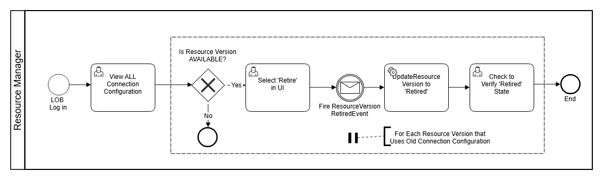

*Image 1941: Extracted from page 60*

*Image 1942: Extracted from page 60*

*Image 1943: Extracted from page 60*

*Image 1944: Extracted from page 60*

*Image 1945: Extracted from page 60*

*Image 1946: Extracted from page 60*

*Image 1947: Extracted from page 60*

*Image 1948: Extracted from page 60*

*Image 1949: Extracted from page 60*

*Image 1950: Extracted from page 60*

*Image 1951: Extracted from page 60*

*Image 1952: Extracted from page 60*

*Image 1953: Extracted from page 60*

*Image 1954: Extracted from page 60*

*Image 1955: Extracted from page 60*

*Image 1956: Extracted from page 60*

*Image 1957: Extracted from page 60*

*Image 1958: Extracted from page 60*

*Image 1959: Extracted from page 60*

*Image 1960: Extracted from page 60*

### Vector Graphics on Page 60

*This page contains 284 vector graphic elements (diagrams, shapes, lines)*

---

## Page 61

For Each Resource Version that Uses Old Connection 
Configuration
Repeat the subprocess for each Resource Version that uses the old Connection 
Configuration.
End
The Resource Version Retirement subprocess is complete.
Create / Update / Retire Workflow 
This model demonstrates how workflow is created, updated with additional configurations and retired from its AVAILABLE state by LOB Admin. Additional 
configurations include adding or removing Full Templates and storage and distribution options with Claim Evidence and Package Manager. Claim 
Evidence is responsible for the storage of Documents and Package Manager accepts request from Claim Evidence to distribute correspondence to the 
 
recipient. 
Task
Description
Log in to Template Manager
The LoB Admin logs into Template Manager. 
Workflow Exists?
Decision Point: The LoB Admin checks to see if the Workflow already exists.
No Create New DRAFT 
Workflow
If a Workflow does not exist, the LoB Admin creates a new Workflow in the DRAFT state.
Assign Workflow new Name
The LoB Admin assigns a new Name to the Workflow.
Add Workflow Description 
(Optional)
The LoB Admin adds an optional description for the Workflow
Mark Workflow as AVAILABLE
LoB Admin marks the Workflow as AVAILABLE.
Workflow Created
Workflow is created.
Workflow Exists? Yes Update 
or Retire?
The LoB Admin can choose to Update or Retire the Workflow.
Update  Select AVAILABLE 
Workflow
The LoB Admin selects the AVAILABLE Workflow to update the Configurations.
Select Configurations? 
(options)
The LoB Admin determines the Configurations they want to update.
Configure Templates
The LoB Admin selects to configure Templates already added to the Workflow.  Here they are able to make the 
Template, at the Workflow level, Package Manager or Claim Evidence Exempt, and configure it with a Claim 
Evidence Document Type as needed.
Update Name
The LoB Admin selects to updates the Workflow Name.
Update Key Parameter
The LoB Admin selects to updates the Workflow Parameter.
Add or Remove Template(s)
The LoB Admin selects to Add or Remove Templates.

### Images on Page 61

*Image 1961: Extracted from page 61*

*Image 1962: Extracted from page 61*

*Image 1963: Extracted from page 61*

*Image 1964: Extracted from page 61*

*Image 1965: Extracted from page 61*

*Image 1966: Extracted from page 61*

*Image 1967: Extracted from page 61*

*Image 1968: Extracted from page 61*

*Image 1969: Extracted from page 61*

*Image 1970: Extracted from page 61*

*Image 1971: Extracted from page 61*

*Image 1972: Extracted from page 61*

*Image 1973: Extracted from page 61*

*Image 1974: Extracted from page 61*

*Image 1975: Extracted from page 61*

*Image 1976: Extracted from page 61*

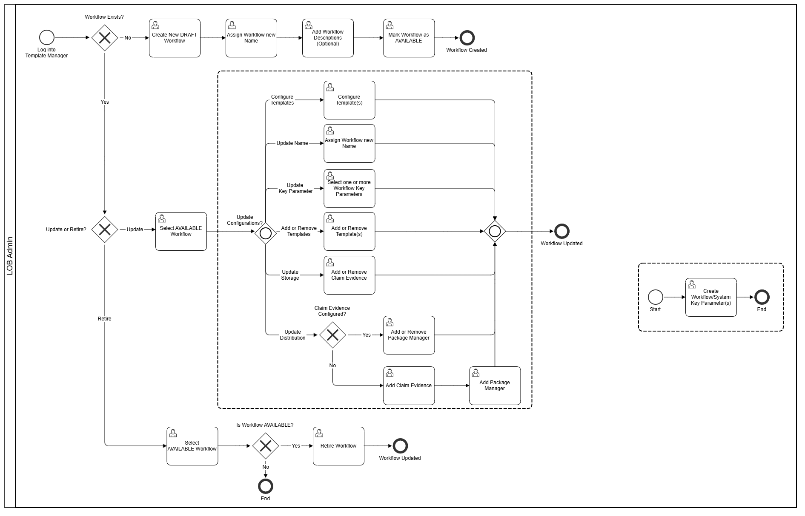

*Image 1977: Extracted from page 61*

*Image 1978: Extracted from page 61*

*Image 1979: Extracted from page 61*

*Image 1980: Extracted from page 61*

*Image 1981: Extracted from page 61*

*Image 1982: Extracted from page 61*

*Image 1983: Extracted from page 61*

*Image 1984: Extracted from page 61*

*Image 1985: Extracted from page 61*

*Image 1986: Extracted from page 61*

*Image 1987: Extracted from page 61*

*Image 1988: Extracted from page 61*

*Image 1989: Extracted from page 61*

*Image 1990: Extracted from page 61*

*Image 1991: Extracted from page 61*

*Image 1992: Extracted from page 61*

*Image 1993: Extracted from page 61*

### Vector Graphics on Page 61

*This page contains 204 vector graphic elements (diagrams, shapes, lines)*

---

## Page 62

Update Storage
The LoB Admin selects to update Storage.
Update Distribution
The LoB Admin selects to update Distribution.
Update Name Assign Workflow 
new Name
The LoB Admin assigns a new Name to the Workflow.
Update Key Parameter–> 
Select one or more Workflow 
Key Parameters
The LoB Admin selects one or more Workflow Key Parameters to add to the Workflow.
Manage Template–> Add or 
Remove Template
The LoB Admin adds or removes a Template.
Update Storage Add or remove 
Claim Evidence
The LoB Admin adds or removes Claim Evidence as Storage.
Update Distribution Claim 
Evidence Configured?
Decision Point: Is the Workflow configured with Claim Evidence?
Claim Evidence Configured? 
Yes Add or remove Package 
Manager
The LoB Admin adds or removes Package Manager for Distribution.
Claim Evidence Configured? 
No Add Claim Evidence
The LoB Admin configures Claim Evidence for Storage
Add Claim Evidence  Add 
Package Manager
The LoB Admin configures Package Manager for Distribution.
Workflow Updated
After all desired Configuration Updates are performed, the Workflow is updated.
Retire Select  Workflow
The LoB Admin selects the Workflow to be retired.
Is Workflow AVAILABLE? 
Is the selected Workflow AVAILABLE?
If Yes  Retire Workflow
The LoB Admin retires the Workflow.
If No Workflow is not Retired
Workflow cannot be retired.
Overall Changeset Process
This model outlines the complete lifecycle of a Changeset from creation to publishing. It illustrates key states, decision points, and transitions across 
testing, approval, and scheduling.
Changeset Editor Swimlane demonstrates the Changeset Editor creates a Changeset first and creates a new Template Version, add an existing Template 
Version or retire a Template Version. Once all the Template Versions are in COMPLETED state, each Template Version can be tested in the Changeset. 
Changeset can  be submitted for approval when all the Template Versions pass the test scenarios and their status are updated to TESTED. Changeset 
Editor also creates a new File Version or retires a File Version. Changeset Editor marks the File Version as COMPLETE to submit for approval.
Changeset Publisher Swimlane demonstrates Changeset Publisher can approve or reject the Changeset. When the Changeset is approved, it can be 
scheduled or rescheduled for publishing. Upon publishing, the Changeset Status is updated to PUBLISHED.
Overall Changeset Process
Changeset Editor
Task
Description

### Images on Page 62

*Image 1994: Extracted from page 62*

*Image 1995: Extracted from page 62*

*Image 1996: Extracted from page 62*

*Image 1997: Extracted from page 62*

*Image 1998: Extracted from page 62*

*Image 1999: Extracted from page 62*

*Image 2000: Extracted from page 62*

*Image 2001: Extracted from page 62*

*Image 2002: Extracted from page 62*

*Image 2003: Extracted from page 62*

*Image 2004: Extracted from page 62*

*Image 2005: Extracted from page 62*

*Image 2006: Extracted from page 62*

*Image 2007: Extracted from page 62*

*Image 2008: Extracted from page 62*

*Image 2009: Extracted from page 62*

*Image 2010: Extracted from page 62*

*Image 2011: Extracted from page 62*

*Image 2012: Extracted from page 62*

*Image 2013: Extracted from page 62*

*Image 2014: Extracted from page 62*

*Image 2015: Extracted from page 62*

*Image 2016: Extracted from page 62*

*Image 2017: Extracted from page 62*

*Image 2018: Extracted from page 62*

*Image 2019: Extracted from page 62*

*Image 2020: Extracted from page 62*

*Image 2021: Extracted from page 62*

*Image 2022: Extracted from page 62*

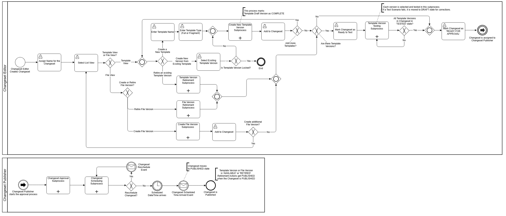

*Image 2023: Extracted from page 62*

*Image 2024: Extracted from page 62*

*Image 2025: Extracted from page 62*

*Image 2026: Extracted from page 62*

### Vector Graphics on Page 62

*This page contains 194 vector graphic elements (diagrams, shapes, lines)*

---

## Page 63

Changeset Editor Creates Changeset
Initiate the process by creating a new changeset to manage template and/or file version changes.
Assign Name for the Changeset
Give the changeset a unique, descriptive name for tracking and identification.
Select List View
Choose the view mode for managing either template versions or file versions.
Decision: Template View or File View?
Decide whether the next action involves templates or file versions.
Decision: Create a New Template / 
Existing?
In template view, decide to either create a new template or work with an existing template version.
Enter Template Name
If creating a new template, specify its name.
Enter Template Type
Select whether the Template Type is a Full or Fragment Template Type.
Create New Template Version 
Subprocess
Begin the subprocess to create a new version for a template, entering all required information and details.
Add to Changeset (Template)
Add the newly created template version to the changeset for further processing.
Decision: Add More Templates?
Decide whether to add additional template versions to the changeset or proceed.
Select Existing Template Version
If not creating a new template, select an existing template version for update or retirement.
Decision: Is Template Version 
Locked?
Check if the selected template version is locked; if locked, the update process cannot proceed and ends for 
that item.
Create New Version from Existing 
Template
If not locked, initiate the creation of a new version from the existing template.
Template Version Retirement 
Subprocess
If retiring, start the subprocess to retire the selected template version.
Add to Changeset (from Retirement
/Update)
Add template versions (created or retired) to the changeset.
Decision: Are there Template 
Versions?
Decide if any template versions are present in the changeset to proceed to testing.
Mark Changeset as Ready to Test
If template versions are present, mark the changeset as ready to begin the testing process.
Template Version Testing Subprocess
Initiate the subprocess to test each template version in the changeset. Failed scenarios move items back to 
DRAFT for correction.
Decision: All Template Versions in 
TESTED?
Check if all template versions in the changeset have passed testing and reached the TESTED state.
Submit Changeset for Approval
Once all template versions are tested, submit the changeset for approval by the publisher.
File View
If file view is selected, manage file versions within the changeset.
Decision: Create or Retire File 
Version?
Decide whether to create a new file version or retire an existing file version.
Create File Version Subprocess
Start the subprocess to create a new file version, including versioning, naming, and validation.
File Version Retirement Subprocess
Begin the subprocess to retire an existing file version.
Add to Changeset (File)
Add created or retired file versions to the changeset for processing.
Decision: Create Additional File 
Version?
Decide whether to create or retire additional file versions or proceed to the next steps in the process.
Changeset Publisher
Task
Description
Changeset Approval Subprocess
Review the changeset and approve or reject it.
Changeset Scheduling Subprocess
Schedule the approved changeset for publication.
Changeset Reschedule Event
Optionally reschedule the publication of the changeset.
Scheduled Date/Time Arrives
Monitor until the scheduled date and time for publication arrives.
Changeset Scheduled Time Arrived 
Event
Trigger publication when the scheduled time is reached.
Changeset is Published
Finalize and publish the changeset.

### Images on Page 63

*Image 2027: Extracted from page 63*

*Image 2028: Extracted from page 63*

*Image 2029: Extracted from page 63*

*Image 2030: Extracted from page 63*

*Image 2031: Extracted from page 63*

*Image 2032: Extracted from page 63*

*Image 2033: Extracted from page 63*

*Image 2034: Extracted from page 63*

*Image 2035: Extracted from page 63*

*Image 2036: Extracted from page 63*

*Image 2037: Extracted from page 63*

*Image 2038: Extracted from page 63*

*Image 2039: Extracted from page 63*

*Image 2040: Extracted from page 63*

*Image 2041: Extracted from page 63*

*Image 2042: Extracted from page 63*

*Image 2043: Extracted from page 63*

*Image 2044: Extracted from page 63*

*Image 2045: Extracted from page 63*

*Image 2046: Extracted from page 63*

*Image 2047: Extracted from page 63*

*Image 2048: Extracted from page 63*

*Image 2049: Extracted from page 63*

*Image 2050: Extracted from page 63*

*Image 2051: Extracted from page 63*

*Image 2052: Extracted from page 63*

*Image 2053: Extracted from page 63*

*Image 2054: Extracted from page 63*

*Image 2055: Extracted from page 63*

*Image 2056: Extracted from page 63*

*Image 2057: Extracted from page 63*

*Image 2058: Extracted from page 63*

### Vector Graphics on Page 63

*This page contains 330 vector graphic elements (diagrams, shapes, lines)*

---

## Page 64

Changeset moves to PUBLISHED state
Update the status of the changeset, template versions, and file versions to AVAILABLE or RETIRED as 
appropriate.
 for Changeset Subprocess
Create Template Version
This model demonstrates the Changeset Editor creating a Template Version and editing its content as needed.  Changeset Editor adds the desired File 
Version(s) to the Template Version and marks it as COMPLETE so the status of the Template Version updates to COMPLETED state.
The Changeset Editor configures the Template Version by either following the Workflow’s existing settings or overriding them for storage and distribution. 
The Changeset Editor can choose to bypass both Claim Evidence and Package Manager, or use Claim Evidence only by exempting Package Manager.
Task
Description
Create Template Version
The process begins with Changeset Editor initiating the creation of a Template Version.
Increment Template Version Number
The system increases the version number for the Template to reflect the new Version.
Add Template Version to Template
The system adds the newly created Template Version to the collection of Templates in the system.
Edit Template Version Content
The Changeset Editor edits and refines the content of the DRAFT Template Version as needed.
Add File Version(s)  Add AVAILABLE File 
Version(s)
The Changeset Editor wants to add one or more File Version(s) in the AVAILABLE state to the DRAFT 
Template Version.
Mark Template Version as 'Completed'
The Changeset Editor marks the Template Version as 'Completed'.
Override Storage/Distribution  Claim 
Evidence/Package Manager Exempt or 
Package Manager Exempt?
The Changeset Editor wants to override the storage/distribution.
Claim Evidence/Package Manager Exempt 
or Package Manager Exempt?
Decision Point: The Changeset Editor can bypass both Claim Evidence and Package Manager or only 
Package Manager.
If Claim Evidence/Package Manager 
Exempt  Mark as 'Claim Evidence and 
Package Manager Exempt'
The Changeset Editor marks the Template Version as 'Claim Evidence and Package Manager Exempt. 
Documents will be stored in CE only if the Workflow is configured to use CE. Package Manager is 
automatically exempt in this situation.
If Package Manager Exempt  Mark as 
'Package Manager Exempt'
The Changeset Editor marks the Template Version as 'Package Manager Exempt'. Documents will be 
stored in CE only if the Workflow is configured with both CE and Package Manager.
Template Version Draft Complete Event
The Template Draft Completed Event is triggered.
*Template Version moves to COMPLETED state
Template Version and File Version Retirement Subprocess 
Template Version and File Version retirement is a stand-alone process, but also integral to the Connection Configuration Replacement process and 
Overall Changeset process.
This model demonstrates Changeset Editor selecting an AVAILABLE Template Version or File Version, and invoking the 
, which 
Retirement Action
changes its status to RETIRED and remove it from active use. 
To Retire all Versions of a Template or File at once, the Changeset Editor can create a Changeset with Retirement Actions only.

### Images on Page 64

*Image 2059: Extracted from page 64*

*Image 2060: Extracted from page 64*

*Image 2061: Extracted from page 64*

*Image 2062: Extracted from page 64*

*Image 2063: Extracted from page 64*

*Image 2064: Extracted from page 64*

*Image 2065: Extracted from page 64*

*Image 2066: Extracted from page 64*

*Image 2067: Extracted from page 64*

*Image 2068: Extracted from page 64*

*Image 2069: Extracted from page 64*

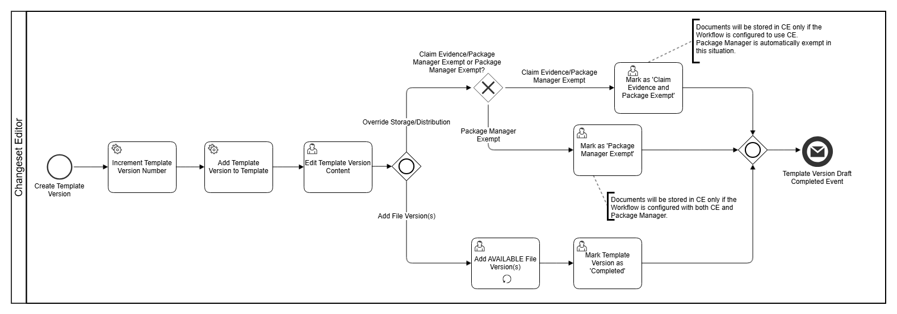

*Image 2070: Extracted from page 64*

*Image 2071: Extracted from page 64*

*Image 2072: Extracted from page 64*

*Image 2073: Extracted from page 64*

*Image 2074: Extracted from page 64*

*Image 2075: Extracted from page 64*

*Image 2076: Extracted from page 64*

*Image 2077: Extracted from page 64*

*Image 2078: Extracted from page 64*

*Image 2079: Extracted from page 64*

*Image 2080: Extracted from page 64*

*Image 2081: Extracted from page 64*

*Image 2082: Extracted from page 64*

*Image 2083: Extracted from page 64*

*Image 2084: Extracted from page 64*

*Image 2085: Extracted from page 64*

*Image 2086: Extracted from page 64*

*Image 2087: Extracted from page 64*

*Image 2088: Extracted from page 64*

*Image 2089: Extracted from page 64*

*Image 2090: Extracted from page 64*

*Image 2091: Extracted from page 64*

### Vector Graphics on Page 64

*This page contains 171 vector graphic elements (diagrams, shapes, lines)*

---

## Page 65

Task
Description
Changeset Editor starts Retirement Action
The Changeset Editor logs in to Template Manager to start the Retirement Action
User Selects AVAILABLE Template Version(s) 
or File Version(s)
Changeset Editor selects AVAILABLE Template Version(s) or File Version(s) to retire. 
User Selects 'Retire' in UI
The Changeset Editor selects to retire the Template Version.
Add to Changeset
The Changeset Editor adds the Template Version(s) or File Version(s) to the Changeset
Create DRAFT Retirement Action
Template Manager creates a DRAFT Retirement Action containing the Template Version(s) or File 
Version(s) selected to be retired.
Add DRAFT Retirement Action to the Changeset
Template Manager adds the Retirement Action to the Changeset. 
Mark Retirement Action as Complete
The Changeset Editor marks the Retirement Action as Complete.
Retirement Action Complete Event
The Retirement Action Complete Event is fire, and the Retirement Action moves to COMPLETED 
state.
Template Version Testing Subprocess
This model demonstrates how the Changeset Editor creates new or selects existing test scenario to validate Template Versions, ensuring they render the 
correct PDF with appropriate changes. Upon successful completion of all test scenarios, the Changeset Editor marks them as TESTED, which transitions 
the Changeset to a TESTED state.
Test Scenarios are created for specific Template Versions, and are used inside of Changesets to test them, but live outside of the Changeset, and can be 
re-used by future Changesets to regression test changes to those Templates.
Task
Description
User COMPLETED Template Version to Test
The process starts when the Changeset Editor has a COMPLETED Template 
Version that they want to test. 
Do Test Scenarios for the Template Version Exist? 
Decision Point: determine if Test Scenario(s) already exist for the Template 
Version.
If No  Create New Test Scenario for Template Version 
If Test Scenario(s) do not already exist, the Changeset Editor creates a new 
Test Scenario for the Template Version.
If Yes  View Existing Test Scenarios for Template Version
If Test Scenario(s) exist, the Changeset Editor view the existing Test Scenario
(s) for the Template Version.
Select Test Scenario 
The Changeset Editor selects the appropriate Test Scenario to work with. 
Enter Fields in Selected Test Scenario 
The Changeset Editor enters the required fields for the selected Test Scenario.
If New Test Scenario  Show Rendered Sample PDF
If the Test Scenario is new, the system renders and displays the sample PDF.
If Existing Test Scenario  Show Side by Side Comparison Between 
PDF Renders of This Version and Last Version 
If there are existing Test Scenario(s), the system shows a side-by-side 
comparison of current and previous PDF Template Versions. 
PDF Meet Expectations
Decision point: do the results of the PDF meet the Changeset Editor's 
expectations?
If Yes  Mark Test Scenario as Passed
If yes, mark the Test Scenario as PASSED. 

### Images on Page 65

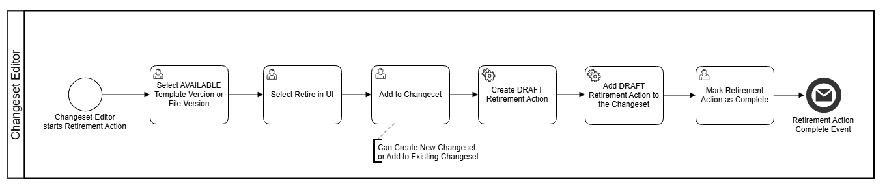

*Image 2092: Extracted from page 65*

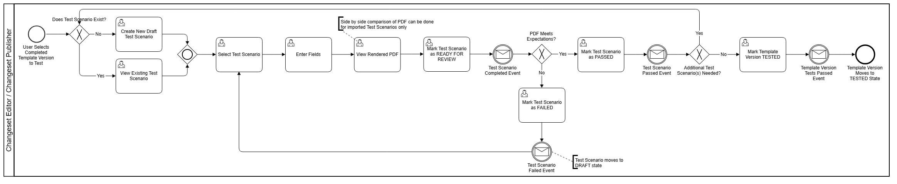

*Image 2093: Extracted from page 65*

*Image 2094: Extracted from page 65*

*Image 2095: Extracted from page 65*

*Image 2096: Extracted from page 65*

*Image 2097: Extracted from page 65*

*Image 2098: Extracted from page 65*

*Image 2099: Extracted from page 65*

*Image 2100: Extracted from page 65*

*Image 2101: Extracted from page 65*

*Image 2102: Extracted from page 65*

*Image 2103: Extracted from page 65*

*Image 2104: Extracted from page 65*

*Image 2105: Extracted from page 65*

*Image 2106: Extracted from page 65*

*Image 2107: Extracted from page 65*

*Image 2108: Extracted from page 65*

*Image 2109: Extracted from page 65*

*Image 2110: Extracted from page 65*

*Image 2111: Extracted from page 65*

*Image 2112: Extracted from page 65*

*Image 2113: Extracted from page 65*

*Image 2114: Extracted from page 65*

*Image 2115: Extracted from page 65*

*Image 2116: Extracted from page 65*

*Image 2117: Extracted from page 65*

*Image 2118: Extracted from page 65*

*Image 2119: Extracted from page 65*

*Image 2120: Extracted from page 65*

*Image 2121: Extracted from page 65*

*Image 2122: Extracted from page 65*

*Image 2123: Extracted from page 65*

*Image 2124: Extracted from page 65*

*Image 2125: Extracted from page 65*

### Vector Graphics on Page 65

*This page contains 228 vector graphic elements (diagrams, shapes, lines)*

---

## Page 66

Test Scenario Passed Event
The system records the Template Version Tests Passed event.
Are Additional Test Scenario(s) needed?
Decision Point: Determine if additional testing is needed.
If Yes  Go back to check if Test Scenario(s) exist
If yes, go back to check if the Test Scenario exists and continue through the 
steps.
If No  Mark Template Version Tested
If no additional Test Scenario(s) are needed, the Changeset Editor marks the 
Template Version as TESTED.
Template Version Tests Passed Event
The system records the Template Version Tests Passed event.
Template Version Moves to Tested State
The Template Version moves to the TESTED state.
If No  Mark Test Scenario as Failed 
If no, mark the Test Scenario as FAILED. The Changeset Editor loops back for 
further action. 
Test Scenario Failed Event
The system records the Test Scenario Failed event and moves the Test 
Scenario to DRAFT state.
Create File Version Subprocess
The Create File Version Subprocess allows a Changeset Editor to create and prepare a new file version for inclusion in a changeset. The process includes 
versioning, naming, file selection and validation, and setting the file version to a completed state once requirements are met.
Task
Description
Increment File Version
The system increments the file version number for a new file version entry.
Enter File Version Name
The editor enters a unique name for the new file version.
Browse File(s)
The editor browses and selects the file(s) to be added (PDF or image).
Add PDF / Add Image
The editor uploads either a PDF or an image, as determined by file selection.
Validate File Type
The system validates the uploaded file is a correct PDF or image; errors prompt user action.
Mark File Version as COMPLETED
Once validation passes, the editor marks the file version as completed.
File Version Draft Completed Event
The file version is updated to the COMPLETED state and is ready for further workflow steps.
Changeset Approval Subprocess
This model demonstrates the Changeset Publisher reviewing the TESTED Template Versions, the Retirement Actions and File Versions within the 
Changeset to approve or reject them. Once all the Template Versions, Retirement Actions and File Versions are approved, the Changeset Publisher 
approves the entire Changeset so that the status of the Changeset updates to APPROVED state.
Changeset Publisher rejects the Changeset if the Publisher doesn't approve the changes for the Template Versions, Retirement Actions or File Versions. 
The Changeset get's recalled back to the DRAFT state and corrections are made by the Changeset Editor before submitting for approval again.

### Images on Page 66

*Image 2126: Extracted from page 66*

*Image 2127: Extracted from page 66*

*Image 2128: Extracted from page 66*

*Image 2129: Extracted from page 66*

*Image 2130: Extracted from page 66*

*Image 2131: Extracted from page 66*

*Image 2132: Extracted from page 66*

*Image 2133: Extracted from page 66*

*Image 2134: Extracted from page 66*

*Image 2135: Extracted from page 66*

*Image 2136: Extracted from page 66*

*Image 2137: Extracted from page 66*

*Image 2138: Extracted from page 66*

*Image 2139: Extracted from page 66*

*Image 2140: Extracted from page 66*

*Image 2141: Extracted from page 66*

*Image 2142: Extracted from page 66*

*Image 2143: Extracted from page 66*

*Image 2144: Extracted from page 66*

*Image 2145: Extracted from page 66*

*Image 2146: Extracted from page 66*

*Image 2147: Extracted from page 66*

*Image 2148: Extracted from page 66*

*Image 2149: Extracted from page 66*

*Image 2150: Extracted from page 66*

*Image 2151: Extracted from page 66*

*Image 2152: Extracted from page 66*

*Image 2153: Extracted from page 66*

*Image 2154: Extracted from page 66*

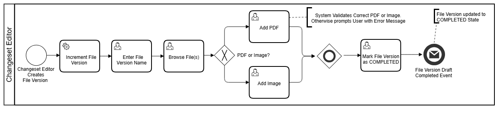

*Image 2155: Extracted from page 66*

*Image 2156: Extracted from page 66*

*Image 2157: Extracted from page 66*

*Image 2158: Extracted from page 66*

### Vector Graphics on Page 66

*This page contains 194 vector graphic elements (diagrams, shapes, lines)*

---

## Page 67

Changeset Approval Subprocess
Changeset Publisher
Task
Description
Select Changeset
Publisher selects the changeset to review and approve.
Is Changeset Approval Required?
Decision point to determine if approval is needed for the changeset.
Review Template Versions
If template versions exist, publisher reviews each one in the changeset.
Review File Versions
If file versions exist, publisher reviews each one in the changeset.
Review Retirement Actions
If the changeset contains retirement actions, publisher reviews each one.
Mark Changeset as APPROVED
If all versions/actions are approved, publisher marks the changeset as APPROVED.
Mark Changeset as REJECTED
If any version/action is not approved, publisher marks the changeset as REJECTED 
and provides a reason.
Changeset Approval Process Complete Event
Publisher completes the approval process, transitioning the changeset to the 
APPROVED state.
Changeset Rejected Event
Publisher completes the rejection process, transitioning the changeset to the 
REJECTED state.
Are all Template Versions, File Versions, and Retirement 
Actions approved?
Decision to confirm full approval before moving to final state.
Template Version Approval Subprocess
Task
Description
Select Template Version
Publisher selects each template version in the changeset for review.
Review content in Template Version
Publisher reviews the content and details of the template version.

### Images on Page 67

*Image 2159: Extracted from page 67*

*Image 2160: Extracted from page 67*

*Image 2161: Extracted from page 67*

*Image 2162: Extracted from page 67*

*Image 2163: Extracted from page 67*

*Image 2164: Extracted from page 67*

*Image 2165: Extracted from page 67*

*Image 2166: Extracted from page 67*

*Image 2167: Extracted from page 67*

*Image 2168: Extracted from page 67*

*Image 2169: Extracted from page 67*

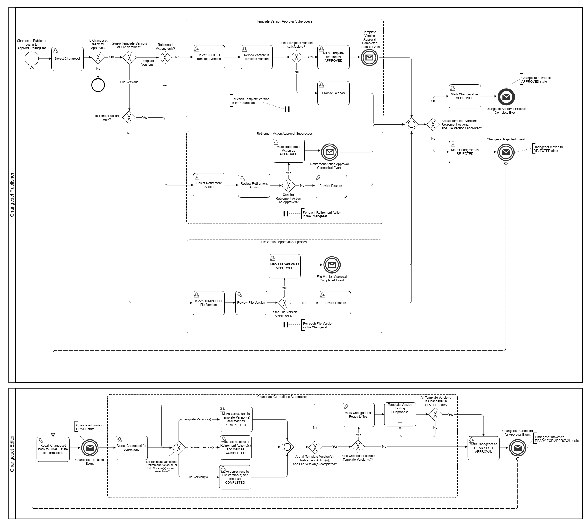

*Image 2170: Extracted from page 67*

*Image 2171: Extracted from page 67*

*Image 2172: Extracted from page 67*

*Image 2173: Extracted from page 67*

*Image 2174: Extracted from page 67*

*Image 2175: Extracted from page 67*

*Image 2176: Extracted from page 67*

*Image 2177: Extracted from page 67*

*Image 2178: Extracted from page 67*

*Image 2179: Extracted from page 67*

*Image 2180: Extracted from page 67*

*Image 2181: Extracted from page 67*

*Image 2182: Extracted from page 67*

*Image 2183: Extracted from page 67*

*Image 2184: Extracted from page 67*

*Image 2185: Extracted from page 67*

*Image 2186: Extracted from page 67*

*Image 2187: Extracted from page 67*

*Image 2188: Extracted from page 67*

*Image 2189: Extracted from page 67*

*Image 2190: Extracted from page 67*

*Image 2191: Extracted from page 67*

### Vector Graphics on Page 67

*This page contains 180 vector graphic elements (diagrams, shapes, lines)*

---

## Page 68

Is the Template Version APPROVED?
Decision point to approve or reject the template version.
Mark Template Version as APPROVED
If approved, publisher marks the template version as APPROVED.
Provide Reason
If rejected, publisher provides a reason for rejection.
Template Version Approval Completed Event
Publisher completes approval/rejection for each template version.
Retirement Action Approval Subprocess
Task
Description
Select Retirement Action
Publisher selects each retirement action in the changeset for review.
Review Retirement Action
Publisher reviews the details of the retirement action.
Is the Retirement Action APPROVED?
Decision point to approve or reject the retirement action.
Mark Retirement Action as APPROVED
If approved, publisher marks the retirement action as APPROVED.
Provide Reason
If rejected, publisher provides a reason for rejection.
Retirement Action Approval Completed Event
Publisher completes approval/rejection for each retirement action.
File Version Approval Subprocess
Task
Description
Select COMPLETED File Version
Publisher selects each file version in the changeset for review.
Review File Version
Publisher reviews the details and content of the file version.
Is the File Version APPROVED?
Decision point to approve or reject the file version.
Mark File Version as APPROVED
If approved, publisher marks the file version as APPROVED.
Provide Reason
If rejected, publisher provides a reason for rejection.
File Version Approval Completed Event
Publisher completes approval/rejection for each file version.
Changeset Editor
Task
Description
Recall Changeset to DRAFT state for corrections
Editor recalls the rejected changeset for modifications.
Select Changeset for corrections
Editor selects the recalled changeset to begin making necessary corrections.
Make corrections to Template Versions
Editor modifies or updates template versions as required.
Make corrections to Retirement Actions
Editor modifies or updates retirement actions as required.
Make corrections to File Versions
Editor modifies or updates file versions as required.
Are all Template Versions and File Versions complete?
Decision to check if everything is updated and complete.
Mark Changeset as Ready to Test
If complete, editor marks the changeset as ready for testing.
Template Version Testing Subprocess
Editor initiates testing for updated template versions.
Are all Template Versions in TESTED state?
Decision to check if all template versions have passed testing.
Changeset contains Template Versions?
Decision to check if the changeset has template versions.
Changeset Submitted for Approval Event
Editor submits the finalized changeset for approval.
Changeset moves to READY FOR APPROVAL state
Changeset status is updated to indicate it is ready for publisher review.
Changeset Scheduling Subprocess 
This model demonstrates the Changeset Publisher scheduling the Changeset for publication and notifying business stakeholders of the scheduled date.
Should rescheduling be necessary, the Changeset Publisher can update the publication date accordingly.

### Images on Page 68

*Image 2192: Extracted from page 68*

*Image 2193: Extracted from page 68*

*Image 2194: Extracted from page 68*

*Image 2195: Extracted from page 68*

*Image 2196: Extracted from page 68*

*Image 2197: Extracted from page 68*

*Image 2198: Extracted from page 68*

*Image 2199: Extracted from page 68*

*Image 2200: Extracted from page 68*

*Image 2201: Extracted from page 68*

*Image 2202: Extracted from page 68*

*Image 2203: Extracted from page 68*

*Image 2204: Extracted from page 68*

*Image 2205: Extracted from page 68*

*Image 2206: Extracted from page 68*

*Image 2207: Extracted from page 68*

*Image 2208: Extracted from page 68*

*Image 2209: Extracted from page 68*

*Image 2210: Extracted from page 68*

*Image 2211: Extracted from page 68*

*Image 2212: Extracted from page 68*

*Image 2213: Extracted from page 68*

*Image 2214: Extracted from page 68*

*Image 2215: Extracted from page 68*

*Image 2216: Extracted from page 68*

*Image 2217: Extracted from page 68*

*Image 2218: Extracted from page 68*

*Image 2219: Extracted from page 68*

*Image 2220: Extracted from page 68*

*Image 2221: Extracted from page 68*

*Image 2222: Extracted from page 68*

*Image 2223: Extracted from page 68*

### Vector Graphics on Page 68

*This page contains 318 vector graphic elements (diagrams, shapes, lines)*

---

## Page 69

Task
Description
Changeset Publisher Schedules 
Changeset
The Changeset Publisher selects an APPROVED Changeset to schedule for publishing.
Enter Date to Schedule
The Changeset Publisher enters the desired date/time to schedule the Changeset.
Changeset Scheduled Previously?
Decision Point: Has the Changeset been scheduled previously?
If No  Changeset Publishing 
Planned Event
If not previously scheduled, the Changeset Publishing Planned Event is triggered and the Changeset moves to 
SCHEDULED state.
If Yes  Changeset Rescheduled 
Event
If already scheduled, a Changeset Rescheduled Event is triggered; Changeset remains in SCHEDULED state.
Notify Business
The business stakeholders are notified of the scheduled date/time for publishing the Changeset.
Business Notified
The notification process is complete; business stakeholders have been informed.
Letter Finalization Process 
This model illustrates how Letters are reviewed, approved and Finalized. 
The Letter Editor Swimlane demonstrates the Letter Editor's capabilities for managing Letter Instances - creating new ones, modifying existing ones, and 
deleting as needed. New letters automatically utilize the most recent AVAILABLE Template Version to generate DRAFT PDF, while edits to existing letters 
prompt users with an option to upgrade to newer Templates or maintain their current version. Once the Letter Editor completes their work and marks the 
letter as READY FOR REVIEW, the system updates its status to READY FOR REVIEW state.
The Letter Finalizer Swimlane demonstrates the Letter Finalizer reviewing the Letter marked as READY FOR REVIEW to finalize it so the Letter is updated 
to FINALIZED status. Rejected Letters revert to DRAFT state for revision.
Letter Editor

### Images on Page 69

*Image 2224: Extracted from page 69*

*Image 2225: Extracted from page 69*

*Image 2226: Extracted from page 69*

*Image 2227: Extracted from page 69*

*Image 2228: Extracted from page 69*

*Image 2229: Extracted from page 69*

*Image 2230: Extracted from page 69*

*Image 2231: Extracted from page 69*

*Image 2232: Extracted from page 69*

*Image 2233: Extracted from page 69*

*Image 2234: Extracted from page 69*

*Image 2235: Extracted from page 69*

*Image 2236: Extracted from page 69*

*Image 2237: Extracted from page 69*

*Image 2238: Extracted from page 69*

*Image 2239: Extracted from page 69*

*Image 2240: Extracted from page 69*

*Image 2241: Extracted from page 69*

*Image 2242: Extracted from page 69*

*Image 2243: Extracted from page 69*

*Image 2244: Extracted from page 69*

*Image 2245: Extracted from page 69*

*Image 2246: Extracted from page 69*

*Image 2247: Extracted from page 69*

*Image 2248: Extracted from page 69*

*Image 2249: Extracted from page 69*

*Image 2250: Extracted from page 69*

*Image 2251: Extracted from page 69*

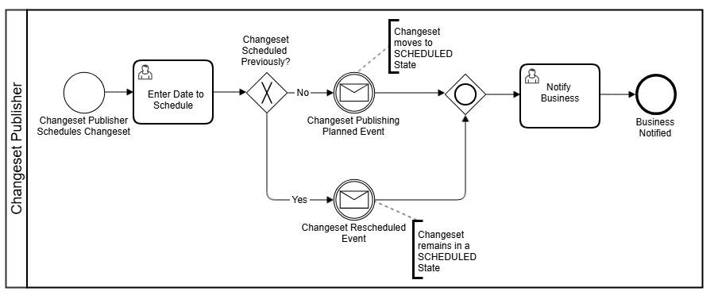

*Image 2252: Extracted from page 69*

*Image 2253: Extracted from page 69*

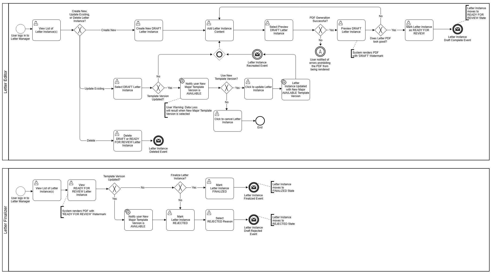

*Image 2254: Extracted from page 69*

*Image 2255: Extracted from page 69*

*Image 2256: Extracted from page 69*

*Image 2257: Extracted from page 69*

### Vector Graphics on Page 69

*This page contains 130 vector graphic elements (diagrams, shapes, lines)*

---

## Page 70

Task
Description
User logs in to Letter Manager
Letter Editor logs into the Letter Manager to manage Letter Instance(s).
View List of Letter Instance(s)
Displays Letter Instance(s), highlighting those with retired or outdated Template Versions.
Create New, Update Existing, or Delete Letter 
Instance?
Decision Point: Choose to create, update, or delete a Letter Instance.
Create New  Create New DRAFT Letter Instance
Create a new draft Letter Instance using the most current AVAILABLE Template Version.
Update Existing  Select DRAFT Letter Instance
Select existing draft Letter Instance to update.
Delete  Delete DRAFT or READY FOR REVIEW 
Letter Instance
Delete draft or ready for review Letter Instance. Triggers Letter Instance Deleted Event.
Add Letter Instance Content
Add content to the selected Letter Instance. The selected Letter Instance will contain Data 
Resource values that can be overwritten by a User.
Select Preview DRAFT Letter Instance
Select draft Letter Instance for preview.
Render PDF(s) with DRAFT watermark
Generate PDF of draft Letter Instance with watermark.
PDF Generation Successful?
Decision Point: Check if PDF generation was successful.
If No  Notify user of errors
User is notified of errors prohibiting PDF rendering.
If Yes  Preview DRAFT Letter Instance
Preview the PDF of draft Letter Instance.
Does Letter PDF look good?
Decision Point: Does the PDF preview meet requirements?
If No  Edit Letter Instance Content
Return to editing the Letter Instance.
If Yes  Mark Letter Instance as READY FOR 
REVIEW
Mark Letter Instance as READY FOR REVIEW.
Letter Instance Draft Complete Event
System records completion event; Letter Instance moves to READY FOR REVIEW state.
Template Version Updated?
Decision Point: If Template Version has changed, notify user.
Notify user New Template Version is AVAILABLE
User is warned of potential data loss if new Template Version is selected.
Use New Template Version?
Decision Point: Choose to update Letter Instance with new template version.
If Yes  Letter Instance Updated with New 
AVAILABLE Template Version
Update Letter Instance with new template version.
If No  User clicks to Cancel the Letter Instance
The Letter Instance is cancelled by the user and the process ends.
Letter Finalizer
Task
Description
User logs in to Letter Manager
Letter Finalizer logs into the Letter Manager to finalize letter instances.
View READY FOR REVIEW Letter Instance(s)
Display all letter instances that are in READY FOR REVIEW state.
Render PDF(s) with READY FOR REVIEW watermark
Generate PDF(s) with watermark for final review.
Finalize Letter Instance(s)?
Decision Point: Choose to finalize or reject the letter instance(s).
If Yes  Mark Letter Instance(s) FINALIZED
Mark letter instance(s) as finalized.
Letter Instance Finalized Event
System records the event; letter instance moves to FINALIZED state.
If No  Mark Letter Instance(s) REJECTED
Mark letter instance(s) as rejected.
Letter Instance Draft Rejected Event
System records the rejection; letter instance moves back to DRAFT state.
 - Systems Event-Trace Description (SV-10c)
Process Sequence
The following diagrams illustrate chronological sequences of events and interactions within different workflows of ECM-L, providing a dynamic view of 
system behavior over time.

### Images on Page 70

*Image 2258: Extracted from page 70*

*Image 2259: Extracted from page 70*

*Image 2260: Extracted from page 70*

*Image 2261: Extracted from page 70*

*Image 2262: Extracted from page 70*

*Image 2263: Extracted from page 70*

*Image 2264: Extracted from page 70*

*Image 2265: Extracted from page 70*

*Image 2266: Extracted from page 70*

*Image 2267: Extracted from page 70*

*Image 2268: Extracted from page 70*

*Image 2269: Extracted from page 70*

*Image 2270: Extracted from page 70*

*Image 2271: Extracted from page 70*

*Image 2272: Extracted from page 70*

*Image 2273: Extracted from page 70*

*Image 2274: Extracted from page 70*

*Image 2275: Extracted from page 70*

*Image 2276: Extracted from page 70*

*Image 2277: Extracted from page 70*

*Image 2278: Extracted from page 70*

*Image 2279: Extracted from page 70*

*Image 2280: Extracted from page 70*

*Image 2281: Extracted from page 70*

*Image 2282: Extracted from page 70*

*Image 2283: Extracted from page 70*

*Image 2284: Extracted from page 70*

*Image 2285: Extracted from page 70*

*Image 2286: Extracted from page 70*

*Image 2287: Extracted from page 70*

*Image 2288: Extracted from page 70*

*Image 2289: Extracted from page 70*

### Vector Graphics on Page 70

*This page contains 319 vector graphic elements (diagrams, shapes, lines)*

---

## Page 71

Letter Creation Sequence (SV-10c)
Implementation View
The Implementation View (sometimes called the Development View) will be further completed alongside the Development of ECM-L.
Deployment View
Purpose
This section is to document any deviations or unique conditions that are not outlined by the standard practices of the BIP Platform 
which may be found in the Deployment View section of BIP Architecture Documentation (2001AM).
Acceptance 
Criteria
Environments 
System Configuration
System Monitoring and Metrics
System Logging and Auditing
Security Strategy
Diagram 
Type
UML Component or Block if needed
Environment Mapping
Environment
Description
DEV
Development Environment
TEST
Development testing environment
INT
Development Integration testing environment
IV&V/SQA
Independent Verification & Validation / System Quality Assurance
UAT
User Acceptance Testing
PAT
Pre-Acceptance Testing

### Images on Page 71

*Image 2290: Extracted from page 71*

*Image 2291: Extracted from page 71*

*Image 2292: Extracted from page 71*

*Image 2293: Extracted from page 71*

*Image 2294: Extracted from page 71*

*Image 2295: Extracted from page 71*

*Image 2296: Extracted from page 71*

*Image 2297: Extracted from page 71*

*Image 2298: Extracted from page 71*

*Image 2299: Extracted from page 71*

*Image 2300: Extracted from page 71*

*Image 2301: Extracted from page 71*

*Image 2302: Extracted from page 71*

*Image 2303: Extracted from page 71*

*Image 2304: Extracted from page 71*

*Image 2305: Extracted from page 71*

*Image 2306: Extracted from page 71*

*Image 2307: Extracted from page 71*

*Image 2308: Extracted from page 71*

*Image 2309: Extracted from page 71*

*Image 2310: Extracted from page 71*

*Image 2311: Extracted from page 71*

*Image 2312: Extracted from page 71*

*Image 2313: Extracted from page 71*

*Image 2314: Extracted from page 71*

*Image 2315: Extracted from page 71*

*Image 2316: Extracted from page 71*

*Image 2317: Extracted from page 71*

*Image 2318: Extracted from page 71*

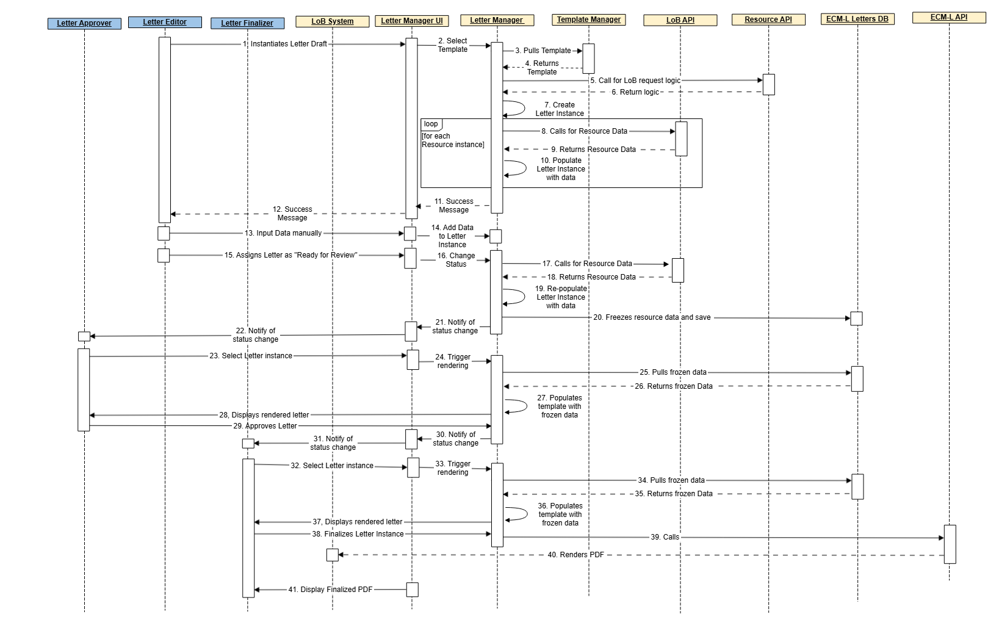

*Image 2319: Extracted from page 71*

*Image 2320: Extracted from page 71*

*Image 2321: Extracted from page 71*

*Image 2322: Extracted from page 71*

### Vector Graphics on Page 71

*This page contains 156 vector graphic elements (diagrams, shapes, lines)*

---

## Page 72

PROD Development Test (PDT)
Environment used by Development to Test changes and patches
DEMO
Demonstrations
PREPROD
Environment used to test new releases prior to deploying to PROD
PERF
Performance testing
Cost of Living Adjustment (COLA)
Environment used to assist in determining Cost of Living changes
PROD Test (PRODTEST)
Environment to test PROD changes and patches prior to deploying to PROD
PROD
Production
System Configuration
No deltas from BIP standard practices.
System Monitoring and Metrics
No deltas from BIP standard practices.
System Logging and Auditing
No deltas from BIP standard practices.
Long-Term Provenance
Letter Instance Provenance refers to the ability to chronicle how a Letter Instance was created, i.e., by whom, and when, while also tracing the origins of 
every element, including configured content as well as all data values input. A Letter Instance is derived from a Template Version, thus maintaining a 
comprehensive record of the Template Version, from which it was derived, including the Template Version’s unique content and the Resource Version(s) it 
used, will ensure traceability of all the configured content.  Chronicling the data input ensures the verifiable origin of the data necessary for auditing and 
validation purposes.  For all data fields, the record will log the data/time of input, the source of data (e.g., the Resource Version from which the data 
originated (API or URL) or user, if manually input), and the actual data values entered in the Letter Instance. 
The diagram below illustrates how each data element depicted in the Letter Instance (Orange, Red, Yellow) can be traced to its origin.  For example, the 
Data Structure input in the Letter Instance can be traced to the Orange Resource (configured in the Template Version) which used a Connection 
Configuration to API #1 to access the data used to populate the Letter Instance. The Data File can be traced to the Red Resource (configured in the 
Template Version) which accessed the Data File from API #2 via the Connection Configuration and Other Data can be traced to the User who manually 
input the data in the Letter Instance.    
  
Security Strategy

### Images on Page 72

*Image 2323: Extracted from page 72*

*Image 2324: Extracted from page 72*

*Image 2325: Extracted from page 72*

*Image 2326: Extracted from page 72*

*Image 2327: Extracted from page 72*

*Image 2328: Extracted from page 72*

*Image 2329: Extracted from page 72*

*Image 2330: Extracted from page 72*

*Image 2331: Extracted from page 72*

*Image 2332: Extracted from page 72*

*Image 2333: Extracted from page 72*

*Image 2334: Extracted from page 72*

*Image 2335: Extracted from page 72*

*Image 2336: Extracted from page 72*

*Image 2337: Extracted from page 72*

*Image 2338: Extracted from page 72*

*Image 2339: Extracted from page 72*

*Image 2340: Extracted from page 72*

*Image 2341: Extracted from page 72*

*Image 2342: Extracted from page 72*

*Image 2343: Extracted from page 72*

*Image 2344: Extracted from page 72*

*Image 2345: Extracted from page 72*

*Image 2346: Extracted from page 72*

*Image 2347: Extracted from page 72*

*Image 2348: Extracted from page 72*

*Image 2349: Extracted from page 72*

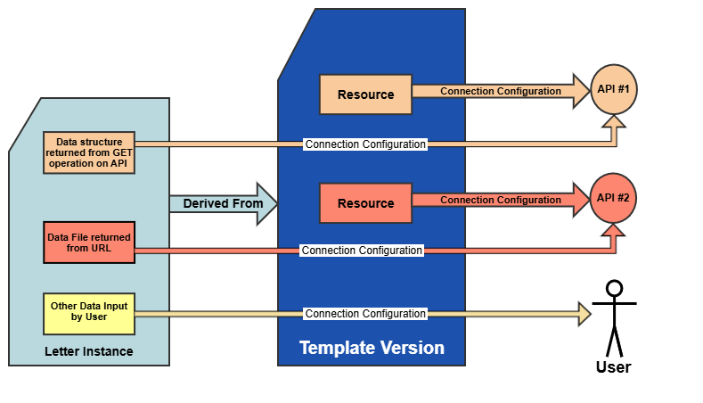

*Image 2350: Extracted from page 72*

*Image 2351: Extracted from page 72*

*Image 2352: Extracted from page 72*

*Image 2353: Extracted from page 72*

*Image 2354: Extracted from page 72*

*Image 2355: Extracted from page 72*

### Vector Graphics on Page 72

*This page contains 120 vector graphic elements (diagrams, shapes, lines)*

---

## Page 73

1.  
2.  
3.  
4.  
5.  
ECM-L is heavily dependent on policies concerning authentication and authorization and will utilize the enefits pplication uthori ation framework 
B
A
A
Z
(BAAZ) as the propagation mechanism for an LOB’s authorization policies.  BAAZ is a policy framework that uses Open Policy Agent (OPA) with a central 
policy store where LOBs can manage their own policies and any application can create its own policies and apply policies that are managed by a central 
security authority and appropriately audited. (
). As an enterprise system, LOBs will have self-service 
See Benefit Applications Authorization Services
capabilities for maintaining their own governance and security policies.  An important part of the Intake Process will be for each LOB to establish a set of 
policies for that LOB, including policies for access to Applications and Workflows. 
Recommendation 
Analysis of Alternatives
Based on comprehensive analysis across technical, business, and operational dimensions, comparing the ECM-L solution against a solution making use of 
the Salesforce Platform, the recommendation is to proceed with this custom development approach to best meet the business's needs.  This 
recommendation is supported by the following key findings:
Superior Technical Fit: Provides significantly better performance at the required scale (approximately 40,000 users across 20 Lines of Business 
generating 20 million letters annually) and enables the strict multi-tenant isolation required between the different Lines of Business.
Lower Total Cost of Ownership: Provides a 22% cost advantage over Salesforce ($28.7M), primarily due to lower annual licensing and 
infrastructure costs. (see 
.)
Costing Considerations
Better Risk Profile: Presents lower risks in areas critical to success, including performance at scale, future cost escalation, and vendor lock-in.
Greater Long-term Flexibility: Provides superior flexibility for future enhancements and integrations without platform constraints.
Stronger Alignment with Enterprise Strategy: Better supports the organization's strategic priorities for control over core systems, vendor 
diversification, and cost optimization.
Custom development offers an unparalleled combination of performance optimization, multi-tenant isolation, and customization flexibility, allowing us to 
achieve all of our goals for less.
Recommendation
Phases and Roadmap
Summary of Phases
Functionality Breakdown
Phase Map

### Images on Page 73

*Image 2356: Extracted from page 73*

*Image 2357: Extracted from page 73*

*Image 2358: Extracted from page 73*

*Image 2359: Extracted from page 73*

*Image 2360: Extracted from page 73*

*Image 2361: Extracted from page 73*

*Image 2362: Extracted from page 73*

*Image 2363: Extracted from page 73*

*Image 2364: Extracted from page 73*

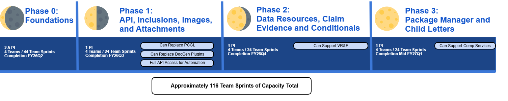

*Image 2365: Extracted from page 73*

*Image 2366: Extracted from page 73*

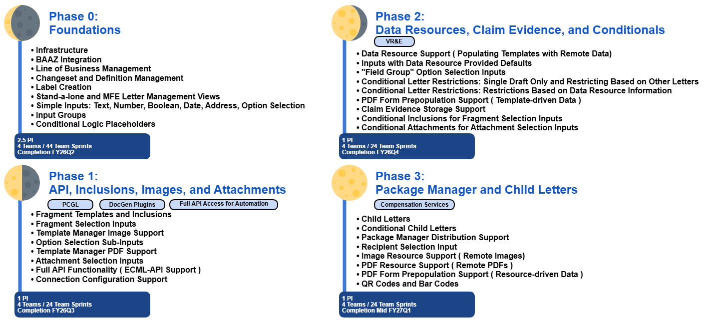

*Image 2367: Extracted from page 73*

*Image 2368: Extracted from page 73*

*Image 2369: Extracted from page 73*

*Image 2370: Extracted from page 73*

*Image 2371: Extracted from page 73*

*Image 2372: Extracted from page 73*

*Image 2373: Extracted from page 73*

*Image 2374: Extracted from page 73*

*Image 2375: Extracted from page 73*

*Image 2376: Extracted from page 73*

*Image 2377: Extracted from page 73*

*Image 2378: Extracted from page 73*

*Image 2379: Extracted from page 73*

*Image 2380: Extracted from page 73*

*Image 2381: Extracted from page 73*

*Image 2382: Extracted from page 73*

*Image 2383: Extracted from page 73*

*Image 2384: Extracted from page 73*

*Image 2385: Extracted from page 73*

*Image 2386: Extracted from page 73*

*Image 2387: Extracted from page 73*

*Image 2388: Extracted from page 73*

*Image 2389: Extracted from page 73*

### Vector Graphics on Page 73

*This page contains 65 vector graphic elements (diagrams, shapes, lines)*

---

## Page 74

Functionality Group
Functionality
Jira Ticket 
Infrastructure
New Tenant Apps, Repos, etc.
VBMSR-32947 Capability to Establish Infrastructure to support ECML
BAAZ
BAAZ Integration Intake 
Process
VBMSR-32948 Capability to Establish Infrastructure to support ECML
Line of Business 
Management
Create Workflow
VBMSR-33097 Capability to Manage Workflow
Create Key Parameter Type
VBMSR-33098 Capability to Manage Key Parameter Types
Changeset and Template 
Management
Create Changeset
VBMSR-32955 Capability to Create a Changeset and Update Its Attributes
VBMSR-32959 Capability to Cancel and Recall a Changeset
VBMSR-33154 Capability to Self-Assign a Changeset
Create, Update, Retire 
Template
VBMSR-32956 Capability to Manage Template Versions in a Changeset
VBMSR-32961 Capability to Add, Update Simple Attributes on a Template
VBMSR-32963 Capability to Retire a Template Version
Create and Run Test Scenarios
VBMSR-32957 Capability to Test Template Versions in a Changeset
Schedule Changeset
VBMSR-32958 Capability to Validate and Schedule a Changeset
Create, Align Template Label
VBMSR-33769 Ability to Update Attributes of a Template
Get Template List
VBMSR-33255 Capability to View a List of Templates for a Line of Business
VBMSR-33754 Capability to View Templates that are associated to a Fragment 
Template Version
Label Creation
VBMSR-33099 Capability to Manage Template Labels
Stand-alone and MFE 
Letter Management
Create, Edit, Delete Letter
VBMSR-32964 Capability to Access Stand Alone Letter Manager Portal
VBMSR-32966 Capability to Process a Letter Instance Through Its Lifecycle
Render Letter
VBMSR-33100 Capability to View a PDF Rendered by ECM-L API
Finalize Letter
VBMSR-32966 Capability to Process a Letter Instance Through Its Lifecycle
Input Support
Conditional Logic
VBMSR-33105 Capability to Support Conditional Content in a Template Version
Simple Input Support
Text Inputs
VBMSR-33101 Capability to Support Simple Input Fields on a Template Version
VBMSR-32967 Capability to Manage Simple Inputs on a Letter Instance
Number Inputs
VBMSR-33101 Capability to Support Simple Input Fields on a Template Version
VBMSR-32967 Capability to Manage Simple Inputs on a Letter Instance
Boolean Inputs
VBMSR-33101 Capability to Support Simple Input Fields on a Template Version
VBMSR-32967 Capability to Manage Simple Inputs on a Letter Instance
Date/Time Inputs
VBMSR-33101 Capability to Support Simple Input Fields on a Template Version
VBMSR-32967 Capability to Manage Simple Inputs on a Letter Instance
Address Inputs
VBMSR-33410 Capability to Support Address Inputs on a Template
VBMSR-33256 Capability to Enter Values for Input Groups, Addresses and Option 
Selection Inputs on the Letter Interview Screen
Phone Inputs
VBMSR-33381 Capability to Support Phone Input Fields on a Template Version
VBMSR-33414 Capability to Enter Phone Inputs on the Letter Interview Screen
Option Selection Inputs 
VBMSR-33104 Capability to support Simple Option Selection Inputs on a Template
VBMSR-33256 Capability to Enter Values for Input Groups, Addresses and Option 
Selection Inputs on the Letter Interview Screen

### Images on Page 74

*Image 2390: Extracted from page 74*

*Image 2391: Extracted from page 74*

*Image 2392: Extracted from page 74*

*Image 2393: Extracted from page 74*

*Image 2394: Extracted from page 74*

*Image 2395: Extracted from page 74*

*Image 2396: Extracted from page 74*

*Image 2397: Extracted from page 74*

*Image 2398: Extracted from page 74*

*Image 2399: Extracted from page 74*

*Image 2400: Extracted from page 74*

*Image 2401: Extracted from page 74*

*Image 2402: Extracted from page 74*

*Image 2403: Extracted from page 74*

*Image 2404: Extracted from page 74*

*Image 2405: Extracted from page 74*

*Image 2406: Extracted from page 74*

*Image 2407: Extracted from page 74*

*Image 2408: Extracted from page 74*

*Image 2409: Extracted from page 74*

*Image 2410: Extracted from page 74*

*Image 2411: Extracted from page 74*

*Image 2412: Extracted from page 74*

*Image 2413: Extracted from page 74*

*Image 2414: Extracted from page 74*

*Image 2415: Extracted from page 74*

*Image 2416: Extracted from page 74*

*Image 2417: Extracted from page 74*

*Image 2418: Extracted from page 74*

*Image 2419: Extracted from page 74*

*Image 2420: Extracted from page 74*

*Image 2421: Extracted from page 74*

### Vector Graphics on Page 74

*This page contains 283 vector graphic elements (diagrams, shapes, lines)*

---

## Page 75

Complex Input Support
Input Groups 
VBMSR-33409 Capability to Support Input Groups on a Template Version
VBMSR-33256 Capability to Enter Values for Input Groups, Addresses and Option 
Selection Inputs on the Letter Interview Screen
Attachment Selection Inputs 
VBMSR-33645 Capability to Configure Attachment Selection Inputs on a Template 
Version
VBMSR-33646 Capability to Populate an Attachment on a Letter Instance
VBMSR-33701 Capability to Configure Conditional Rules in Attachment Selection 
Inputs
"Field Group" Option Selection 
Inputs
... need the initiative for template manager ...
VBMSR-33716 Capability to Interact with the List Builder Input Type in the Letter 
Manager
Option Selection Sub-Inputs
Recipient Selection Input
/VBMSR-33717 Capability to Add and Configure the Recipient Input Type in Template 
Manager
VBMSR-33718 Capability to Interact with the Recipient Selection Input Type in Letter 
Manager
Inputs with Data Resource 
Defaults
VBMSR-34383 -Capability to Assign Data Resources as Default Values for Input 
Fields
Inclusions
Template Inclusion 
VBMSR-33586 Capability to Manage Fragment Template on a Template
VBMSR-33754 Capability to Templates that are associated to a Fragment Template
Fragment Selection 
VBMSR-33630 Capability to Allow a User to Manage Fragment Selection Inputs within 
the Content of a Template
VBMSR-33629 Capability to Allow a User to Select a Fragment Selection Input to be 
Included in a Letter Instance
VBMSR-34328 Capability to Override the Conditional Rules Assigned to Fragment 
Selection Inputs within Fragments
Conditional Inclusions 
Image Resource Support 
Upload Image Support
VBMSR-33758 Capability to Manage Images in a Template Version
VBMSR-33644 Capability to Support File Versions on a Template
Integration Support
Full API Functionality 
VBMSR-33385 Capability to Process Letter Instances by ECM-L API
VBMSR-33100 Capability to View a PDF Rendered by ECM-L API
Connection Configuration 
Support
Connection Configuration 
Support
VBMSR-32951 Capability to Manage Connection Configurations
Attachment Support
File Version or "DGMT-Style 
Attachments"
VBMSR-33644 Capability to Support File Versions on a Template
Conditional Attachments
VBMSR-33701 Capability to Configure Conditional Rules in Attachment Selection 
Inputs
VBMSR-33702 Capability to Apply Conditional Rules for Attachments in Letter 
Manager
Attachment Field Population
... need template manager requirement ...
Remote Image Support 
Resource-Derived Attachment 
Form Population
Restrictions
Letter Restrictions for Single 
and Existing Letters
VBMSR-34109 Capability to Restrict Letter Create based on Rules
Conditional Restrictions 
VBMSR-34109 Capability to Restrict Letter Create based on Rules
VBMSR-33719 Capability to Restrict Manual Creation and/or Finalization of Letter 
Instances

### Images on Page 75

*Image 2422: Extracted from page 75*

*Image 2423: Extracted from page 75*

*Image 2424: Extracted from page 75*

*Image 2425: Extracted from page 75*

*Image 2426: Extracted from page 75*

*Image 2427: Extracted from page 75*

*Image 2428: Extracted from page 75*

*Image 2429: Extracted from page 75*

*Image 2430: Extracted from page 75*

*Image 2431: Extracted from page 75*

*Image 2432: Extracted from page 75*

*Image 2433: Extracted from page 75*

*Image 2434: Extracted from page 75*

*Image 2435: Extracted from page 75*

*Image 2436: Extracted from page 75*

*Image 2437: Extracted from page 75*

*Image 2438: Extracted from page 75*

*Image 2439: Extracted from page 75*

*Image 2440: Extracted from page 75*

*Image 2441: Extracted from page 75*

*Image 2442: Extracted from page 75*

*Image 2443: Extracted from page 75*

*Image 2444: Extracted from page 75*

*Image 2445: Extracted from page 75*

*Image 2446: Extracted from page 75*

*Image 2447: Extracted from page 75*

*Image 2448: Extracted from page 75*

*Image 2449: Extracted from page 75*

*Image 2450: Extracted from page 75*

*Image 2451: Extracted from page 75*

*Image 2452: Extracted from page 75*

*Image 2453: Extracted from page 75*

### Vector Graphics on Page 75

*This page contains 244 vector graphic elements (diagrams, shapes, lines)*

---

## Page 76

Populate Template with 
Remote Data
Text Fields (Data Resource)
VBMSR-34421 Capability to Manage Data Resources in the Resource Manager
VBMSR-34403 Capability to Configure Data Resource Placeholders on a Template 
Manager
Number Fields (Data Resource)
VBMSR-34421 Capability to Manage Data Resources in the Resource Manager
VBMSR-34403 Capability to Configure Data Resource Placeholders on a Template 
Manager
Boolean Fields (Data Resource)
VBMSR-34421 Capability to Manage Data Resources in the Resource Manager
VBMSR-34403 Capability to Configure Data Resource Placeholders on a Template 
Manager
Date Fields (Data Resource)
VBMSR-34421 Capability to Manage Data Resources in the Resource Manager
VBMSR-34403 Capability to Configure Data Resource Placeholders on a Template 
Manager
Physical Address Fields (Data 
Resource)
VBMSR-34421 Capability to Manage Data Resources in the Resource Manager
VBMSR-34403 Capability to Configure Data Resource Placeholders on a Template 
Manager
Field Groups (Data Resource)
VBMSR-34421 Capability to Manage Data Resources in the Resource Manager
VBMSR-34403 Capability to Configure Data Resource Placeholders on a Template 
Manager
Child Letters
Child Letters
Conditional Child Letters
Bar Code Support
QR Codes
VBMSR-34252 Capability to Manage Unique Scannable Identifier (USI) on Template 
Version
Bar Codes
VBMSR-34252 Capability to Manage Unique Scannable Identifier (USI) on Template 
Version
Storage and Distribution
Claim Evidence Support
VBMSR-34108 Capability to Automatically Upload Finalized Letters to Claims Evidence
Package Manager Support
VBMSR-33717Capability to Add and Configure the Recipient Input Type in Template 
Manager
VBMSR-33718 Capability to Interact with the Recipient Selection Input Type in Letter 
Manager

### Images on Page 76

*Image 2454: Extracted from page 76*

*Image 2455: Extracted from page 76*

*Image 2456: Extracted from page 76*

*Image 2457: Extracted from page 76*

*Image 2458: Extracted from page 76*

*Image 2459: Extracted from page 76*

*Image 2460: Extracted from page 76*

*Image 2461: Extracted from page 76*

*Image 2462: Extracted from page 76*

*Image 2463: Extracted from page 76*

*Image 2464: Extracted from page 76*

*Image 2465: Extracted from page 76*

*Image 2466: Extracted from page 76*

*Image 2467: Extracted from page 76*

*Image 2468: Extracted from page 76*

*Image 2469: Extracted from page 76*

*Image 2470: Extracted from page 76*

*Image 2471: Extracted from page 76*

*Image 2472: Extracted from page 76*

*Image 2473: Extracted from page 76*

*Image 2474: Extracted from page 76*

*Image 2475: Extracted from page 76*

*Image 2476: Extracted from page 76*

*Image 2477: Extracted from page 76*

*Image 2478: Extracted from page 76*

*Image 2479: Extracted from page 76*

*Image 2480: Extracted from page 76*

*Image 2481: Extracted from page 76*

*Image 2482: Extracted from page 76*

*Image 2483: Extracted from page 76*

*Image 2484: Extracted from page 76*

*Image 2485: Extracted from page 76*

### Vector Graphics on Page 76

*This page contains 176 vector graphic elements (diagrams, shapes, lines)*

---

